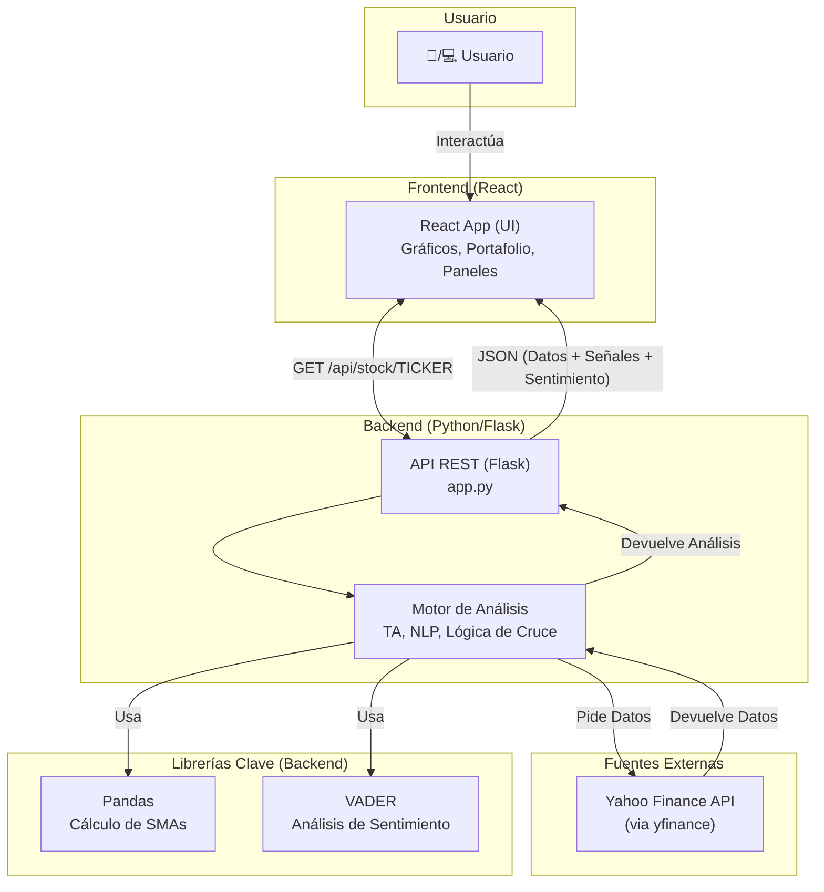
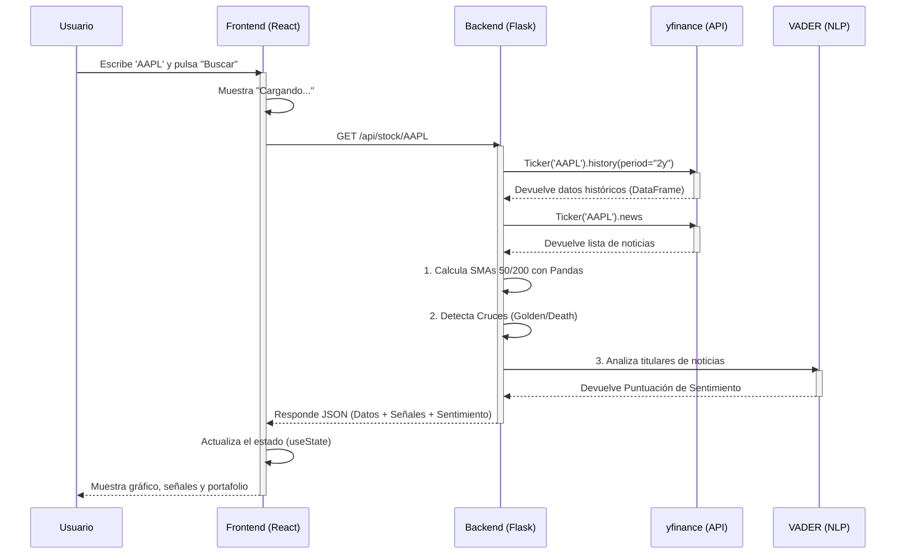

# Lumina 📈

Lumina es una plataforma de análisis de acciones y *paper trading* centrada en la educación y la transparencia. A diferencia de otras herramientas que prometen "hacerse rico rápido", Lumina está diseñada para desmitificar el análisis financiero combinando datos técnicos (TA) con Procesamiento de Lenguaje Natural (NLP) para el análisis de sentimiento, todo en un entorno ético y sin riesgos.

## 💡 Nuestra Filosofía (El Manifiesto)

**El Problema:** El mundo de las inversiones es opaco, intimidante y está lleno de "ruido". La mayoría de las herramientas fomentan decisiones impulsivas o son tan complejas que solo los expertos las entienden.

**Nuestra Solución:** Creemos en el poder de los datos para ofrecer claridad. Lumina no es una bola de cristal; es una **herramienta de aprendizaje y análisis**. Usamos la ciencia de datos no para darte "respuestas", sino para ayudarte a **formular mejores preguntas**.

**Nuestros Principios:**

1.  **Educación primero, no especulación:** Nuestro éxito se mide por cuánto aprende el usuario, no por cuánto "gana" en un simulador.
2.  **Transparencia (La "Caja de Cristal"):** Nunca te daremos una señal de "Compra" sin explicarte el *por qué*. Mostramos nuestros indicadores, su nivel de confianza y cómo se calcularon.
3.  **El Riesgo es Real:** Somos brutalmente honestos sobre el riesgo. Nuestra primera métrica siempre será la volatilidad y la incertidumbre, no solo la ganancia potencial.
4.  **Simulación Responsable:** Todo es dinero virtual. El objetivo es construir hábitos de análisis, no fomentar la adicción al *trading*.

## ✨ Características Principales

  * **Búsqueda de Acciones:** Obtén datos de cualquier ticker listado en Yahoo Finance.
  * **Gráficos Interactivos:** Visualiza el historial de precios del último año con `Chart.js`.
  * **Análisis Técnico (TA):** Cálculo y visualización automática de:
      * Media Móvil Simple de 50 días (SMA 50)
      * Media Móvil Simple de 200 días (SMA 200)
  * **Detección de Señales:** Alertas en tiempo real para:
      * **Cruce Dorado (Golden Cross):** (SMA 50 cruza por encima de SMA 200) - Señal alcista.
      * **Cruce de la Muerte (Death Cross):** (SMA 50 cruza por debajo de SMA 200) - Señal bajista.
  * **Análisis de Sentimiento (IA):** Un modelo de NLP (`VADER`) analiza los titulares de las noticias más recientes para generar un puntaje de sentimiento (Positivo, Neutral, Negativo).
  * **Paper Trading:** Un portafolio virtual con 100.000€ para simular compras y ventas sin riesgo.
  * **UI Ética:** Cada indicador incluye un *tooltip* `(i)` que explica qué significa la señal y, lo más importante, cuáles son sus limitaciones.


## 🛠️ Stack Tecnológico

  * **Frontend:**
      * **React:** Para construir la interfaz de usuario interactiva.
      * **Chart.js (`react-chartjs-2`):** Para la visualización de datos financieros.
  * **Backend:**
      * **Python:** Lenguaje principal del servidor.
      * **Flask:** Micro-framework para crear la API REST.
      * **Pandas:** Para la manipulación de series temporales y el cálculo de indicadores técnicos (SMAs).
      * **`yfinance`:** Para obtener datos históricos y noticias de Yahoo Finance.
      * **`vaderSentiment`:** Librería de NLP para el análisis de sentimiento de los titulares.


## Diagramas de Arquitectura

### 1. Arquitectura General del Sistema

Este diagrama muestra cómo los componentes principales (Frontend, Backend, APIs externas) interactúan entre sí.



### 2. Flujo de una Petición de Análisis

Este diagrama de secuencia muestra, paso a paso, qué ocurre cuando un usuario busca un *ticker* como "AAPL".




## 🚀 Instalación y Puesta en Marcha

Para ejecutar este proyecto localmente, necesitarás tener **Python**, **Node.js** y **npm** instalados.

### 1. Configurar el Backend (Servidor)

Abre una terminal y sigue estos pasos:

```bash
# 1. Navega a la carpeta del backend
cd backend

# 2. Crea un entorno virtual
python -m venv venv

# 3. Activa el entorno virtual
# En macOS/Linux:
source venv/bin/activate
# En Windows:
.\venv\Scripts\activate

# 4. Instala las dependencias de Python
# (Asegúrate de tener un archivo 'requirements.txt' con el contenido de abajo)
pip install -r requirements.txt

# 5. Inicia el servidor
python app.py
```

Tu servidor backend estará corriendo en `http://127.0.0.1:5000`.

### 2. Configurar el Frontend (Cliente)

Abre una **segunda terminal** (¡deja la primera corriendo el backend\!).

```bash
# 1. Navega a la carpeta del frontend
cd frontend

# 2. Instala las dependencias de Node.js
npm install

# 3. Inicia la aplicación de React
npm start
```

Tu aplicación frontend se abrirá automáticamente en tu navegador en `http://localhost:3000`.


## 🔮 Futuras Mejoras

Este proyecto es una base sólida. Los siguientes pasos para mejorarlo serían:

  * **Persistencia de Datos:** Integrar una base de datos (como **PostgreSQL** o **MongoDB**) para guardar las cuentas de usuario y los portafolios virtuales.
  * **Autenticación:** Añadir un sistema de inicio de sesión (ej. JWT) para que cada usuario tenga su propio portafolio.
  * **Más Indicadores:** Implementar indicadores técnicos adicionales como el **RSI** (Índice de Fuerza Relativa) y el **MACD**.
  * **Modelos de ML Avanzados:** Usar redes neuronales (como **LSTM**) para intentar predecir la tendencia del precio a corto plazo (y mostrar el % de confianza).
  * **Fuentes de Noticias Robustas:** Integrar una API de noticias profesional (como **NewsAPI** o **Alpaca**) para un análisis de sentimiento más profundo.
  * **Listas de Seguimiento (Watchlists):** Permitir al usuario guardar sus acciones favoritas.


## 📄 Licencia

Este proyecto se distribuye bajo la Licencia MIT. Ver `LICENSE` para más información.