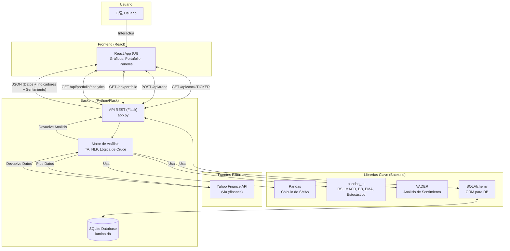
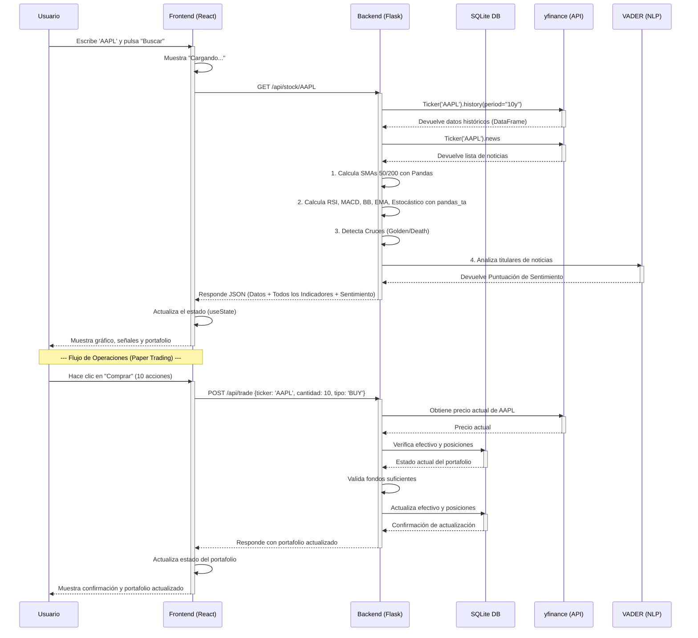

# Lumina 📈

Lumina es una plataforma de análisis de acciones y _paper trading_ centrada en la educación y la transparencia. A diferencia de otras herramientas que prometen "hacerse rico rápido", Lumina está diseñada para desmitificar el análisis financiero combinando datos técnicos (TA) con Procesamiento de Lenguaje Natural (NLP) para el análisis de sentimiento, todo en un entorno ético y sin riesgos.

## 💡 Nuestra Filosofía (El Manifiesto)

**El Problema:** El mundo de las inversiones es opaco, intimidante y está lleno de "ruido". La mayoría de las herramientas fomentan decisiones impulsivas o son tan complejas que solo los expertos las entienden.

**Nuestra Solución:** Creemos en el poder de los datos para ofrecer claridad. Lumina no es una bola de cristal; es una **herramienta de aprendizaje y análisis**. Usamos la ciencia de datos no para darte "respuestas", sino para ayudarte a **formular mejores preguntas**.

**Nuestros Principios:**

1.  **Educación primero, no especulación:** Nuestro éxito se mide por cuánto aprende el usuario, no por cuánto "gana" en un simulador.
2.  **Transparencia (La "Caja de Cristal"):** Nunca te daremos una señal de "Compra" sin explicarte el _por qué_. Mostramos nuestros indicadores, su nivel de confianza y cómo se calcularon.
3.  **El Riesgo es Real:** Somos brutalmente honestos sobre el riesgo. Nuestra primera métrica siempre será la volatilidad y la incertidumbre, no solo la ganancia potencial.
4.  **Simulación Responsable:** Todo es dinero virtual. El objetivo es construir hábitos de análisis, no fomentar la adicción al _trading_.

## ✨ Características Principales

- **Búsqueda de Acciones:** Obtén datos de cualquier ticker listado en Yahoo Finance.
- **Gráficos Interactivos:** Visualiza el historial de precios de hasta 10 años con `Chart.js`.
- **Análisis Técnico (TA) Avanzado:** Cálculo y visualización automática de:
  - Media Móvil Simple de 50 días (SMA 50)
  - Media Móvil Simple de 200 días (SMA 200)
  - **RSI (Índice de Fuerza Relativa):** Indicador de impulso que identifica condiciones de sobrecompra (>70) o sobreventa (<30)
  - **MACD (Moving Average Convergence Divergence):** Indicador de impulso que muestra la relación entre dos medias móviles exponenciales
  - **Bandas de Bollinger:** Miden la volatilidad del mercado y identifican condiciones de sobrecompra/sobreventa
  - **EMA (Media Móvil Exponencial):** EMAs de 12 y 26 períodos para análisis de tendencias a corto plazo
  - **Estocástico:** Oscilador de momentum que compara el precio de cierre con su rango de precios
- **Detección de Señales:** Alertas en tiempo real para:
  - **Cruce Dorado (Golden Cross):** (SMA 50 cruza por encima de SMA 200) - Señal alcista.
  - **Cruce de la Muerte (Death Cross):** (SMA 50 cruza por debajo de SMA 200) - Señal bajista.
- **Análisis de Sentimiento con NewsAPI:** Sistema robusto de análisis de noticias:
  - **Integración NewsAPI:** Acceso a miles de fuentes de noticias profesionales
  - **Análisis NLP con VADER:** Procesamiento avanzado del sentimiento en titulares y descripciones
  - **Panel de Noticias:** Visualización de las 10 noticias más recientes con score de sentimiento individual
  - **Sentimiento Agregado:** Cálculo del sentimiento promedio basado en múltiples fuentes
  - **Fallback inteligente:** Si NewsAPI no está configurado, usa yfinance como fuente alternativa
- **Predicción con Machine Learning (LSTM):**
  - **Modelo LSTM Entrenado:** Red neuronal recurrente para predicción de precios
  - **Predicciones Multi-día:** Predice tendencias de 1 a 30 días en el futuro
  - **Nivel de Confianza:** Cálculo automático basado en volatilidad histórica
  - **Entrenamiento Personalizado:** Entrena modelos específicos para cada ticker
  - **Métricas de Rendimiento:** MAE, MSE y visualización del error del modelo
  - **Advertencias Éticas:** Información clara sobre limitaciones y riesgos de las predicciones
- **Paper Trading con Persistencia:** Un portafolio virtual con 100.000€ para simular compras y ventas sin riesgo.
  - **Base de Datos SQLite:** Todas las operaciones se persisten en una base de datos local.
  - **Validación en el Servidor:** Los precios se verifican en tiempo real en el backend para evitar manipulaciones.
  - **Gestión de Posiciones:** Compra y vende acciones con actualización automática del portafolio.
- **Análisis Avanzado de Cartera:**
  - **Ratio de Sharpe:** Mide el retorno ajustado al riesgo del portafolio
  - **Índice de Diversificación:** Evalúa qué tan diversificado está tu portafolio
  - **Retornos Anualizados:** Calcula el rendimiento de cada posición
  - **Métricas en Tiempo Real:** Actualización automática cada 30 segundos
- **UI Ética y Responsiva:** Cada indicador incluye un _tooltip_ `(i)` que explica qué significa la señal y sus limitaciones. Diseño completamente adaptable a móviles, tablets y desktop.
- **Modo Oscuro:** Tema oscuro completo con persistencia de preferencias para mejorar la experiencia de usuario.

## 🛠️ Stack Tecnológico

- **Frontend:**
  - **React:** Para construir la interfaz de usuario interactiva.
  - **Chart.js (`react-chartjs-2`):** Para la visualización de datos financieros.
  - **Gestión de Estado:** Hooks de React (useState, useEffect) para gestión del estado de la aplicación.
  - **CSS Responsivo:** Diseño adaptable con media queries y grid layouts para móviles, tablets y desktop.
  - **Modo Oscuro:** Sistema de temas con persistencia en localStorage.
- **Backend:**
  - **Python:** Lenguaje principal del servidor.
  - **Flask:** Micro-framework para crear la API REST.
  - **SQLAlchemy:** ORM para la gestión de la base de datos.
  - **Flask-Migrate:** Para las migraciones de base de datos.
  - **Pandas:** Para la manipulación de series temporales y el cálculo de indicadores técnicos (SMAs).
  - **pandas_ta:** Librería especializada para indicadores técnicos avanzados (RSI, MACD, Bandas de Bollinger, EMA, Estocástico).
  - **`yfinance`:** Para obtener datos históricos y noticias de Yahoo Finance.
  - **`vaderSentiment`:** Librería de NLP para el análisis de sentimiento de los titulares.
  - **`newsapi-python`:** Cliente para NewsAPI que proporciona acceso a miles de fuentes de noticias profesionales.
  - **`tensorflow`:** Framework de deep learning para entrenar y ejecutar modelos LSTM.
  - **`scikit-learn`:** Librería de machine learning para normalización de datos y división train/test.
  - **`python-dotenv`:** Gestión de variables de entorno para API keys y configuración.
- **Base de Datos:**
  - **SQLite:** Base de datos ligera para persistir el portafolio del usuario (efectivo y posiciones).

## Diagramas de Arquitectura

### 1. Arquitectura General del Sistema

Este diagrama muestra cómo los componentes principales (Frontend, Backend, APIs externas) interactúan entre sí.



### 2. Flujo de una Petición de Análisis

Este diagrama de secuencia muestra, paso a paso, qué ocurre cuando un usuario busca un _ticker_ como "AAPL".



## 🚀 Instalación y Puesta en Marcha

Para ejecutar este proyecto localmente, necesitarás tener **Python**, **Node.js** y **npm** instalados.

### 1. Configurar el Backend (Servidor)

Abre una terminal y sigue estos pasos:

```bash
# 1. Navega a la carpeta del backend
cd backend

# 2. Crea un entorno virtual
python -m venv .venv

# 3. Activa el entorno virtual
# En macOS/Linux:
source .venv/bin/activate
# En Windows:
.\.venv\Scripts\activate

# 4. Instala las dependencias de Python
pip install -r requirements.txt

# 5. (Opcional) Configura NewsAPI para análisis de sentimiento robusto
# Copia el archivo de ejemplo y añade tu API key
cp .env.example .env
# Edita .env y añade tu NEWS_API_KEY (obtén una gratis en https://newsapi.org/register)

# 6. Inicia el servidor (esto creará automáticamente la base de datos)
python app.py
```

Tu servidor backend estará corriendo en `http://127.0.0.1:5000`.

**Nota:** La primera vez que ejecutes el servidor, se creará automáticamente la base de datos `lumina.db` con un portafolio inicial de 100.000€. Si no configuras NewsAPI, el sistema usará yfinance como fuente alternativa de noticias.

### 2. Configurar el Frontend (Cliente)

Abre una **segunda terminal** (¡deja la primera corriendo el backend!).

```bash
# 1. Navega a la carpeta del frontend
cd frontend

# 2. Instala las dependencias de Node.js
npm install

# 3. Inicia la aplicación de React
npm start
```

Tu aplicación frontend se abrirá automáticamente en tu navegador en `http://localhost:3000`.

## � API Endpoints

El backend expone los siguientes endpoints REST:

### `GET /api/stock/<ticker>`
Obtiene los datos históricos, indicadores técnicos y análisis de sentimiento de una acción.

**Parámetros:**
- `ticker` (string): El símbolo del ticker (ej: AAPL, MSFT)

**Respuesta exitosa (200):**
```json
{
  "companyName": "Apple Inc.",
  "history": [...],
  "signal_event": "GOLDEN_CROSS",
  "current_state": "GOLDEN",
  "sentiment_score": 0.42,
  "sentiment_news_count": 10,
  "news_articles": [...],
  "latest_rsi": 65.3,
  "latest_macd": {
    "macd": 2.45,
    "signal": 1.83,
    "histogram": 0.62
  },
  "latest_bb": {
    "upper": 152.30,
    "middle": 150.00,
    "lower": 147.70
  },
  "latest_ema": {
    "ema_short": 149.80,
    "ema_long": 148.20
  },
  "latest_stoch": {
    "stoch_k": 72.4,
    "stoch_d": 68.9
  }
}
```

### `GET /api/news/<ticker>`
Obtiene noticias recientes con análisis de sentimiento usando NewsAPI.

**Parámetros opcionales:**
- `days`: Días hacia atrás (default: 7)

**Respuesta (200):**
```json
{
  "articles": [...],
  "sentiment_score": 0.42,
  "total_articles": 10
}
```

### `POST /api/train/<ticker>`
Entrena un modelo LSTM para predicción de precios.

**Cuerpo (opcional):**
```json
{
  "epochs": 50
}
```

**Respuesta (200):**
```json
{
  "message": "Modelo entrenado exitosamente",
  "metrics": {
    "success": true,
    "train_loss": 0.0023,
    "test_loss": 0.0031
  }
}
```

### `GET /api/predict/<ticker>`
Realiza predicciones usando el modelo LSTM.

**Parámetros opcionales:**
- `days`: Días a predecir (default: 5)

**Respuesta (200):**
```json
{
  "ticker": "AAPL",
  "current_price": 150.25,
  "predictions": [151.30, 152.10, ...],
  "predicted_change_pct": 2.49,
  "confidence": 72.5,
  "trend": "alcista"
}
```

### `GET /api/model/info/<ticker>`
Información del modelo LSTM entrenado.

### `GET /api/portfolio/analytics`
Análisis avanzado del portafolio (Sharpe, diversificación).

### `GET /api/portfolio`
Obtiene el estado actual del portafolio del usuario.

**Respuesta exitosa (200):**
```json
{
  "efectivo": 95000.50,
  "posiciones": {
    "AAPL": 10,
    "MSFT": 5
  }
}
```

### `POST /api/trade`
Ejecuta una operación de compra o venta de acciones.

**Cuerpo de la petición:**
```json
{
  "ticker": "AAPL",
  "cantidad": 10,
  "tipo": "BUY"  // "BUY" o "SELL"
}
```

**Respuesta exitosa (200):**
Devuelve el portafolio actualizado (mismo formato que `/api/portfolio`).

**Errores comunes:**
- `400`: Fondos insuficientes o datos inválidos
- `404`: No se pudo obtener el precio del ticker
- `500`: Error interno del servidor

## 🔮 Futuras Mejoras

Aunque Lumina ya cuenta con un conjunto completo de funcionalidades avanzadas, aquí hay algunas ideas para el futuro:

- **Comparación de Múltiples Acciones:** Visualización lado a lado de diferentes tickers
- **Alertas Personalizadas:** Notificaciones cuando se detecten señales específicas
- **Backtesting Automático:** Evaluar estrategias contra datos históricos
- **Export de Datos:** Descargar análisis en CSV/PDF
- **Websockets en Tiempo Real:** Actualización de precios sin refrescar
- **Análisis Fundamental:** P/E ratio, EPS, dividendos
- **Optimización de Hiperparámetros LSTM:** Auto-tuning de los parámetros del modelo
- **Ensemble Models:** Combinar múltiples modelos ML para mejor precisión

---

## 📝 Licencia

Este proyecto es de código abierto y está disponible bajo la licencia MIT.

---

## 🙏 Agradecimientos

- **yfinance:** Por el acceso gratuito a datos históricos de Yahoo Finance
- **pandas_ta:** Por los indicadores técnicos avanzados
- **NewsAPI:** Por el acceso a fuentes de noticias profesionales
- **TensorFlow:** Por el framework de deep learning
- **Chart.js:** Por las visualizaciones interactivas
- **React:** Por el framework de frontend
- **Flask:** Por el micro-framework web de Python

---

## 📚 Documentación Adicional

- **[NUEVAS_FUNCIONALIDADES.md](NUEVAS_FUNCIONALIDADES.md):** Guía detallada de NewsAPI y LSTM
- **[.env.example](backend/.env.example):** Plantilla de configuración
- **[test_new_features.py](test_new_features.py):** Script de pruebas automatizadas

---

**Hecho con 💙 y ☕ por el equipo de Lumina**

*"Datos claros, decisiones informadas"*

Este proyecto es una base sólida. Los siguientes pasos para mejorarlo serían:

- **Autenticación Multi-Usuario:** Añadir un sistema de inicio de sesión (ej. JWT) para que múltiples usuarios puedan tener sus propios portafolios independientes.
- **Más Indicadores Técnicos:** Implementar indicadores adicionales como **Bandas de Bollinger**, **Media Móvil Exponencial (EMA)** y **Estocástico**.
- **Modelos de ML Avanzados:** Usar redes neuronales (como **LSTM**) para intentar predecir la tendencia del precio a corto plazo (y mostrar el % de confianza).
- **Fuentes de Noticias Robustas:** Integrar una API de noticias profesional (como **NewsAPI** o **Alpaca**) para un análisis de sentimiento más profundo.
- **Listas de Seguimiento (Watchlists):** Permitir al usuario guardar y monitorizar sus acciones favoritas.
- **Historial de Transacciones:** Implementar un registro completo de todas las operaciones realizadas con métricas de rendimiento.
- **Alertas en Tiempo Real:** Sistema de notificaciones para avisar cuando se detecten señales importantes en las acciones del portafolio.
- **Análisis de Cartera:** Métricas avanzadas como el Ratio de Sharpe, diversificación, y retorno ajustado al riesgo.
- **Modo Oscuro:** Implementar un tema oscuro para mejorar la experiencia de usuario en diferentes condiciones de luz.

## ✅ Mejoras Implementadas Recientemente

### Backend
- ✨ **Persistencia con Base de Datos:** Implementación completa de SQLite con SQLAlchemy para almacenar el portafolio
- 🔒 **Validación de Precios en Servidor:** Los precios se verifican en tiempo real en el backend, evitando manipulaciones del cliente
- 📊 **Indicador RSI:** Cálculo del Índice de Fuerza Relativa usando `pandas_ta`
- � **Indicador MACD:** Implementación del Moving Average Convergence Divergence con valores de MACD, señal e histograma
- �🔄 **Gestión de Datos Mejorada:** Uso de `.fillna(None)` y `.where()` para convertir correctamente NaN a null en JSON
- 🏗️ **Migraciones de Base de Datos:** Integración de Flask-Migrate para gestionar cambios en el esquema
- 📈 **Historial Extendido:** Análisis de hasta 10 años de datos históricos para mayor precisión en indicadores
- 🛡️ **Manejo de Errores Robusto:** Validaciones completas con rollback de transacciones en caso de error

### Frontend
- 🎨 **Código Más Limpio:** Refactorización de CSS y JavaScript para mejor legibilidad
- 🔄 **Sincronización con Backend:** El portafolio se carga y actualiza desde la base de datos
- 📱 **Interfaz Mejorada:** Grid de 2x2 para 4 indicadores (SMA, RSI, Sentimiento, MACD)
- ⚡ **Manejo de Errores Robusto:** Validación completa de operaciones con mensajes informativos
- 🎯 **Componente RSI:** Indicador visual con estados de sobrecompra/sobreventa
- 📊 **Componente MACD:** Nuevo indicador de impulso con análisis alcista/bajista
- 💰 **Panel de Operaciones:** Widget dedicado para comprar/vender con cálculo en tiempo real del coste
- 📱 **Diseño Responsivo Completo:**
  - Layout adaptable de 2 columnas en desktop, 1 columna en móviles
  - Viewport optimizado para todos los dispositivos
  - Tooltips y componentes adaptados a pantallas pequeñas
  - Grid de indicadores que se apila en móviles (<768px)
  - Formularios y botones con width 100% en móviles
  - Prevención de scroll horizontal con overflow-x
  - Canvas de gráficos completamente responsivo

## 📄 Licencia

Este proyecto se distribuye bajo la Licencia MIT. Ver `LICENSE` para más información.
