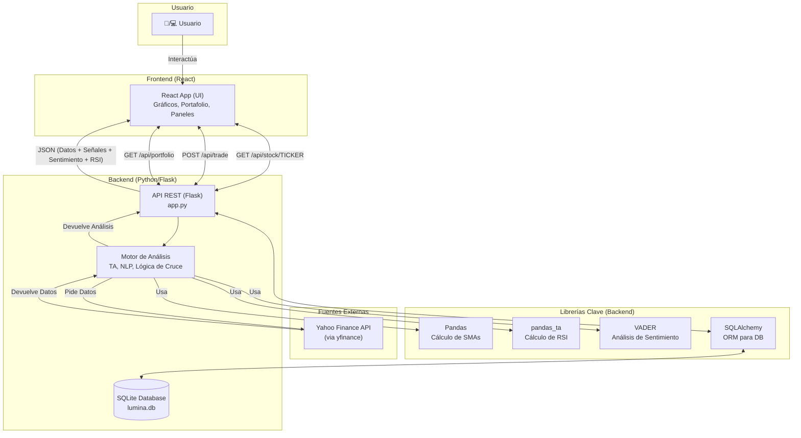
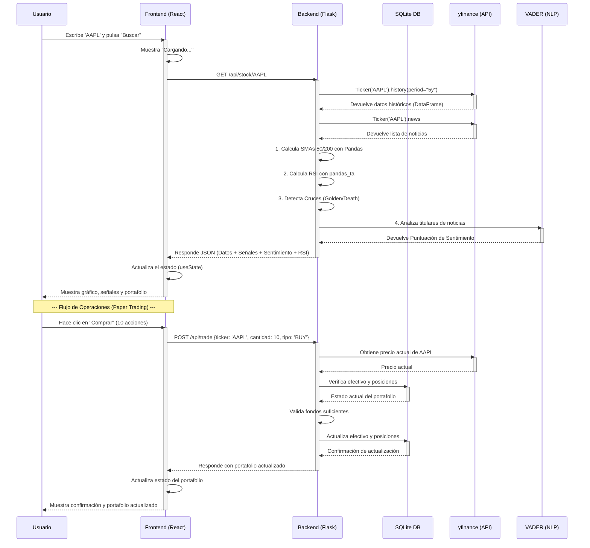

# Lumina 📈

Lumina es una plataforma de análisis de acciones y _paper trading_ centrada en la educación y la transparencia. A diferencia de otras herramientas que prometen "hacerse rico rápido", Lumina está diseñada para desmitificar el análisis financiero combinando datos técnicos (TA) con Procesamiento de Lenguaje Natural (NLP) para el análisis de sentimiento, todo en un entorno ético y sin riesgos.

## 💡 Nuestra Filosofía (El Manifiesto)

**El Problema:** El mundo de las inversiones es opaco, intimidante y está lleno de "ruido". La mayoría de las herramientas fomentan decisiones impulsivas o son tan complejas que solo los expertos las entienden.

**Nuestra Solución:** Creemos en el poder de los datos para ofrecer claridad. Lumina no es una bola de cristal; es una **herramienta de aprendizaje y análisis**. Usamos la ciencia de datos no para darte "respuestas", sino para ayudarte a **formular mejores preguntas**.

**Nuestros Principios:**

1.  **Educación primero, no especulación:** Nuestro éxito se mide por cuánto aprende el usuario, no por cuánto "gana" en un simulador.
2.  **Transparencia (La "Caja de Cristal"):** Nunca te daremos una señal de "Compra" sin explicarte el _por qué_. Mostramos nuestros indicadores, su nivel de confianza y cómo se calcularon.
3.  **El Riesgo es Real:** Somos brutalmente honestos sobre el riesgo. Nuestra primera métrica siempre será la volatilidad y la incertidumbre, no solo la ganancia potencial.
4.  **Simulación Responsable:** Todo es dinero virtual. El objetivo es construir hábitos de análisis, no fomentar la adicción al _trading_.

## ✨ Características Principales

- **Búsqueda de Acciones:** Obtén datos de cualquier ticker listado en Yahoo Finance.
- **Gráficos Interactivos:** Visualiza el historial de precios de los últimos 5 años con `Chart.js`.
- **Análisis Técnico (TA):** Cálculo y visualización automática de:
  - Media Móvil Simple de 50 días (SMA 50)
  - Media Móvil Simple de 200 días (SMA 200)
  - **RSI (Índice de Fuerza Relativa):** Indicador de impulso que identifica condiciones de sobrecompra (>70) o sobreventa (<30)
- **Detección de Señales:** Alertas en tiempo real para:
  - **Cruce Dorado (Golden Cross):** (SMA 50 cruza por encima de SMA 200) - Señal alcista.
  - **Cruce de la Muerte (Death Cross):** (SMA 50 cruza por debajo de SMA 200) - Señal bajista.
- **Análisis de Sentimiento (IA):** Un modelo de NLP (`VADER`) analiza los titulares de las noticias más recientes para generar un puntaje de sentimiento (Positivo, Neutral, Negativo).
- **Paper Trading con Persistencia:** Un portafolio virtual con 100.000€ para simular compras y ventas sin riesgo.
  - **Base de Datos SQLite:** Todas las operaciones se persisten en una base de datos local.
  - **Validación en el Servidor:** Los precios se verifican en tiempo real en el backend para evitar manipulaciones.
  - **Gestión de Posiciones:** Compra y vende acciones con actualización automática del portafolio.
- **UI Ética:** Cada indicador incluye un _tooltip_ `(i)` que explica qué significa la señal y, lo más importante, cuáles son sus limitaciones.

## 🛠️ Stack Tecnológico

- **Frontend:**
  - **React:** Para construir la interfaz de usuario interactiva.
  - **Chart.js (`react-chartjs-2`):** Para la visualización de datos financieros.
  - **Gestión de Estado:** Hooks de React (useState, useEffect) para gestión del estado de la aplicación.
- **Backend:**
  - **Python:** Lenguaje principal del servidor.
  - **Flask:** Micro-framework para crear la API REST.
  - **SQLAlchemy:** ORM para la gestión de la base de datos.
  - **Flask-Migrate:** Para las migraciones de base de datos.
  - **Pandas:** Para la manipulación de series temporales y el cálculo de indicadores técnicos (SMAs).
  - **pandas_ta:** Librería especializada para indicadores técnicos adicionales (RSI).
  - **`yfinance`:** Para obtener datos históricos y noticias de Yahoo Finance.
  - **`vaderSentiment`:** Librería de NLP para el análisis de sentimiento de los titulares.
- **Base de Datos:**
  - **SQLite:** Base de datos ligera para persistir el portafolio del usuario (efectivo y posiciones).

## Diagramas de Arquitectura

### 1. Arquitectura General del Sistema

Este diagrama muestra cómo los componentes principales (Frontend, Backend, APIs externas) interactúan entre sí.



### 2. Flujo de una Petición de Análisis

Este diagrama de secuencia muestra, paso a paso, qué ocurre cuando un usuario busca un _ticker_ como "AAPL".



## 🚀 Instalación y Puesta en Marcha

Para ejecutar este proyecto localmente, necesitarás tener **Python**, **Node.js** y **npm** instalados.

### 1. Configurar el Backend (Servidor)

Abre una terminal y sigue estos pasos:

```bash
# 1. Navega a la carpeta del backend
cd backend

# 2. Crea un entorno virtual
python -m venv .venv

# 3. Activa el entorno virtual
# En macOS/Linux:
source .venv/bin/activate
# En Windows:
.\.venv\Scripts\activate

# 4. Instala las dependencias de Python
pip install -r requirements.txt

# 5. Inicia el servidor (esto creará automáticamente la base de datos)
python app.py
```

Tu servidor backend estará corriendo en `http://127.0.0.1:5000`.

**Nota:** La primera vez que ejecutes el servidor, se creará automáticamente la base de datos `lumina.db` con un portafolio inicial de 100.000€.

### 2. Configurar el Frontend (Cliente)

Abre una **segunda terminal** (¡deja la primera corriendo el backend!).

```bash
# 1. Navega a la carpeta del frontend
cd frontend

# 2. Instala las dependencias de Node.js
npm install

# 3. Inicia la aplicación de React
npm start
```

Tu aplicación frontend se abrirá automáticamente en tu navegador en `http://localhost:3000`.

## � API Endpoints

El backend expone los siguientes endpoints REST:

### `GET /api/stock/<ticker>`
Obtiene los datos históricos, indicadores técnicos y análisis de sentimiento de una acción.

**Parámetros:**
- `ticker` (string): El símbolo del ticker (ej: AAPL, MSFT)

**Respuesta exitosa (200):**
```json
{
  "companyName": "Apple Inc.",
  "history": [...],  // Array de datos históricos
  "signal_event": "GOLDEN_CROSS",  // GOLDEN_CROSS, DEATH_CROSS o NONE
  "current_state": "GOLDEN",  // GOLDEN, DEATH o HOLD
  "sentiment_score": 0.42,  // Entre -1 (muy negativo) y 1 (muy positivo)
  "sentiment_news_count": 10,  // Número de noticias analizadas
  "latest_rsi": 65.3  // Valor RSI actual (0-100)
}
```

### `GET /api/portfolio`
Obtiene el estado actual del portafolio del usuario.

**Respuesta exitosa (200):**
```json
{
  "efectivo": 95000.50,
  "posiciones": {
    "AAPL": 10,
    "MSFT": 5
  }
}
```

### `POST /api/trade`
Ejecuta una operación de compra o venta de acciones.

**Cuerpo de la petición:**
```json
{
  "ticker": "AAPL",
  "cantidad": 10,
  "tipo": "BUY"  // "BUY" o "SELL"
}
```

**Respuesta exitosa (200):**
Devuelve el portafolio actualizado (mismo formato que `/api/portfolio`).

**Errores comunes:**
- `400`: Fondos insuficientes o datos inválidos
- `404`: No se pudo obtener el precio del ticker
- `500`: Error interno del servidor

## �🔮 Futuras Mejoras

Este proyecto es una base sólida. Los siguientes pasos para mejorarlo serían:

- **Autenticación Multi-Usuario:** Añadir un sistema de inicio de sesión (ej. JWT) para que múltiples usuarios puedan tener sus propios portafolios independientes.
- **Más Indicadores Técnicos:** Implementar indicadores adicionales como el **MACD**, **Bandas de Bollinger** y **Media Móvil Exponencial (EMA)**.
- **Modelos de ML Avanzados:** Usar redes neuronales (como **LSTM**) para intentar predecir la tendencia del precio a corto plazo (y mostrar el % de confianza).
- **Fuentes de Noticias Robustas:** Integrar una API de noticias profesional (como **NewsAPI** o **Alpaca**) para un análisis de sentimiento más profundo.
- **Listas de Seguimiento (Watchlists):** Permitir al usuario guardar y monitorizar sus acciones favoritas.
- **Historial de Transacciones:** Implementar un registro completo de todas las operaciones realizadas con métricas de rendimiento.
- **Alertas en Tiempo Real:** Sistema de notificaciones para avisar cuando se detecten señales importantes en las acciones del portafolio.
- **Análisis de Cartera:** Métricas avanzadas como el Ratio de Sharpe, diversificación, y retorno ajustado al riesgo.

## ✅ Mejoras Implementadas Recientemente

### Backend
- ✨ **Persistencia con Base de Datos:** Implementación completa de SQLite con SQLAlchemy para almacenar el portafolio
- 🔒 **Validación de Precios en Servidor:** Los precios se verifican en tiempo real en el backend, evitando manipulaciones del cliente
- 📊 **Indicador RSI:** Cálculo del Índice de Fuerza Relativa usando `pandas_ta`
- 🔄 **Gestión de Datos Mejorada:** Uso de `.fillna(None)` para convertir correctamente NaN a null en JSON
- 🏗️ **Migraciones de Base de Datos:** Integración de Flask-Migrate para gestionar cambios en el esquema
- 📈 **Historial Extendido:** Análisis de hasta 5 años de datos históricos para mayor precisión en indicadores

### Frontend
- 🎨 **Código Más Limpio:** Refactorización de CSS y JavaScript para mejor legibilidad
- 🔄 **Sincronización con Backend:** El portafolio se carga y actualiza desde la base de datos
- 📱 **Interfaz Mejorada:** Grid de 3 columnas para indicadores (SMA, Sentimiento, RSI)
- ⚡ **Manejo de Errores Robusto:** Validación completa de operaciones con mensajes informativos
- 🎯 **Componente RSI:** Nuevo indicador visual con estados de sobrecompra/sobreventa
- 💰 **Panel de Operaciones:** Widget dedicado para comprar/vender con cálculo en tiempo real del coste

## 📄 Licencia

Este proyecto se distribuye bajo la Licencia MIT. Ver `LICENSE` para más información.
