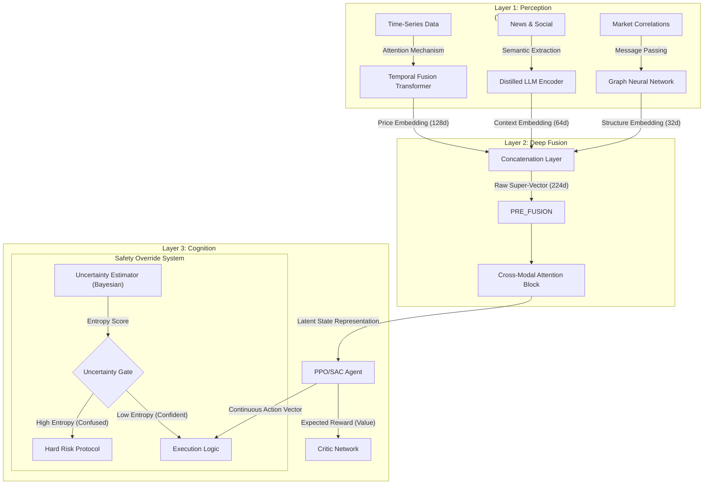

# **LUMINA V3: THE DEEP FUSION ARCHITECTURE**

## **From Quantitative Analyst to Cognitive Autonomous Agent**

**"We choose to go to the moon in this decade and do the other things, not
because they are easy, but because they are hard."**

— John F. Kennedy

## **Table of Contents**

1. [Executive Summary: The "Hard Path"](https://www.google.com/search?q=%231-executive-summary-the-hard-path)
2. [The "Chimera" Architecture Overview](https://www.google.com/search?q=%232-the-chimera-architecture-overview)
3. [Layer 1: The Perception Engines (Encoders)](https://www.google.com/search?q=%233-layer-1-the-perception-engines-encoders)
   - [A. Temporal Encoder (TFT)](https://www.google.com/search?q=%23a-the-temporal-encoder-temporal-fusion-transformer-tft)
   - [B. Semantic Encoder (Distilled Quant-LLM)](https://www.google.com/search?q=%23b-the-semantic-encoder-distilled-quant-llm)
   - [C. Structural Encoder (Graph Neural Network)](https://www.google.com/search?q=%23c-the-structural-encoder-graph-neural-network-gnn)
4. [Layer 2: The Deep Fusion Nexus](https://www.google.com/search?q=%234-layer-2-the-deep-fusion-nexus)
5. [Layer 3: The Cognitive Core (Hierarchical RL)](https://www.google.com/search?q=%235-layer-3-the-cognitive-core-hierarchical-rl)
6. [Infrastructure: The Low-Latency Nervous System](https://www.google.com/search?q=%236-infrastructure-the-low-latency-nervous-system)
7. [The "Spartan" Training Curriculum](https://www.google.com/search?q=%237-the-spartan-training-curriculum)
8. [Risk Management: The Uncertainty Gate](https://www.google.com/search?q=%238-risk-management-the-uncertainty-gate)
9. [Implementation Roadmap (12-Month Horizon)](https://www.google.com/search?q=%239-implementation-roadmap-12-month-horizon)

## **1. Executive Summary: The "Hard Path"**

### **The Paradigm Shift: Beyond Linear Processing**

Lumina V2 was a sophisticated calculator. It operated on a linear plane: ingest
historical data, apply a mathematical transformation, and output a statistical
probability. While effective for standard market regimes, this approach fails
during "Black Swan" events because it lacks context. The original V3 plan was a
"voting machine"—an ensemble of independent models shouting over one another,
hoping the consensus would average out errors.

The **New Lumina V3** represents a fundamental ontological shift: it is designed
to be a **Cognitive Entity**.

We are abandoning the standard "Ensemble" approach in favor of **Deep Sensor
Fusion**. In biological systems, this is akin to how the human brain operates
via the thalamus. A human driver does not process vision (sight), sound (horns),
and vestibular balance (acceleration) as separate mathematical tasks and then
hold a "vote" on whether to brake. Instead, these sensory inputs are fused into
a unified, multi-dimensional representation of reality _before_ a decision is
made. The brain understands that a red light (vision) is irrelevant if the
brakes have failed (tactile feedback).

Lumina V3 will operate on this bio-mimetic principle. It will ingest
high-frequency market data, the semantic nuance of global news streams, and the
hidden structural correlations of the financial web. These inputs will not
produce separate predictions (e.g., "The news says buy," "The chart says sell").
Instead, they will produce raw, high-dimensional embeddings that merge to form a
singular, holographic view of the market state. The agent acts on this unified
reality, allowing it to detect the subtle interplay between sentiment and price
that a linear voting system would miss.

### **The Core Differentiators**

1. **Multimodal Perception (The "Synesthesia" of Trading):**  
   The model possesses a form of digital synesthesia. It simultaneous "reads"
   the anxiety in market sentiment and "feels" the tremors in the graph
   relationships between assets. It understands context via cross-modal
   attention:
   - _Context:_ A 2% price drop accompanied by "silence" in the news is likely
     noise or a buying opportunity.
   - _Context:_ A 2% price drop accompanied by "panic" in the semantic vector
     space and a breakdown in sector correlations is a structural break—a signal
     to exit immediately.
2. **Epistemic Uncertainty (Self-Awareness):**  
   Most deep learning models are dangerously overconfident. A standard LSTM will
   predict a price movement with 99% confidence even when fed random noise,
   because it is forced to output a probability. Lumina V3 distinguishes between
   two critical types of risk:
   - **Aleatoric Risk:** The inherent, irreducible noise of the market (standard
     volatility, bid-ask bounce).
   - **Epistemic Risk:** "I have never seen this data distribution before."  
     When the model encounters a true anomaly outside its training manifold
     (e.g., a global pandemic, a flash crash triggered by a new HFT algorithm,
     or a decoupling of usually correlated assets), it measures its own internal
     confusion (entropy). If entropy is high, it automatically cedes control to
     hard-coded safety protocols, effectively saying, "I don't know," and moving
     to cash.
3. **Adversarial Hardening (The Spartan Forge):**  
   The agent is not trained solely on historical data. History is a biased
   teacher; it only shows what _has_ happened, not what _could_ happen. The
   agent is trained in a simulation environment that generates **"Nightmare
   Scenarios"**—artificial flash crashes, liquidity droughts, inverse
   correlation breakdowns, and data outages—specifically designed to break the
   agent. It learns survival first, profit second.

## **2. The "Chimera" Architecture Overview**

We are building a single, massive neural network composed of specialized
sub-modules, biologically inspired by different regions of the brain. We call
this **The Chimera**—a hybrid beast composed of distinct parts working in
unison.

The architecture flows from raw sensory data, through compression and
abstraction (Encoders), into a unification layer (Fusion), and finally to
executive function (Cognition).



## **3. Layer 1: The Perception Engines (Encoders)**

We do not feed raw data (OHLCV, text, correlation matrices) to the RL agent. Raw
data is noisy, sparse, and chemically different across modalities. Instead, we
feed it **Compressed Representations (Embeddings)**—dense vectors that capture
the _essence_ of the input, stripping away the noise.

### **A. The Temporal Encoder: Temporal Fusion Transformer (TFT)**

_Replaces: Standard LSTM and GRU architectures_

**The Problem with LSTMs:**

Long Short-Term Memory (LSTM) networks suffer from a "vanishing gradient"
problem over very long sequences; they tend to forget what happened 500 bars
ago. Furthermore, they struggle to integrate static metadata (like "Sector:
Tech" or "Market Cap: Large") alongside dynamic data without complex
architectural hacks.

**The TFT Solution:**

The Temporal Fusion Transformer utilizes self-attention mechanisms to weigh the
importance of different time steps dynamically, regardless of how far back they
occurred. It treats time not just as a sequence, but as a map of relevant
events.

**Technical Spec:**

- **Input:** High-frequency OHLCV candles (1m, 5m, 1h), Technical Indicators
  (RSI, MACD, Bollinger Bands), and Static Covariates (Asset Class, Volatility
  Profile).
- **Architecture Components:**
  - _Variable Selection Networks (VSN):_ Automatically selects which features
     matter for the current regime (e.g., automatically learning to ignore
     volume data during low-liquidity after-hours trading).
  - _Static Covariate Encoders:_ Integrates metadata to condition the
     prediction.
  - _Multi-head Attention:_ Identifies long-term dependencies (e.g.,
     recognizing a fractal pattern that last appeared 3 months ago and linking
     it to the present).
- **Output:** A fixed-size vector (e.g., dim=128) representing the _current
  state of price action_, weighted by historical relevance.
- **Interpretability:** Unlike a black-box LSTM, the TFT provides attention
  weights. We can visualize exactly which past candles the model is focusing on
  to make its prediction, allowing for "white-box" auditing.

### **B. The Semantic Encoder: Distilled Quant-LLM**

_Replaces: Simple Sentiment Scores (VADER, TextBlob)_

**The Problem with Sentiment Scores:**

A sentiment score of "0.8 Positive" loses all nuance. Consider two headlines:

1. _"Apple beats earnings expectations by 10%."_
2. _"Apple beats earnings expectations by 10%, but warns of catastrophic supply
   chain failure next quarter."_  
   Both might register as "Positive" in simple keyword counters or VADER.
   However, the second headline implies a future crash. Simple scores miss the
   fear, the hesitation, and the conditional logic ("X is good, BUT Y is bad").

**The LLM Solution:**

We use a Large Language Model to extract a semantic embedding—a vector that
represents the _meaning_ of the text in a high-dimensional space.

**Technical Spec:**

- **Model:** DistilRoBERTa-financial or a 4-bit quantized Llama-3-8B running
  locally.
- **Mechanism:**
   1. Ingest raw text from NewsAPI, Twitter, and SEC filings.
   2. Tokenize the text into sub-word units.
   3. Pass through Transformer layers to generate a "Context Vector."
   4. In this vector space, the mathematical distance between "Recall" and
      "Loss" is small, while the distance between "Recall" and "Growth" is
      large.
- **Output:** A dense vector (e.g., dim=64) capturing the _semantic context_.
- **Latency Constraint:** Must run inference . 100ms. We achieve this via
  **Knowledge Distillation**—training a smaller student model to mimic the
  vector output of a massive teacher model (like GPT-4), sacrificing a tiny
  amount of accuracy for massive speed gains.

### **C. The Structural Encoder: Graph Neural Network (GNN)**

_New Component: The "Spatial" Awareness_

**The Problem with I.I.D. Assumptions:**

Standard models treat assets as Independent and Identically Distributed (I.I.D.)
islands. They assume AAPL moves only because of AAPL data. In reality, stocks do
not move in a vacuum. If NVDA (Nvidia) drops, AMD reacts immediately because
they are competitors (correlation). SMCI (Super Micro) follows because they are
supply chain partners (causality).

**The GNN Solution:**

A Graph Neural Network understands the "contagion" effect of the market web. It
models the market as a graph where nodes are stocks and edges are relationships.

**Technical Spec:**

- **Nodes:** Assets (SPY, AAPL, MSFT, VIX, Oil, Gold).
- **Edges:**
  - _Dynamic Edges:_ Rolling 30-day price correlation (updated daily). High
     correlation . Strong edge weight.
  - _Static Edges:_ Supply chain relationships (Supplier/Customer), Sector
     membership, ETF weightings.
- **Mechanism:** **Graph Attention Network (GATv2)**. It performs "Message
  Passing"—aggregating information from neighbor nodes.
  - _Example:_ If the "Semiconductor" neighbors are crashing, the GNN embedding
     for AAPL will reflect "neighborhood stress" (a specific vector orientation)
     even if AAPL itself hasn't dropped yet. It predicts the shockwave before it
     hits.
- **Output:** A vector (e.g., dim=32) representing the _market structure
  pressure_ on the asset.

## **4. Layer 2: The Deep Fusion Nexus**

This is the most critical innovation of V3. We don't average predictions; we
merge realities into a single **Super-State**. This layer acts as the "Thalamus"
of the AI brain, gating and prioritizing sensory information.

**The Mechanism:**

1. **Concatenation:**  
   We fuse the specialized vectors into a single stream:  
   State . \[Price_Embedding (128) | Sentiment_Embedding (64) | Graph_Embedding
   (32)\].  
   This results in a total vector of dim=224. This vector represents the raw,
   unweighted information from all senses.
2. **Cross-Modal Attention Block:**  
   A Transformer-based Gating Unit sits here. It allows the distinct modalities
   to "talk" to each other and suppress noise via learned attention weights.
   - _Scenario A (The Earnings Call):_ The Semantic Embedding is "screaming"
     (high activation due to breaking news). The Attention Block suppresses the
     Technical Embedding because technical support levels are irrelevant during
     a fundamental news shock. The model learns to ignore the chart and trade
     the news.
   - _Scenario B (The Flash Crash):_ The Price Embedding shows massive
     volatility anomalies. The Semantic Embedding is empty (no news has been
     written yet). The Attention Block amplifies the Price Embedding and ignores
     the lack of news, allowing for a pure reflex reaction to liquidity gaps.
   - _Scenario C (The Sector Rotation):_ Price is flat, News is flat. But the
     GNN shows massive movement in the Energy sector. The Attention Block
     highlights the Structural Embedding, signaling a potential sympathy move.

**The Output:**

A **Latent State Representation**—a refined, holographic view of the market
moment. This vector contains no "human-readable" data, but it contains all the
information required for the Agent to act, filtered by relevance.

## **5. Layer 3: The Cognitive Core (Hierarchical RL)**

We use a **Hierarchical Reinforcement Learning (HRL)** approach to separate
high-level strategy (The General) from low-level execution (The Soldier).

### **The Agent: Proximal Policy Optimization (PPO) with Continuous Action Space**

We utilize PPO (Proximal Policy Optimization) for its stability or SAC (Soft
Actor-Critic) for its sample efficiency and entropy maximization (exploration).
Crucially, the agent operates in a **Continuous Action Space**.

- **Why Continuous?** Discrete actions (Buy, Sell, Hold) are insufficient for
  professional trading. They lack nuance. A "Buy" with high conviction is
  different from a "Buy" with hesitation.
- **The Action Vector:** The agent outputs a vector of continuous floats:
  - Action.0\] (Direction): A float between \-1.0 (Full Short) and 1.0 (Full
     Long).
  - Action.1\] (Urgency): Determines the order type. Low value (\<0.5) \= Limit
     Order (passive/maker). High value (\>0.5) \= Market Order
     (aggressive/taker).
  - Action.2\] (Sizing): Percentage of available Risk Capital to deploy. The
     agent learns an internal "Kelly Criterion" to bet big only when the
     probability of success is high.
  - Action.3\] (Stop-Distance): How tight the dynamic stop-loss should be
     relative to ATR (Average True Range). In volatile markets, it learns to
     widen stops; in calm markets, it tightens them.

### **The Uncertainty Head (The "Epistemic" Monitor)**

Alongside the Policy (Action) and Value (Critic) heads, the network possesses a
third, critical head: **Uncertainty**.

- **Method:** **Monte Carlo Dropout** (running the network forward pass 10 times
  with random neuron dropouts enabled) or **Deep Ensembles** (running 3
  lightweight versions of the agent simultaneously).
- **Logic:**
  - If the 10 runs produce nearly identical action vectors, the model is
     **Confident** (Low Entropy). The features are robust and within the
     training distribution.
  - If the 10 runs produce widely different outputs (e.g., one run says "Buy",
     another says "Sell"), the model is **Guessing** (High Entropy). It
     indicates the input data is outside the training distribution (an anomaly).
- **Trigger:** If Uncertainty . Critical_Threshold, the RL output is discarded
  entirely. The system defaults to the **Hard-Coded Risk Manager** (The
  Amygdala), usually reducing position size or moving to cash. This is our "I
  don't know" safety valve—a feature most trading bots lack.

## **6. Infrastructure: The Low-Latency Nervous System**

To support this heavy architecture without introducing fatal latency,
event.driven.py requires a distributed upgrade. We move from a monolithic script
to a microservices architecture.

### **The Online/Offline Feature Store**

**Problem:** Calculating GNNs and BERT embeddings on every tick (millisecond
level) is computationally impossible. It would introduce seconds of lag,
rendering the bot useless.

**Solution:** Asynchronous Pre-computation with a **Hot/Cold Architecture**.

- **Redis (Hot Storage . The Short-Term Memory):**
  - Holds the most recent _embeddings_, _not_ the raw data.
  - The NLP Service watches news feeds. When a story breaks, it computes the
     embedding _once_ and pushes it to Redis with a TTL (Time To Live).
  - The TFT Service updates price embeddings every minute on a background
     worker.
  - The GNN Service updates correlation weights hourly.
- **The Inference Loop (The Reflex Arc):**
   1. **Event:** A Market Tick arrives at the Execution Engine.
   2. **Fetch:** The Agent queries Redis: MGET embeddings:price:AAPL
      embeddings:news:AAPL embeddings:graph:AAPL. This key-value lookup takes
      microseconds.
   3. **Think:** The Agent runs _only_ the Fusion Layer and Policy Head on the
      GPU. This forward pass takes . 10ms.
   4. **Act:** The Action is sent to the Broker API.

This decoupling allows the heavy "Perception" layers to run at their own pace,
while the "Cognition" layer runs at market speed.

## **7. The "Spartan" Training Curriculum**

An AI is only as good as its experience. We do not just "train on data." We
build a gladiator school to forge a robust agent.

### **Phase A: Behavioral Cloning (The Apprentice)**

- **Concept:** Imitation Learning / Supervised Learning.
- **Teacher:** Your V2 AdvancedLSTM signals . classic Moving Average Crossovers
  \+ strict Risk Rules (The "Expert" baseline).
- **Student:** The Deep Fusion Agent.
- **Goal:** We force the Agent to mimic the Teacher's decisions perfectly using
  the new complex inputs. This solves the "Cold Start" problem where an RL agent
  flails randomly for millions of steps, losing simulated money. It learns the
  basic "grammar" of trading (buy low, sell high, don't go bankrupt) before
  trying to write "poetry."

### **Phase B: Domain Randomization (The Matrix)**

- **Concept:** Overfitting prevention via chaos engineering.
- **Environment:** MinuteByMinuteSimulator enhanced with **Monte Carlo
  Generators**.
- **Technique:** We don't just replay history. We warp it to create synthetic
  realities.
  - _Warp 1 (Volatility):_ Multiply historical volatility by 2x, 3x, or 5x. Can
     the agent survive a VIX of 80?
  - _Warp 2 (Noise):_ Introduce artificial spread widening and slippage spikes.
     Can the agent profit when trading costs are high?
  - _Warp 3 (Blackout):_ Simulate data feed outages (missing candles) to test
     robustness. Does it panic or hold?
- **Goal:** The agent learns to trade markets that haven't existed yet. It
  learns that "stability is a privilege, not a right."

### **Phase C: Self-Play / Pure RL (The Master)**

- **Concept:** Gradient Ascent on the Objective Function.
- **Environment:** Clean historical data . Recent market data \+ Generated
  Scenarios.
- **Goal:** We unleash the objective function (Maximize Sharpe Ratio / Minimize
  Max Drawdown). The agent is now allowed to deviate from the Teacher. If it
  finds a strategy that violates a moving average but yields a higher Sharpe
  Ratio (perhaps by front-running news), it adopts it. This is where "Alpha" is
  discovered—strategies that humans might not intuitively find.

## **8. Risk Management: The Uncertainty Gate**

The Risk Manager (risk.manager.py) evolves from a passive set of rules to an
active, integrated **Gatekeeper**. It is no longer just a wrapper; it is an
integrated part of the inference pipeline.

**The Logic Flow:**

```python
def execute_step(self, market_data):
    # 1. Perception: Generate Super-State from Feature Store
    # This combines TFT, BERT, and GNN vectors
    embeddings = self.perception_layer.fetch_embeddings(market_data.ticker)

    # 2. Introspection: Check Epistemic Uncertainty
    # Run 10 forward passes with dropout enabled to measure variance
    uncertainty_score = self.estimate_uncertainty(embeddings)

    # THE GATE: The First Line of Defense
    if uncertainty_score > CRITICAL_THRESHOLD:
        logger.warning(
            f"Model Confused (Entropy: {uncertainty_score}). "
            "Engaging Safety Protocol."
         )
        # Fallback to defensive, non-ML logic (e.g., simple trailing stop or cash)
        # This prevents the AI from "hallucinating" a trade in unknown conditions.
        return self.risk_manager.get_defensive_action()

    # 3. Cognition: RL Decision (Only runs if confident)
    action = self.agent.predict(embeddings)

    # 4. Physics Check: Hard Constraint Veto
    # Even if model is confident, it cannot violate physics/rules
    # e.g., "Cannot buy if leverage > 1.5x" or "Cannot buy if daily loss > 3%"
    if self.risk_manager.is_violation(action):
        logger.info("Agent action vetoed by Hard Constraints.")
        return self.risk_manager.override(action)

    return action
```

## **9. Implementation Roadmap (12-Month Horizon)**

This is a massive engineering undertaking. We break it down into quarterly
"Mega-Sprints."

### **Quarter 1: The Foundation & The Gate**

- **Objective:** Robust Infrastructure and Safety First.
- **Key Deliverables:**
  - Refactor event.driven.py to support vector embeddings and continuous
     actions.
  - Implement the **Uncertainty Gate** logic (Monte Carlo Dropout wrapper).
  - Complete SafetyArbitrator (Profit Taking @ 20%, Drawdown Limits, Kill
     Switches).
  - Deploy Redis and TimescaleDB container cluster.
  - Create the "Data Feeder" services that will eventually populate the Feature
     Store.

### **Quarter 2: The Eyes (Perception Layer)**

- **Objective:** Building and training the Encoders separately.
- **Key Deliverables:**
  - **TFT Model:** Train on 10 years of 1-minute data. Target: Lower validation
     loss than the V2 LSTM.
  - **NLP Engine:** Deploy the Distilled LLM container. Build the pipeline to
     ingest NewsAPI, tokenize, and output vectors to Redis.
  - **GNN Prototype:** Build the correlation matrix builder and simple Graph
     Attention Network.
  - _Milestone:_ **Embedding Visualization.** Use t-SNE to visualize the
     "Market States." We should see "Crash" states clustering together visually,
     distinct from "Bull" states.

### **Quarter 3: The Brain (Fusion & Cloning)**

- **Objective:** Connecting the parts and Imitation Learning.
- **Key Deliverables:**
  - Build the **Deep Fusion Module** (Concatenation . Cross-Attention
     mechanisms).
  - **Phase A Training:** Behavioral Cloning. Train the PPO agent to mimic V2
     logic using the new complex inputs.
  - _Parity Check:_ Prove that the complex V3 architecture can at least match
     the performance of the simple V2 system. If it cannot match V2, we debug
     the Fusion layer.

### **Quarter 4: The Gladiator School (RL & Adversarial)**

- **Objective:** Advanced RL training and Stress Testing.
- **Key Deliverables:**
  - **Phase B Training:** Domain Randomization. Train on 100,000 "warped"
     episodes to harden the policy.
  - **Phase C Training:** Fine-tuning for Sharpe Ratio maximization.
  - **Paper Trading:** Live deployment of the Chimera on Alpaca Paper API.
  - _Final Milestone:_ The Agent navigates a simulated 2020-style crash without
     hitting the hard kill-switch, preserving capital through autonomous
     decision-making.

### **Conclusion**

This roadmap changes Lumina from a standard algorithmic trading bot into a
**state-of-the-art AI research project**. It combines the latest advances in
Time-Series Transformers, Natural Language Processing, and Graph Theory into a
unified decision-making engine.

**It is overkill for a simple trading bot.**

**It is exactly what is needed to solve the market.**
