<!-- docs/spartan_arena.md -->

# Spartan Arena

> Self-improving simulation loop: runs N parallel historical replays with Monte
> Carlo perturbations, captures decision attribution at every step, and feeds
> divergence-based counterfactual pairs back to the trainer.

## Naming-adapter table

The implementation follows the *contracts* in
`Lumina_V3_SPARTAN_ARENA_ROADMAP.md` while reusing the existing file and class
names already on disk. The aliases are:

| Roadmap reference | Actual module / symbol |
|---|---|
| `backend/perception/temporal/encoder.py` | `backend/perception/temporal/tft_model.py` (`TemporalFusionTransformer`) |
| `backend/perception/structural/gnn_model.py` | `backend/perception/structural/gat_model.py` (`GraphEncoder`) |
| `backend/perception/semantic/llm_distilled.py` | `backend/perception/semantic/distilled_llm.py` (`DistilledFinancialEncoder`) |
| `backend/fusion/attention.py` | `backend/fusion/cross_attention.py` (`CrossModalAttention`) |
| `backend/fusion/state_builder.py` | `backend/fusion/state_assembler.py` (`StateAssembler.build`) |
| `backend/cognition/agent/uncertainty.py` (`UncertaintyEstimator`) | `backend/cognition/agent/uncertainty_gate.py` (`UncertaintyGate`) |
| `backend/cognition/agent/ppo_continuous.py` (`PPOContinuousAgent`) | `backend/cognition/agent/ppo_agent.py` (`PPOAgent`) |
| `backend/simulation/environments/base_env.py` (`BaseTradingEnv`) | same path, class is `LuminaTradingEnv` |

## 1. Overview

The Spartan Arena lets an operator (or CI) replay a historical period as N
independent trajectories. Each trajectory advances through the same calendar
but with a different Monte Carlo seed driving the adversarial perturbation
generator (`backend/simulation/generators/adversarial.py`). At every step the
runner:

1. Calls the agent (untrained or checkpoint).
2. Records the action, the cross-modal attention weights, and any optional
   TFT-VSN / GAT-edge / LLM-IG attribution byproducts.
3. Logs to TimescaleDB + JSONL + an `.npy` super-state blob.
4. Compares actions across trajectories. When two trajectories diverged
   *and* their subsequent K-bar Sharpe ratios diverged, the analyzer emits a
   `DivergencePoint`. The pivotal ones become `CounterfactualPair`s.
5. The counterfactual pairs feed a Behavioral-Cloning dataset; the regime
   classifier feeds the adversarial curriculum.

The arena never modifies the live agent — it produces datasets that the
next BC training phase consumes explicitly.

## 2. Architecture

```mermaid
flowchart LR
    A[POST /arena/run] --> B[Runner spawns N envs]
    B --> C{Step loop}
    C --> D[StateAssembler.build]
    D --> E[Agent.act]
    E --> F[Env.step]
    F --> G[TrajectoryLogger]
    F --> H[DivergenceAnalyzer.ingest]
    G --> I[(TimescaleDB + JSONL + .npy)]
    H -->|after K bars| J[DivergencePoint]
    J --> K[CounterfactualPairs]
    K --> L[BCDatasetWriter -> .npz]
    J --> M[CurriculumUpdater -> JSON config]
    C -.->|step_explainer| N[StepExplanation]
    N --> O[Redis pub/sub -> WS /arena/runs/&#123;id&#125;/live]
```



Module map:

```
backend/simulation/
├── environments/         existing
├── generators/           existing (adversarial.py is the source of MC seeds)
├── arena/                NEW   - runner, time_controller, trajectory_logger,
│                                 divergence_analyzer, schemas
├── xai/                  NEW   - attribution_extractor, step_explainer,
│                                 run_summarizer
└── feedback/             NEW   - counterfactual_pairs, replay_buffer_writer,
                                  curriculum_updater
```

## 3. API reference

All endpoints live under `/arena/*`.

| Method | Path | Body / Params | Returns |
|---|---|---|---|
| POST  | `/run`                          | `ArenaRunRequest` | `202 {run_id}` |
| GET   | `/runs`                         | `?limit=&offset=` | `ArenaRunMetadata[]` |
| GET   | `/runs/{run_id}`                | —                 | `ArenaRunMetadata` |
| GET   | `/runs/{run_id}/decisions`      | `?trajectory_id=&limit=&offset=` | `DecisionRecord[]` |
| GET   | `/runs/{run_id}/divergences`    | `?limit=&offset=` | `DivergencePoint[]` |
| GET   | `/runs/{run_id}/explanations`   | `?limit=&offset=` | `StepExplanation[]` |
| GET   | `/runs/{run_id}/pairs`          | `?limit=&offset=` | `CounterfactualPair[]` |
| GET   | `/runs/{run_id}/summary`        | —                 | `RunSummary` |
| WS    | `/runs/{run_id}/live`           | (subscribe)       | NDJSON of records |
| POST  | `/runs/{run_id}/cancel`         | —                 | `{cancel_requested: true}` |

OpenAPI docs are at `/docs` once the API is running. The request schema
constrains `n_trajectories ∈ [3, 16]` and `playback_multiplier ∈ [1.0, 1000.0]`.

## 4. Schema reference

See `backend/simulation/arena/schemas.py` for the canonical definitions.

| Model | Purpose |
|---|---|
| `ActionKind` | Enum: BUY, SELL, HOLD, REDUCE, INCREASE. |
| `ArenaRunStatus` | Enum: PENDING, RUNNING, COMPLETED, FAILED, CANCELLED. |
| `VSNWeight` | One TFT Variable-Selection-Network entry. |
| `GATEdgeCoefficient` | One GATv2 last-layer edge with α coefficient. |
| `CrossModalWeights` | (price, news, graph) softmax over modalities. |
| `AttributionPayload` | Bundle of the four above. |
| `DecisionRecord` | One decision (frozen). Persisted to `arena_decision_records`. |
| `DivergencePoint` | Pivotal divergence (frozen). `arena_divergence_points`. |
| `CounterfactualPair` | Training-grade `(state, good, bad)` triplet (frozen). |
| `ArenaRunMetadata` | Control record. `arena_runs`. |
| `StepExplanation` | Pure-template human-readable block. |
| `RunSummary` | End-of-run narrative (template or SLM). |

## 5. Operational runbook

### Run locally

```bash
# 1. Apply the migration once.
alembic upgrade head

# 2. Smoke-test against synthetic data (no GPU, no real OHLCV).
python scripts/run_arena.py \
    --ticker AAPL \
    --start 2024-01-01 \
    --end 2024-01-02 \
    --n-trajectories 3 \
    --n-steps 200 \
    --output-dir ./artifacts/arena

# The standalone CLI logs MLflow metadata to ./artifacts/arena/mlflow.db by
# default. Pass --mlflow-tracking-uri http://localhost:5000 to use a running
# MLflow server instead.

# 3. Inspect the artifacts.
ls ./artifacts/arena/<run_id>/states/   # per-trajectory super-state .npy
cat ./artifacts/arena/<run_id>/decisions.jsonl | head -1 | jq .
```

### Run via the API

```bash
curl -X POST http://localhost:8000/arena/run \
     -H 'x-api-key: change_me_in_production' \
     -H 'Content-Type: application/json' \
     -d '{"ticker":"AAPL","start_date":"2024-01-01T00:00:00Z","end_date":"2024-01-05T00:00:00Z","n_trajectories":4,"playback_multiplier":1.0}'
```

A worker (CLI script or Celery task) drains `arena:request:<run_id>` from
Redis and runs the arena. The POST returns immediately with the new
`run_id`; clients poll `/arena/runs/{run_id}` or subscribe to the
WebSocket for live events.

### Cancel a run

```bash
curl -X POST http://localhost:8000/arena/runs/<run_id>/cancel \
     -H 'x-api-key: change_me_in_production'
```

The worker polls `arena:cancel:<run_id>` between steps; on detection the
runner calls `runner.cancel()` and finalises with status `CANCELLED`.

## 6. Feedback loop

```
DivergencePoint (pivotal) --> CounterfactualPair --> bc_dataset.npz
                                                   |
                                                   v
                                         next BC training phase
                                            (PPO BC warmup)

DivergencePoint (any)    --> CurriculumUpdater --> curriculum_weights.json
                                                       |
                                                       v
                                     AdversarialGenerator.scenario_weights
```

The BC dataset lives at `<ARENA_ARTIFACT_DIR>/bc_dataset.npz` with keys
`states: (N, 224)` and `actions: (N, 4)`. High-confidence pairs are
weight-by-duplication (1 + round(4 · confidence) copies). The curriculum
config lives at `<ARENA_ARTIFACT_DIR>/curriculum_weights.json` — five
regimes (`high_vol`, `news_event`, `trend_reversal`, `sideways`,
`low_vol`), each clamped to `[0.05, 0.50]` after a 0.2 smoothing step.

## 7. Configuration

Every Arena setting uses the `ARENA_` env prefix and lives under
`Settings.arena` (see `backend/config/settings.py:ArenaSettings`).

| Variable | Default | Purpose |
|---|---|---|
| `ARENA_ARTIFACT_DIR` | `./artifacts/arena` | Per-run JSONL + `.npy` blobs. |
| `ARENA_ENABLE_RUN_SUMMARIZER_LLM` | `false` | If true, `run_summarizer` may load a local SLM. |
| `ARENA_RUN_SUMMARIZER_MODEL_PATH` | _empty_ | Path to local SLM weights. |
| `ARENA_DEFAULT_PLAYBACK_MULTIPLIER` | `1.0` | Default playback speed for the dashboard. |

Hard constants live in `backend/config/constants.py`:
`ARENA_MIN_TRAJECTORIES=3`, `ARENA_MAX_TRAJECTORIES=16`,
`ARENA_DEFAULT_TRAJECTORIES=8`, `ARENA_DIVERGENCE_HORIZON_BARS=30`,
`ARENA_DIVERGENCE_ACTION_THRESHOLD=0.25`, `ARENA_PIVOTAL_SHARPE_DELTA=0.30`,
`ARENA_STEP_HARD_CEILING_MS=5000.0`, `ARENA_TIMING_WINDOW_SIZE=100`.
