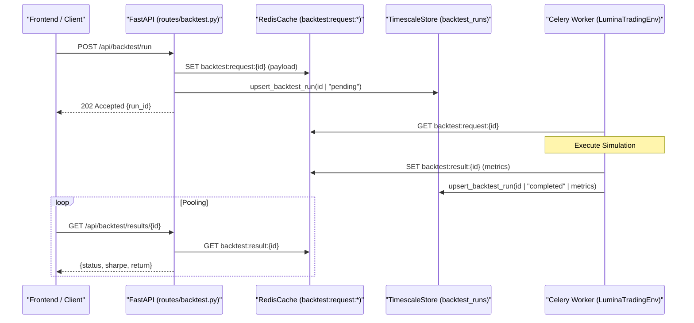

# Backtest, Arena, and Risk Routes

```mermaid
sequenceDiagram
    participant Frontend as "Frontend / Client"
    participant FastAPI as "FastAPI (routes/backtest.py)"
    participant RedisCache as "RedisCache (backtest:request:*)"
    participant TimescaleStore as "TimescaleStore (backtest_runs)"
    participant Celery as "Celery Worker (LuminaTradingEnv)"
    Frontend ->> FastAPI: POST /api/backtest/run
    FastAPI ->> RedisCache: SET backtest:request:{id} (payload)
    FastAPI ->> TimescaleStore: upsert_backtest_run(id | "pending")
    FastAPI -->> Frontend: 202 Accepted {run_id}
    Celery ->> RedisCache: GET backtest:request:{id}
    note over Celery: Execute Simulation
    Celery ->> RedisCache: SET backtest:result:{id} (metrics)
    Celery ->> TimescaleStore: upsert_backtest_run(id | "completed" | metrics)
    loop Pooling
        Frontend ->> FastAPI: GET /api/backtest/results/{id}
        FastAPI ->> RedisCache: GET backtest:result:{id}
        FastAPI -->> Frontend: {status, sharpe, return}
    end
```

Sources: [gh:backend/api/routes/backtest.py#L50-L75]
[gh:backend/api/routes/backtest.py#L93-L125]

##
