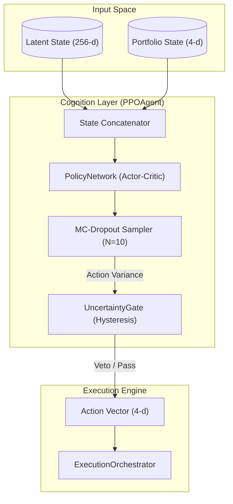
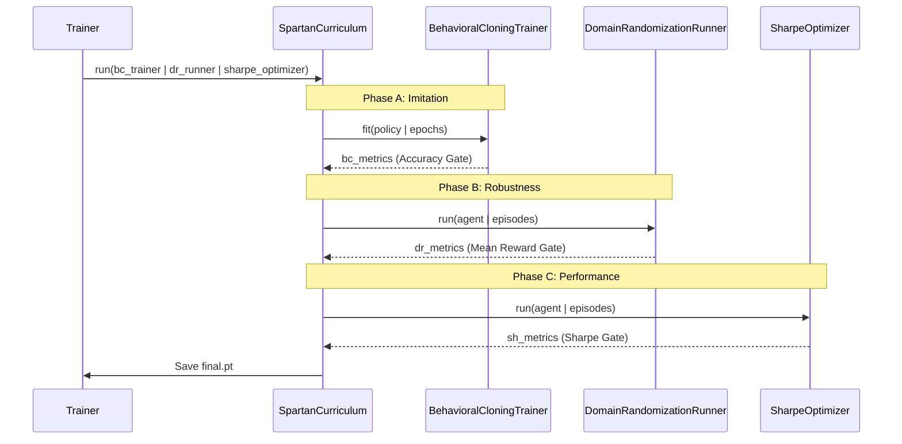

# Cognition Layer: RL Agent and Training

??? note "Relevant source files"

    - [gh:backend/cognition/agent/ppo_agent.py]
    - [gh:backend/cognition/training/curriculum.py]
    - [gh:backend/cognition/training/trainer.py]
    - [gh:backend/simulation/arena/schemas.py]

The **Cognition Layer** (Layer 3) is the decision-making engine of the Lumina V3
architecture. It consumes the 256-dimensional latent state produced by the
[Cross-Modal Attention and DeepFusionNexus](../fusion_layer/cross_modal.md) and
outputs a 4-dimensional continuous action vector. This layer implements the
Proximal Policy Optimization (PPO) algorithm, integrated with an epistemic
Uncertainty Gate to prevent execution during high-latent-volatility regimes.

The system is trained using the **Spartan Curriculum**, a multi-phase pipeline
that transitions from supervised imitation to robust reinforcement learning
under adversarial conditions.

### System Overview and Entity Mapping

The Cognition Layer bridges the high-dimensional embedding space (from
Perception and Fusion) to the discrete world of trade execution.

#### Cognition Logic to Code Mapping

| System COncept        | Code Entity         | File Path                                               |
| --------------------- | ------------------- | ------------------------------------------------------- |
| RL Agent              | `PPOAgent`          | [gh:backend/cognition/agent/ppo_agent.py#L135-L143]     |
| Polcity Network       | `PolicyNetwork`     | [gh:backend/cognition/agent/policy_network.py#L1-L10]   |
| Safety Gate           | `UncertaintyGate`   | [gh:backend/cognition/agent/uncertainty_gate.py#L1-L10] |
| Training Orchestrator | `SpartanCurriculum` | [gh:backend/cognition/training/curriculum.py#L33-L39]   |
| Action Vector         | `ACTION_DIM` (4)    | [gh:backend/config/constants.py#L54]                    |

### Decision Flow: Latent State to Action

The agent does not simply perform a forward pass. It uses Monte-Carlo (MC)
Dropout to estimate the confidence of its own policy before committing to an
action.

#### Agent Decision Process

1. **Input:** Receives a 260-d vector (256-d Fusion latent + 4-d Portfolio
   state) [gh:backend/cognition/training/trainer.py#L101-L106]
2. **Stochastic Sampling:** Performs $N$ MC-Dropout forward passes
   [gh:backend/cognition/agent/ppo_agent.py#L186-L192]
3. **Uncertainty Evaluation:** The `UncertaintyGate` compares the variance of
   these samples against $\tau_{high}/\tau_{low}$ thresholds
   [gh:backend/cognition/agent/uncertainty_gate.py#L1-L10]
4. **Veto Mechanism:** If uncertainty is too high, the agent returns a defensive
   "Hold/Neutral" action [gh:backend/cognition/agent/ppo_agent.py#L179-L182]

**Sources:** [gh:backend/cognition/agent/ppo_agent.py#L167-L182]
[gh:backend/cognition/training/trainer.py#L101-L112]

### [PPO Agent and Uncertainty Gate](ppo_agent.md)

The `PPOAgent` implements the clipped surrogate objective to ensure stable
policy updates. It utilizes a `RolloutBuffer` to store transitions including
states, actions, log-probs, and value estimates
[gh:backend/cognition/agent/ppo_agent.py#L90-L105]

- **Action Space:** A 4-D squashed-Gaussian space representing Direction,
  Urgency, Sizing, and Stop Distance
  [gh:backend/simulation/arena/schemas.py#L94]
- **Uncertainty Gate:** A safety wrapper that monitors epistemic uncertainty. It
  uses a hysteresis mechanism to prevent "flickering" vetoes in volatile
  markets.
- **Policy Architecture:** An Actor-Critic MLP that shares the initial feature
  extraction layers before branching into policy ($\pi$) and value ($V$) heads.

For a deep dive into the mathematical implementation and MC-Dropout logic, see
[**PPO Agent and Uncertainty Gate**](ppo_agent.md).

### [Spartan Curriculum: Training Pipeline](spartan.md)

The `SpartanCurriculum` is the master orchestrator for training the agent. It is
designed to solve the "cold start" problem of RL in financial markets by using
three distinct phases.

#### Training Phases

1. **Phase A: Behavioral Cloning (BC):** The agent learns to imitate an "Oracle"
   (Kelly-fractional MA crossover) to establish a baseline of sensible trading
   behavior [gh:backend/cognition/training/trainer.py#L12-L14]
2. **Phase B: Domain Randomization (DR):** THe agent is trained on "Warped"
   episodes (adversarial scenarios like Flash Crashes or Volatility Spikes) to
   build robustness [gh:backend/cognition/training/trainer.py#L15]
3. **Phase C: Sharpe Optimization:** The final fine-tuning phase where the
   reward function is strictly tied to the Sharpe Ratio and entropy is annealed
   to encourage exploitation [gh:backend/cognition/training/trainer.py#L16-L17]

#### Curriculum Pipeline Diagram

For details on the adversarial generators and the acceptance gates for each
phase, see [Spartan Curriculum: Training Pipeline](spartan.md).

**Sources:** [gh:backend/cognition/training/curriculum.py#L33-L67]
[gh:backend/cognition/training/trainer.py#L1-L31]
