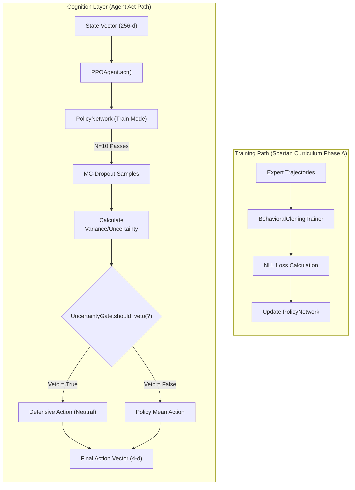
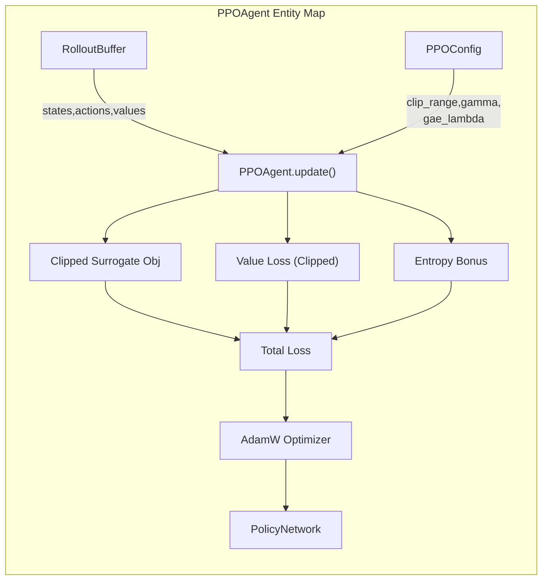

# PPO Agent and Uncertainty Gate

??? note "Relevant source files"

    - [gh:backend/cognition/agent/ppo_agent.py]
    - [gh:backend/cognition/training/behavioral_cloning.py]
    - [gh:backend/config/constants.py]
    - [gh:backend/simulation/arena/schemas.py]
    - [gh:notebooks/06_uncertainty_calibration.ipynb]

The Cognition Layer (Layer 3) of the Lumina V3 architecture is responsible for
high-level decision-making. It consumes the 256-d latent state from the Deep
Fusion Nexus and maps it to a 4-dimensional continuous action space. This layer
implements a **Proximal Policy Optimization (PPO)** agent equipped with an
**Uncertainty Gate**, a safety mechanism that monitors epistemic uncertainty via
MC-Dropout to prevent the agent from acting in regimes where the model is
"confused".

## PPO Agent Implementation

The `PPOAgent` class manages the policy network, the rollout buffer, and the
update logic. It follows the clipped surrogate objective approach to ensure
stable policy updates [gh:backend/cognition/agent/ppo_agent.py#L135-L152]

### Action Space

The agent operates in a 4-D squashed-Gaussian continuous action space
[gh:backend/config/constants.py#L26-L33]:

- **Action[0] (Direction):** Range [-1, 1], representing full short to full
  long.
- **Action[1] (Urgency):** Range [-1, 1], representing limit/maker to
  market/taker.
- **Action[2] (Sizing):** Range [-1, 1], representing the fraction of risk
  capital (Kelly-fraction multiplier).
- **Action[3] (Stop Distance):** Range [-1, 1], representing tight to wide stops
  in ATR multiples.

### Core Objectives and Loss

The agent optimizes a total function $L$ composed of three terms
[gh:backend/cognition/agent/ppo_agent.py#L17-L22]:

1. **Clipped Surrogate Objective ($L^{CLIP}$):** Limits the policy update step
   size to prevent catastrophic performance collapse
   [gh:backend/cognition/agent/ppo_agent.py#L6-L9]
2. **Value Loss ($L^{VF}$):** A clipped MSE loss between predicted values and
   GAE-calculated returns [gh:backend/cognition/agent/ppo_agent.py#L21-L22]
3. **Entropy Bonus ($H$):** Encourages exploration by penalizing overly
   deterministic policies [gh:backend/cognition/agent/ppo_agent.py#L72-L73]

### Advantage Estimation

The agent utilizes **Generalized Advantage Estimation (GAE)** to balance bias
and variance in the advantage signal
[gh:backend/cognition/agent/ppo_agent.py#L11-L16]

- **$\gamma$ (Discount Factor):** Set to 0.99 for an effective horizon of ~100
  steps [gh:backend/cognition/agent/ppo_agent.py#L59-L61]
- **$\lambda$ (GAE Lambda):** Set to 0.95 to provide a smooth trade-off between
  TD(0) and Monte Carlo returns
  [gh:backend/cognition/agent/ppo_agent.py#L62-L64]

### Training Flow and Early-Stop

During the update phase, the agent iterates over the `RolloutBuffer` for a fixed
number of epochs (default 10) [gh:backend/cognition/agent/ppo_agent.py#L76-L77]
It monitors KL divergence between the old and new policy; if the divergence
exceeds $1.5 \times \text{target_k}$ (default 0.2), the update is terminated
early to prevent policy drift [gh:backend/cognition/agent/ppo_agent.py#L82-L84]

**Sources:** [gh:backend/cognition/agent/ppo_agent.py#L1-164]
[gh:backend/config/constants.py#L24-L66]

## Uncertainty Gate

The `UncertaintyGate` is a "hysteresis-based" safety mechanism that sits outside
the core RL loop. It evaluates the model's confidence in its own predictions
using **Monte-Carlo (MC) Dropout**
[gh:backend/cognition/agent/ppo_agent.py#L27-L31]

### MC-Dropout Mechanism

When the agent's `act()` method is called, it performs $N=10$ forward passes
through the `PolicyNetwork` with dropout enabled
[gh:backend/cognition/agent/ppo_agent.py#L186-L191]

1. **Sampling:** $N$ action vectors are sampled.
2. **Variance Calculation:** The variance across these samples represents the
   epistemic uncertainty [gh:notebooks/06_uncertainty_calibration.ipynb]
3. **Normalization:** The variance is normalized to a $[0, 1]$ scalar
   [gh:notebooks/06_uncertainty_calibration.ipynb]

### Gate Logic: Hysteresis and Veto

The gate uses two thresholds, $\tau_{high}$ and $\tau_{low}$, to manage state
transitions:

- **Engagement:** If uncertainty exceeds $\tau_{high}$, the gate engages and
  replaces the agent's action with a **Defensive Action** (usually
  "Neutral/Cash").
- **Disengagement:** The gate only disengages when uncertainty falls bellow
  $\tau_{low}$. This prevents "flickering" in high-volatility regimes
  [gh:notebooks/06_uncertainty_calibration.ipynb]
- **Critical Veto:** If the gate vetoes 50 consecutive steps, it triggers a
  `CRITICAL` log entry, suggesting a potential data-feed failure or major
  distributional shift [gh:notebooks/06_uncertainty_calibration.ipynb]

### Calibration (Threshold Sweep)

Thresholds are picked using a precision/recall trade-off. The goal is to
maximize **Adversarial Recall** (catching 90% of adversarial regimes) while
maintaining **Coverage** (allowing the agent to act in 80% of healthy regimes)
[gh:notebooks/06_uncertainty_calibration.ipynb]

**Sources:** [gh:backend/cognition/agent/ppo_agent.py]
[gh:notebooks/06_uncertainty_calibration.ipynb]

## Architecture Layer Logic Flow

### Cognition Layer Logic Flow

This diagram bridges the conceptual "Uncertainty Gate" with the specific code
entities in the `ppo_agent.py` and `uncertainty_gate.py` files.

**Sources:** [gh:backend/cognition/agent/ppo_agent.py#L166-L192]
[gh:backend/cognition/training/behavioral_cloning.py#L85-L118]
[gh:notebooks/06_uncertainty_calibration.ipynb]

### Code Entity Space: PPO Update Loop

This diagram maps the mathematical PPO components to the specific class
attributes and methods.

**Sources:** [gh:backend/cognition/agent/ppo_agent.py#L51-L84]
[gh:backend/cognition/agent/ppo_agent.py#L90-L130]
[gh:backend/cognition/agent/ppo_agent.py#L135-L164]

## Behavioral Cloning (Phase A)

Before PPO training (Phase B), the `PolicyNetwork` is warm-started using
**Behavioral Cloning (BC)**. This prevents the agent from starting with random
noise and ensures it begins in a region of parameter space that produces
coherent actions [gh:backend/cognition/training/behavioral_cloning.py#L2-L8]

### Loss Function

BC minimizes the **Negative Log-Likelihood (NLL)** of expert actions under the
current policy [gh:backend/cognition/training/behavioral_cloning.py#L12-L16]:

$$
L(\theta)=-\mathbf{E}_{(s,\alpha^*)\sim D}[\log\pi_\theta(a^*|s)]
$$

This is preferred over MSE because it avoids **tanh saturation** at the action
boundaries ($\pm1$) and effectively **calibrates the variance** (log-std) of the
policy for future PPO exploration
[gh:backend/cognition/training/behavioral_cloning.py#L20-L29]

### Validation Metric

The Spartan Curriculum uses a `bc_min_accuracy` gate (default 0.55). Accuracy is
defined as the fraction of validation samples where the policy's deterministic
action has the same sign-pattern (directionality) as the expert across all 4
dimensions [gh:backend/cognition/training/behavioral_cloning.py#L39-L42]

**Sources:** [gh:backend/cognition/training/behavioral_cloning.py#L1-L43]
[gh:backend/cognition/training/behavioral_cloning.py#L85-L118]
