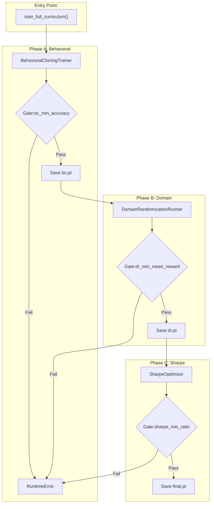
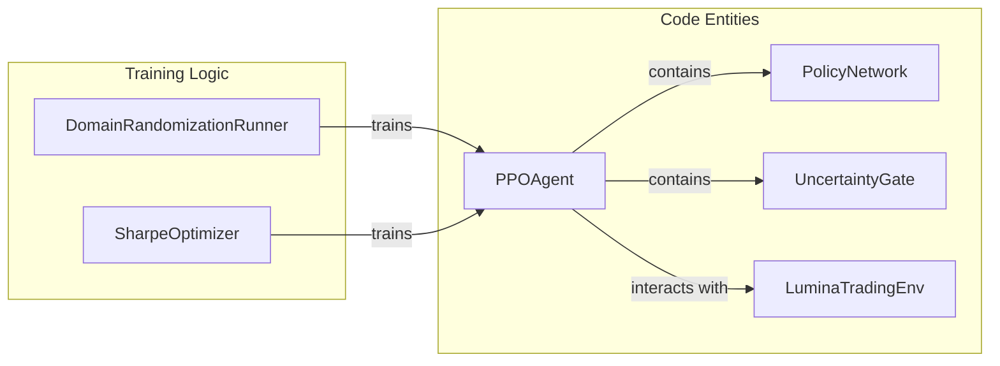

# Spartan Curriculum: Training Pipeline

??? note "Relevant source files"

    - [gh:backend/cognition/training/behavioral_cloning.py]
    - [gh:backend/cognition/training/curriculum.py]
    - [gh:backend/cognition/training/trainer.py]
    - [gh:backend/config/constants.py]
    - [gh:scripts/train.sh]
    - [gh:scripts/train_agent.py]
    - [gh:scripts/train_from_feedback.py]

The Spartan Curriculum is the master training protocol for the Lumina V3
cognitive agent. It employs a three-phase progression designed to move the
policy from initial random noise to robust, risk-adjusted trading performance.
The pipeline transitions from supervised imitation to reinforcement learning
under adversarial conditions, and finally to reward-shaping for financial
objectives [gh:backend/cognition/training/trainer.py#L9-L17]

## Pipeline Overview

The training process is orchestrated by the `SpartanCurriculum` class, which
enforces "acceptance gates" at the end of each phase. If a model fails to meet
the required performance threshold (e.g., minimum accuracy or Sharpe ratio), the
pipeline raises a `RuntimeError` and terminates to prevent the deployment of
sub-optimal models [gh:backend/cognition/training/curriculum.py#L34-L67]

### Training Orchestration Data Flow

This diagram illustrates how the `train_full_curriculum` function wires
components together and moves through the `Stage` sequence.

**Sources:** [gh:backend/cognition/training/trainer.py#L115-L130]
[gh:backend/cognition/training/curriculum.py#L40-L67]
[gh:scripts/train_agent.py#L70-L90]

## Phase A: Behavioral Cloning (BC)

Phase A warm-starts the `PolicyNetwork` by imitating an "oracle" policy. This
ensures that the agent begins Phase B within a region of parameter space that
already produces coherent trajectories, rather than exploring from random
weights [gh:backend/cognition/training/behavioral_cloning.py#L4-L8]

### Expert Demonstrations

The system supports three sources for expert data:

1. **Synthetic Oracle:** A Kelly-fraction MA-crossover policy used for
   cold-starts [gh:backend/cognition/training/trainer.py#L78-L112]
2. **Historical BC:** Real latent states pulled from `TimescaleDB` and processed
   through the `HistoricalEpisodeGenerator`
   [gh:backend/cognition/training/trainer.py#L146-L158]
3. **Feedback Dataset:** An `.npz` file containing expert corrections or
   high-quality historical trajectories, typically loaded via
   `scripts/train_from_feedback.py` [gh:scripts/train_from_feedback.py#L15-L31]

### Implementation Details

- **Loss Function:** Negative Log-Likelihood (NLL) of the expert action under
  the `SquashedGaussian` distribution
  [gh:backend/cognition/training/behavioral_cloning.py#L12-L29]
- **Validation:** A 90/10 chronological split is used to prevent temporal
  leakage [gh:backend/cognition/training/behavioral_cloning.py#L33-L37]
- **Accuracy Metric:** The fraction of validation samples where the policy's
  sign-pattern matches the expert's 4-D action vector
  [gh:backend/cognition/training/behavioral_cloning.py#L39-L42]

**Sources:** [gh:backend/cognition/training/behavioral_cloning.py#L85-L118]
[gh:backend/cognition/training/trainer.py#L136-L160]

## Phase B: Domain Randomization (DR)

Phase B subjects the BC-warmed agent to the Proximal Policy Optimization (PPO)
loop using a mix of clean and "warped" episodes. The goal is to build resilience
against extreme market regimes
[gh:backend/cognition/training/trainer.py#L15-L17]

### Adversarial Warping

The `AdversarialGenerator` wraps a standard episode to inject synthetic
anomalies such as `FLASH_CRASH`, `VOL_SPIKE`, or `SUSTAINED_CRASH`
[gh:backend/cognition/training/trainer.py#L175-L177] This forces the agent to
learn the `UncertaintyGate` logic and defensive positioning when the latent
state diverges from historical norms.

### Cognitive Entity Mapping

This diagram maps the training components to the core cognitive classes defined
in the system.

**Sources:** [gh:backend/cognition/training/trainer.py#L44-L53]
[gh:backend/cognition/training/curriculum.py#L34-L38]
[gh:backend/simulation/environments/base_env.py#L176]

## Phase C: Sharpe Optimization

The final phase optimizes the policy for risk-adjusted returns. The reward
function in `LuminaTradingEnv` is shaped by the Sharpe ratio, and the PPO
entropy bonus is typically annealed to encourage convergence on a stable
strategy [gh:backend/cognition/training/trainer.py#L16-L17]

- **Objective:** Maximize the `sharpe_min_ratio` (default threshold: -25.0 for
  the curriculum gate) [gh:backend/cognition/training/curriculum.py#L29]
- **Final Output:** The best-performing model is saved as
  `models/agent/final.pt` and is accompanied by a `manifest.json` containing
  metadata like the git commit hash and training configuration
  [gh:backend/cognition/training/trainer.py#L24-L30]

**Sources:** [gh:backend/cognition/training/curriculum.py#L60-L67]
[gh:backend/cognition/training/trainer.py#L115-L130]

## Training Infrastructure

### Checkpoint Layout

The curriculum maintains a specific directory structure for checkpoints within
`models/agent/`:

| File             | Description                                             |
| ---------------- | ------------------------------------------------------- |
| `bc.pt`          | Weights after Behavioral Cloning (Phase A)              |
| `dr.pt`          | Weights after Domain Randomization (Phase B)            |
| `best_sharpe.pt` | The highest-performing model found during Phase C       |
| `final.pt`       | The production-ready model (alias for `best_sharpe.pt`) |
| `manifest.json`  | Metadata including timestamp and git hash               |

**Sources:** [gh:backend/cognition/training/trainer.py#L24-L31]

### Execution Scripts

The pipeline is triggered via the following CLI tools:

- `scripts/train_agent.py`: The primary entry point for the full curriculum
  [gh:scripts/train_agent.py#L1-L21]
- `scripts/train.sh`: A shell wrapper using `uv run` for containerized
  environments [gh:scripts/train.sh#L1-L6]
- `scripts/train_from_feedback.py`: Specifically for retraining the policy from
  a master feedback dataset (`master_bc_dataset.npz`)
  [gh:scripts/train_from_feedback.py]

**Sources:** [gh:scripts/train_agent.py#L70-L90]
[gh:scripts/train_from_feedback.py#L15-L54]
