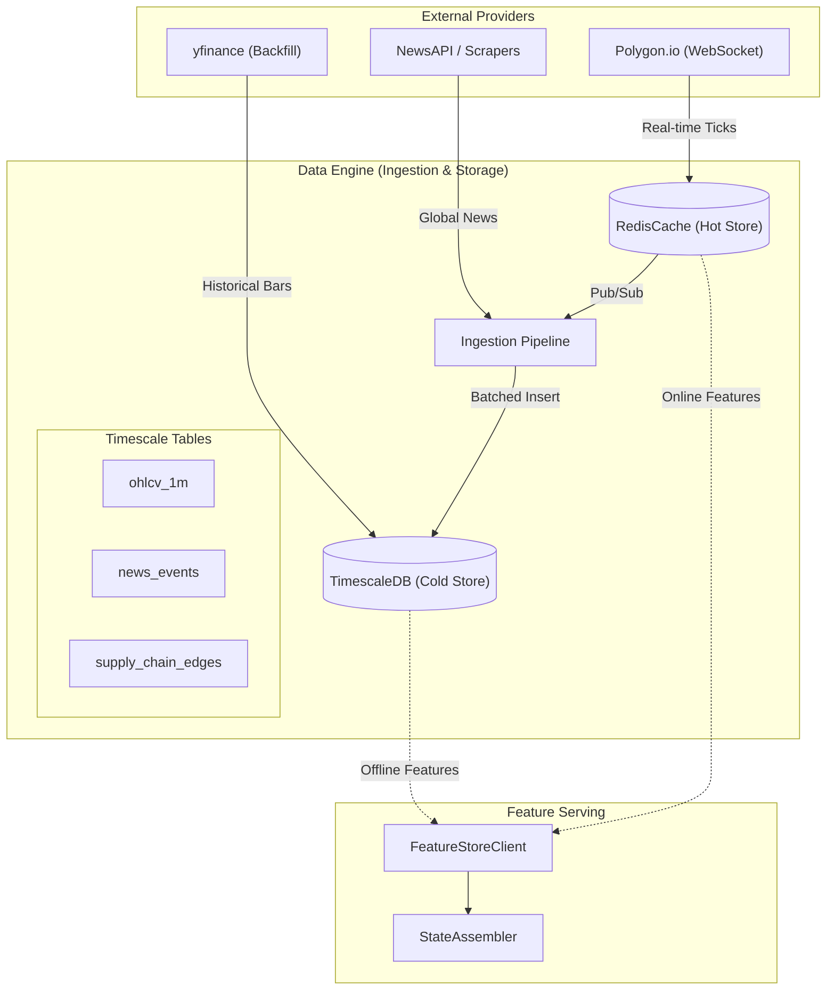
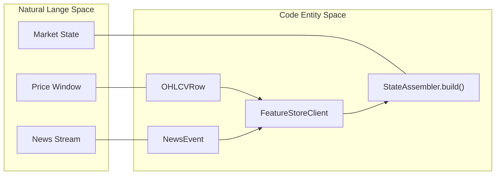

# Data Engine

??? note "Relevant source files"

    - [gh:backend/data_engine/collectors/yfinance_collector.py]
    - [gh:backend/data_engine/pipelines/ingestion.py]
    - [gh:backend/data_engine/storage/timescale.py]
    - [gh:backend/fusion/state_assembler.py]

The **Data Engine** is the foundational subsystem of Lumina V3, responsible for
the end-to-end lifecycle of market data, news events, and structural
relationship graphs. It bridges the gap between raw external data sources and
the high-performance feature requirements of the Chimera architecture's
perception layer.

The engine follows a tiered architecture:

1. **Ingestion Tier:** Multi-source collectors (WebSocket and REST) that stream
   raw data into a Redis-based hot-cache.
2. **Storage Tier:** A dual-backend strategy using **TimescaleDB** for
   high-fidelity historical persistence and **Redis** for sub-millisecond
   real-time access.
3. **Feature Tier:** An abstraction layer that serves normalized tensors to the
   encoders and maintains the "Online Feature Store" for live inference.

### System Data Flow

The following diagram illustrates how data flows from external providers through
the internal storage entities into the `StateAssembler`.

#### Data Ingestion and Feature Flow

Sources: [gh:backend/data_engine/pipelines/ingestion.py#L38-L75]
[gh:backend/data_engine/storage/timescale.py#L80-L128]
[gh:backend/fusion/state_assembler.py#L98-L124]

### Market Data Collectors

The system utilizes a modular collector strategy to balance cost and data
fidelity. While `Polygon.io` serves as the primary production source for
1-minute OHLCV and real-time news, the `YFinanceCollector` provides a zero-cost
alternative for Phase 1 testing and deep historical backfills of daily bars.

- **YFinanceCollector:** Implements a sparse-backfill strategy where daily bars
  are mapped to a single 1-minute record at 20:00 UTC to maintain schema
  compatibility with the `ohlcv_1m` hypertable
  [gh:backend/data_engine/collectors/yfinance_collector.py#L187-L202]
- **Polygon.io:** Handles high-frequency WebSocket streams for price ticks and
  news events.
- **Scrapers:** Specialized collectors for social sentiment and supply-chain
  relationship extraction.

For details, see [Market Data Collectors](market_collectors.md).

### Storage Backends: TimescaleDB and Redis

Lumina V3 employs a "Hot/Cold" storage split to satisfy both the low-latency
requirements of the RL agent and the high-throughput requirements of model
training.

| Backend     | Role                   | Key Entities / Tables                                                |
| ----------- | ---------------------- | -------------------------------------------------------------------- |
| TimescaleDB | Historical Persistence | `ohlcv_1m`, `news_events`, `supply_chain_edges`                      |
| Redis       | Real-time State        | `state:market:{ticker}`, `state:uncertainty:{ticker}`, `tick-latest` |

The `TimescaleStore` class manages an asynchronous connection pool via `asyncpg`
[gh:backend/data_engine/storage/timescale.py#L83-L96] providing optimized
methods for batch inserts and time-bucketed aggregation queries.

For details, see [Storage Backends: TimescaleDB and Redis](storage.md)

### Ingestion Pipeline and Feature Store

The `IngestionPipeline` acts as the system's "circulatory system", consuming
real-time updates from Redis Pub/Sub, performing data cleaning (e.g., news
deduplication via `compute_content_hash`), and flushing batched records to
TimescaleDB [gh:backend/data_engine/pipelines/ingestion.py#L19-L32]

The **Feature Store** abstracts the underlying databases, providing a unified
`FeatureStoreClient`. It operates in two modes:

1. **Online Mode:** Optimized for the `StateAssembler` to retrieve the latest
   embedding from Redis with sub-millisecond latency
   [gh:backend/fusion/state_assembler.py#L309-L312]
2. **Offline Mode:** Used during training to pull massive datasets from
   TimescaleDB hypertables.

#### Code Entity Mapping: Feature Serving

Sources: [gh:backend/data_engine/storage/timescale.py#L47-L68]
[gh:backend/fusion/state_assembler.py#L171-L182]
[gh:backend/data_engine/pipelines/ingestion.py#L37-L54]

For details, see [Ingestion Pipeline and Feature Store](ingestion.md)
