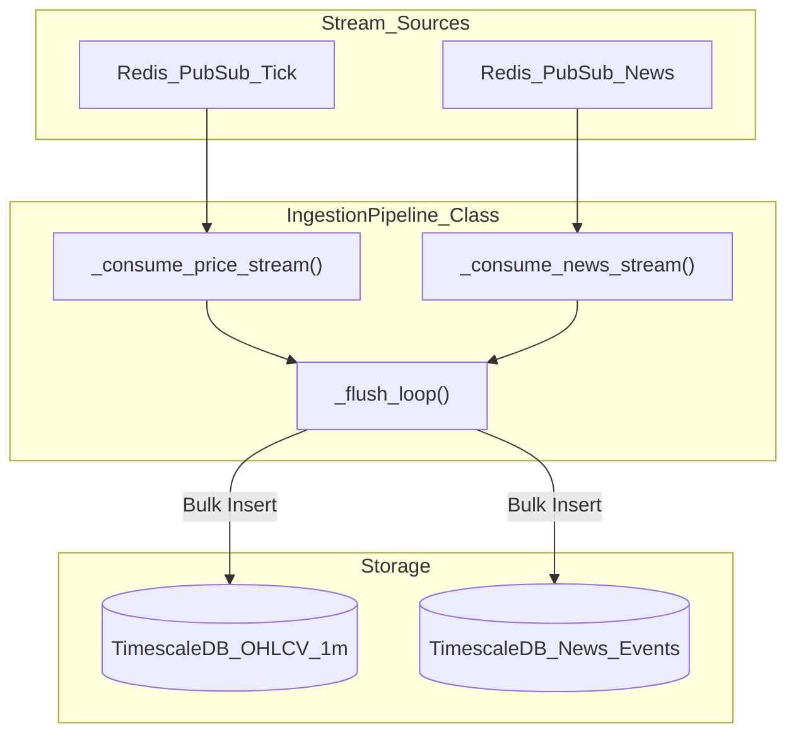
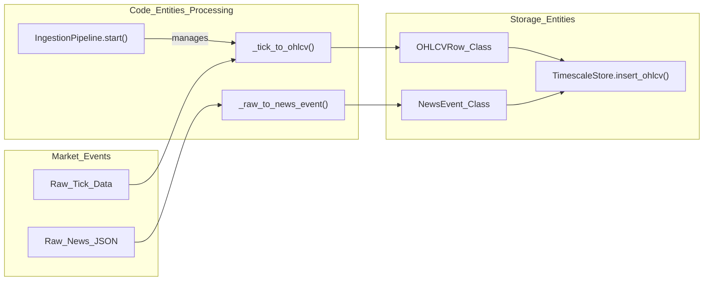
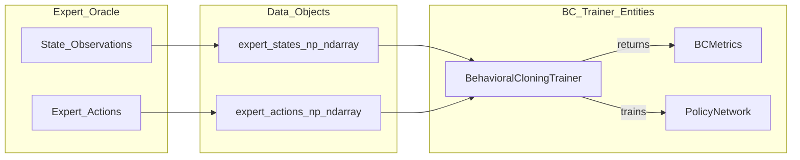

# Ingestion Pipeline and Feature Store

??? note "Relevant source files"

    - [gh:backend/cognition/training/behavioral_cloning.py]
    - [gh:backend/config/constants.py]
    - [gh:backend/data_engine/pipelines/ingestion.py]

The Ingestion Pipeline and Feature Store form the data backbone of the Lumina V3
system. This subsystem is responsible for the transition from raw market events
to structured, high-dimensional embeddings. It utilizes a dual-storage strategy
—**TimescaleDB** for historical depth and **Redis** for sub-millisecond online
retrieval— orchestrated by a batch-oriented ingestion pipeline with integrated
backpressure and cleaning logic.

## Ingestion Pipeline

The `IngestionPipeline` acts as the primary bridge between real-time data
streams (Redis Pub/Sub) and persistent storage (TimescaleDB hypertables). It is
designed to handle high-throughput market data while maintaining system
stability through Prometheus-monitored metrics and backpressure mechanisms.

### Data Flow and Cleaning

The pipeline consumes data from two primary streams:

1. **Price Stream:** Tick data subscribed via `_consume_price_stream`
   [gh:backend/data_engine/pipelines/ingestion.py#L100-L122]
2. **News Stream:** Global news events via `_consume_news_stream`
   [gh:backend/data_engine/pipelines/ingestion.py#L124-L158]

Incoming data is buggered and periodically flushed to TimescaleDB. News data
undergoes specific cleaning steps, including text normalization via
`clean_news_text` and deduplication using content using content hashes
[gh:backend/data_engine/pipelines/ingestion.py#L19-L23]

### Backpressure and Metrics

To prevent memory exhaustion during volatility spikes, the pipeline implements a
backpressure threshold defined by `INGESTION_BACKPRESSURE_FACTOR`
[gh:backend/data_engine/pipelines/ingestion.py#L49-L51] When buffers exceed this
threshold, ingestion pauses, and a Prometheus alert is incremented
[gh:backend/data_engine/pipelines/ingestion.py#L105-L112]

#### Ingestion Pipeline Architecture

**Sources:** [gh:backend/data_engine/pipelines/ingestion.py#L37-L75]
[gh:backend/data_engine/pipelines/ingestion.py#L100-L155]

## Feature Store Abstraction

The Feature Store provides a unified interface for the Perception Layer
(Encoders) to access features without needing to know the underlying storage
implementation. It is split into **Online** and **Offline** components.

### Feature Definitions (`FeatureDef`)

Every feature in the system is registered in a registry using `FeatureDef`. This
defines the feature's name, its dimensionality (e.g., `DIM_PRICE=128`), and its
TTL (Time-To-Live) [gh:backend/config/constants.py#L56-L66]

### Online vs. Offline Storage

- **OnlineFeatureStore:** Optimized for sub-millisecond reads during live
  inference. It retrieves embeddings directly from Redis using keys prefixed by
  ticker and feature type.
- **OfflineFeatureStore:** Used for training and backtesting. It queries
  TimescaleDB hypertables to reconstruct historical feature vectors.

#### Feature Space Mapping

| Feature Category | Dimension | Source Entity       | Storage Key/Table           |
| ---------------- | --------- | ------------------- | --------------------------- |
| Price            | 128       | `TemporalEncoder`   | `feature:price:{ticker}`    |
| Semantic         | 64        | `SemanticEncoder`   | `feature:semantic:{ticker}` |
| Structural       | 32        | `StructuralEncoder` | `feature:graph:{ticker}`    |
| Fused            | 224       | `DeepFusionNexus`   | `state:fused:{ticker}`      |

**Sources:** [gh:backend/config/constants.py#L54-L87]
[gh:backend/data_engine/pipelines/ingestion.py#L31-L32]

## Embedding Ingestion and Serving

The pipeline ensures that embeddings generated by the Perception Layer encoders
are immediately available to the `StateAssembler` for the Fusion Layer.

### Data Lifecycle

1. **Ingestion:** `IngestionPipeline` moves raw data to TimescaleDB
   [gh:backend/data_engine/pipelines/ingestion.py#L173-L180]
2. **Encoding:** Encoders (TFT, FinBERT, GATv2) read windows of data (e.g.,
   `OHLCV_WINDW_MINUTES = 240`) [gh:backend/config/constants.py#L92-L93]
3. **Persistence:** The resulting embeddings are written to the
   `OnlineFeatureStore` (Redis).
4. **Inference:** The `StateAssembler` reads these embeddings to form the 256-d
   latent state for the RL agent [gh:backend/config/constants.py#L81-L87]

#### Natural Language to Code Entity Space: Data Ingestion

**Sources:** [gh:backend/data_engine/pipelines/ingestion.py#L114-L142]
[gh:backend/data_engine/storage/timescale.py#L112-L128]

## Behavioral Cloning (BC) Data Ingestion

As part of the **Spartan Curriculum**, the ingestion system also handles the
persistence of expert trajectories for Phase A training. The
`BehavioralCloningTrainer` consumes `expert_states` and `expert_actions`
[gh:backend/cognition/training/behavioral_cloning.py#L85-L100] These pairs are
stored as `.npz` files or in specific TimescaleDB tables to allow the policy
network to "warm-start" by imitating an oracle
[gh:backend/cognition/training/behavioral_cloning.py#L2-L8]

#### Natural Language to Code Entity Space: BC Pipeline

**Sources:** [gh:backend/cognition/training/behavioral_cloning.py#L59-L134]
