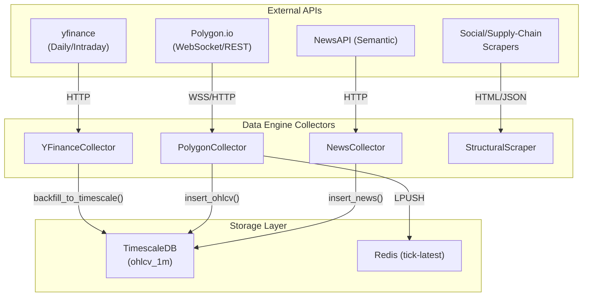
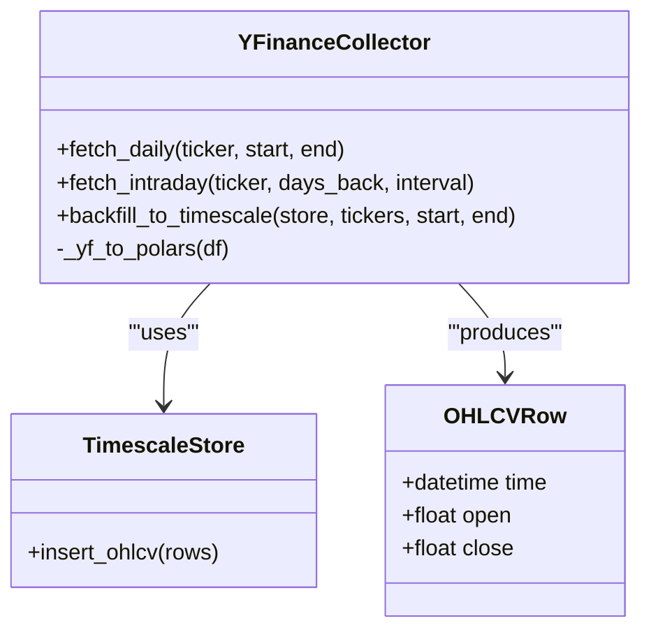

# Market Data Collectors

??? note "Relevant source files"

    - [gh:backend/data_engine/__init__.py]
    - [gh:backend/data_engine/collectors/__init__.py]
    - [gh:backend/data_engine/collectors/base_collector.py]

The **Market Data Collectors** subsystem is responsible for the ingestion of raw
financial data, news sentiment, and structural supply-chain information into the
Lumina V3 platform. It utilizes a multi-source strategy to balance cost and data
fidelity, transitioning from free historical backfills in Phase 1 to
high-frequency WebSocket streams for live operations.

## Architecture Overview

The collectors are designed as modular adapters that normalize heterogeneous
data sources into the system's canonical formats (e.g., `OHLCVRow` for price
data).

### Data Flow Diagram: Ingestion to Storage

The following diagram illustrates how different collectors interact with
external APIs and the internal `TimescaleStore`.

#### Collector Data Flow

Sources: [gh:backend/data_engine/collectors/yfinance_collector.py#L48-L61]
[gh:backend/data_engine/collectors/yfinance_collector.py#L179-L202]

## YFinanceCollector (Phase-1 Strategy)

The `YFinanceCollector` serves as the primary data source for the Phase-1
milestone. It provides zero-cost access to historical OHLCV data, allowing for
the validation of the training pipeline before commiting to paid Polygon.io
subscriptions [gh:backend/data_engine/collectors/yfinance_collector.py#L5-L13]

### Implementation Details

The collector is a synchronous wrapper around the `yfinance` library. Since
`yfinance` is not natively asynchronous, calls are offloaded to a thread
executor when integrated into the system's event loop
[gh:backend/data_engine/collectors/yfinance_collector.py#L62-L66]

- `fetch_daily(ticker, start, end)`: Fetches daily bars. Used for long-term
  historical backfills where intraday precision is not required
  [gh:backend/data_engine/collectors/yfinance_collector.py#L138-L150]
- `fetch_intraday(ticker, days_back, interval)`: Fetches 1-minute resolution
  data, limited by Yahoo Finance to the last 7 days
  [gh:backend/data_engine/collectors/yfinance_collector.py#L154-L175]
- `_yf_to_polars(df)`: Normalizes the raw Pandas DataFrame from `yfinance` into
  a canonical Polars DataFrame with UTC-localized timestamps and standard column
  names (`time`, `open`, `high`, `low`, `close`, `volume`)
  [gh:backend/data_engine/collectors/yfinance_collector.py#L69-L134]

### Sparse-Backfill Strategy

To maintain compatibility with the 1-minute resolution requirements of the
`Temporal Fusion Transformer (TFT)`, the collector implements a
"sparse-backfill" strategy. When backfilling historical daily data, it maps each
daily bar to a single 1-minute bar at 20:00 UTC (NYSE close) withing the
`ohlcv_1m` hypertable
[gh:backend/data_engine/collectors/yfinance_collector.py#L187-L191]

Sources: [gh:backend/data_engine/collectors/yfinance_collector.py#L17-L41]

## Collector Implementation Mapping

The following diagram bridges the conceptual "Collectors" to the specific
classes and methods implemented in the codebase.

#### Code Entity Mapping

Sources: [gh:backend/data_engine/collectors/yfinance_collector.py#L61-L68]
[gh:backend/data_engine/collectors/yfinance_collector.py#L179-L181]
[gh:backend/data_engine/storage/timescale.py#L58]

## Rate Limiting and Robustness

To avoid IP bans and API throttling, the collectors implement explicit rate
limiting and defensive error handling:

| Feature            | Implementation               | Purpose                                                                                             |
| ------------------ | ---------------------------- | --------------------------------------------------------------------------------------------------- |
| Backfill Throttle  | `rate_limit_seconds=0.5`     | Prevents yfinance from flagging burst   requests during multi-ticker backfills                  |
| Schema Enforcement | `_yf_to_polars`              | Ensures consisten types (e.g., `pl.Datatime`,   `pl.Float64`) before insertion into TimescaleDB |
| TZ Normalization   | `dt.tz_convert("UTC")`       | Standardizes all incoming timestamps to UTC   to prevent alignment errors in the Feature Store  |
| Thread Safety      | `asyncio.get_running_loop()` | Wraps synchronous I/O in `run_in_executor`   to prevent blocking the main event loop            |

Sources: [gh:backend/data_engine/collectors/yfinance_collector.py#L185-L205]
[gh:backend/data_engine/collectors/yfinance_collector.py#L69-L134]
