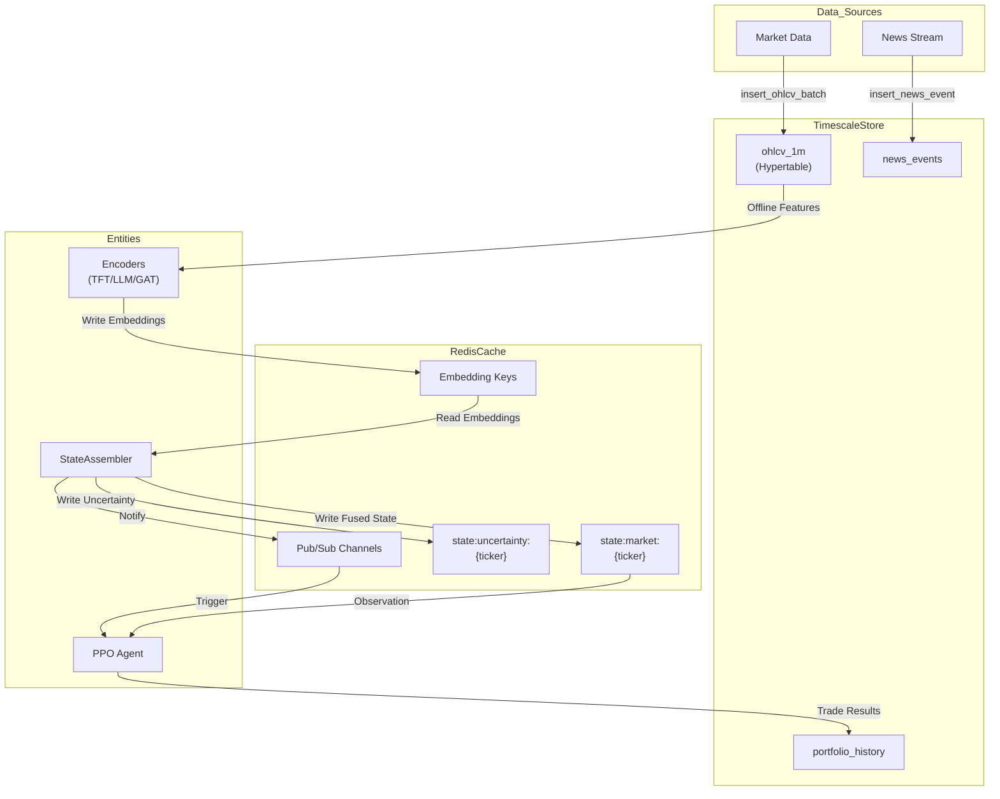
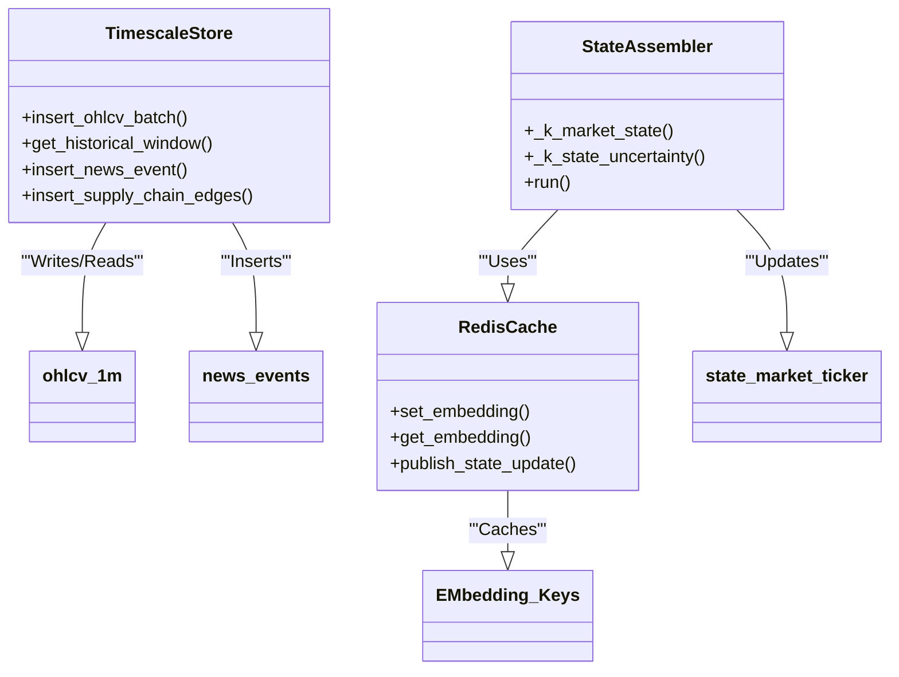

# Storage Backends: TimescaleDB and Redis

??? note "Relevant source files"

    - [gh:.dockerignore]
    - [gh:alembic/versions/003_add_portfolio_and_backtest.py]
    - [gh:backend/data_engine/storage/__init__.py]
    - [gh:backend/data_engine/storage/timescale.py]
    - [gh:backend/fusion/state_assembler.py]
    - [gh:tests/data_engine/storage/test_timescale.py]

Lumina V3 utilizes a dual-storage strategy to balance the high-throughput,
low-latency requirements of real-time trading with the complex, time-series
analytical needs of historical backtesting and feature engineering.

The system partitions data between **TimescaleDB** (the "Cold Store" and
Analytical Engine) and **Redis** (the "Hot Store" and IPC Backbone).

### 1. TimescaleDB: The Analytical Cold Store

TimescaleDB acts as the primary persistence layer. It is used for storing
high-resolution OHLCV data, unstructured news events, supply-chain relationship
graphs and simulation results. The implementation leverages **Hypertables** to
automatically partition data by time, ensuring performance remains stable as the
dataset grows into the hundreds of millions of rows
[gh:alembic/versions/003_add_portfolio_and_backtest.py#L26]

#### Key Tables and Hypertables

| Table Name           | Type       | Purpose                      | Key Columns                                   |
| -------------------- | ---------- | ---------------------------- | --------------------------------------------- |
| `ohlcv_1m`           | Hypertable | 1-minute price bars          | `time`, `ticker`, `open`, `close`, `volume`   |
| `news_events`        | Standard   | Semantic news data           | `time`, `tickers`, `headline`, `content_hash` |
| `supply_chain_edges` | Standard   | Corporate relationship graph | `source_ticker`, `target_ticker`, `weight`    |
| `portfolio_history`  | Hypertable | Equity/Cash tracking         | `time`, `equity`, `cash`                      |
| `backtest_runs`      | Standard   | Metadata for backtest jobs   | `run_id`, `status`, `sharpe`                  |

#### TimescaleStore Gateway

The `TimescaleStore` class in `backend/data_engine/storage/timescale.py`
provides an asynchronous interface using `asyncpg`
[gh:backend/data_engine/storage/timescale.py#L80-L83] It manages a connection
pool and provides high-level methods for batch insertion and window-based
retrieval.

- **Batch Insertion:** `insert_ohlcv_batch` handles bulk inserts with
  `ON CONFLICT DO NOTHING` to prevent duplicates during overlapping backfills
  [gh:backend/data_engine/storage/timescale.py#L112-L128]
- **Time Bucketing:** `get_historical_window` utilizes TimescaleDB's
  `time_bucket` function to aggregate 1m data into 5m, 1h, or 1d intervals
  on-the-fly.

**Sources:** [gh:backend/data_engine/storage/timescale.py#L1-L313]
[gh:alembic/versions/003_add_portfolio_and_backtest.py#L17-L42]

### 2. Redis: The High-Speed Hot Store

Redis serves as the low-latency state-sharing mechanism between the Perception,
Fusion, and Cognition layers. It operates as an asynchronous cache for
embeddings and a Pub/Sub message bus for real-time updates.

#### Data Flow and Key Spaces

Redis handles four primary data types:

1. **Modality Embeddings:** Vector outputs from the TFT (Temporal), FinBERT
   (Semantic), and GAT (Structural) encoders.
2. **Market State:** The 256-d fused latent vector produced by the
   `DeepFusionNexus`.
3. **Deduplication:** Content hashes for news events to prevent redundant
   procesing [gh:backend/data_engine/storage/timescale.py#L168-L188]
4. **Pub/Sub:** Channels like `channel:state.updates` notify the RL Agent when a
   new fused state is ready [gh:backend/fusion/state_assembler.py#L86]

#### State Assembler Integration

The `StateAssembler` is the primary consumer and producer of Redis-backed state
data. It reads individual embeddings and writes the final market state to
specific keys:

- `state:market:{ticker}`: The 256-d fused vector
  [gh:backend/fusion/state_assembler.py#L93-L94]
- `state:uncertainty:{ticker}`: The MC-Dropout variance estimate
  [gh:backend/fusion/state_assembler.py#L101-L102]
- `state:attention:{ticker}`: Cross-modal attention weights
  [gh:backend/fusion/state_assembler.py#L97-L98]

**Sources:** [gh:backend/fusion/state_assembler.py#L1-L142]
[gh:backend/data_engine/storage/timescale.py#L59-L68]

### 3. Dual-Storage Interaction Diagram

The following diagram illustrates how data flows between the two storage
backedns and the core system entities.

#### Data Persistence and IPC Flow

**Sources:** [gh:backend/fusion/state_assembler.py#L83-L142]
[gh:backend/data_engine/storage/timescale.py#L112-L128]
[gh:backend/data_engine/storage/timescale.py#L168-L188]

### 4. Database Migrations (Alembic)

The schema evolution is managed via Alembic, with a focus on partitioning and
indexing for time-series performance.

#### Migration History

- **Revision 001:** Initial of the core trading schemas. Established the
  `ohlcv_1m` hypertable and configured compression policies.
- **Revision 002:** Added `arena_tables` for the Spartan Arena simulation runner
  to persist multi-trajectory results and adversarial scenario metadata.
- **Revision 003:** Implemented `portfolio_history` and `backtest_runs`.
  - `portfolio_history` is a hypertable with a `chunk_time_interval` of 1 day
      to optimize equity curve queries
      [gh:alembic/versions/003_add_portfolio_and_backtest.py#L19-L27]
  - `backtest_runs` includes fields for Sharpe ratio, Max Drawdown, and Total
      Return [gh:alembic/versions/003_add_portfolio_and_backtest.py#L31-L40]

**Sources:** [gh:alembic/versions/003_add_portfolio_and_backtest.py#L1-L45]

### 5. Implementation Mapping: Code to Storage

This diagram maps specific code classes and functions to the storage structures
they manipulate.

#### Code Entity to Storage Mapping

**Sources:** [gh:backend/data_engine/storage/timescale.py#L80-L130]
[gh:backend/fusion/state_assembler.py#L86-L111]
[gh:backend/fusion/state_assembler.py#L125-L132]
