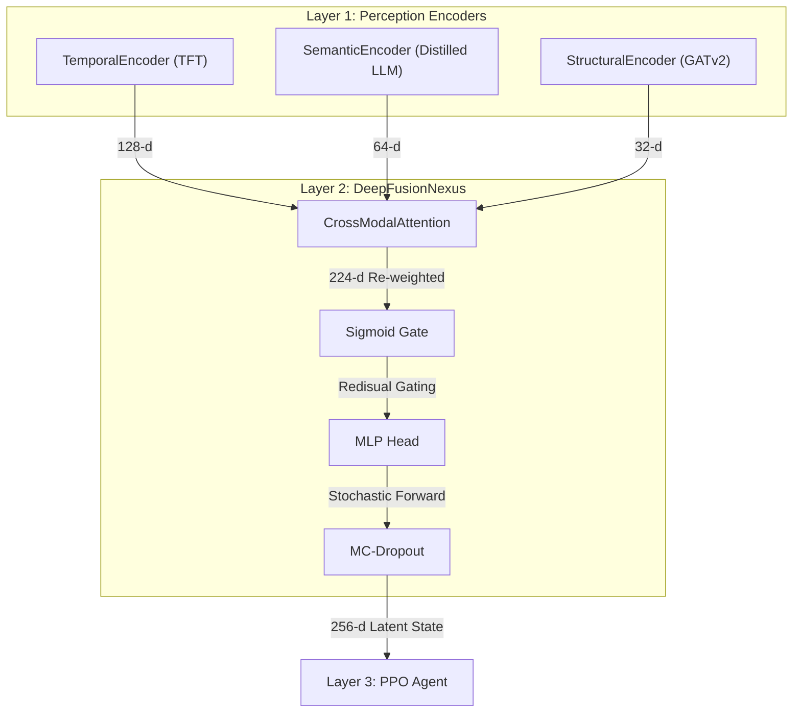
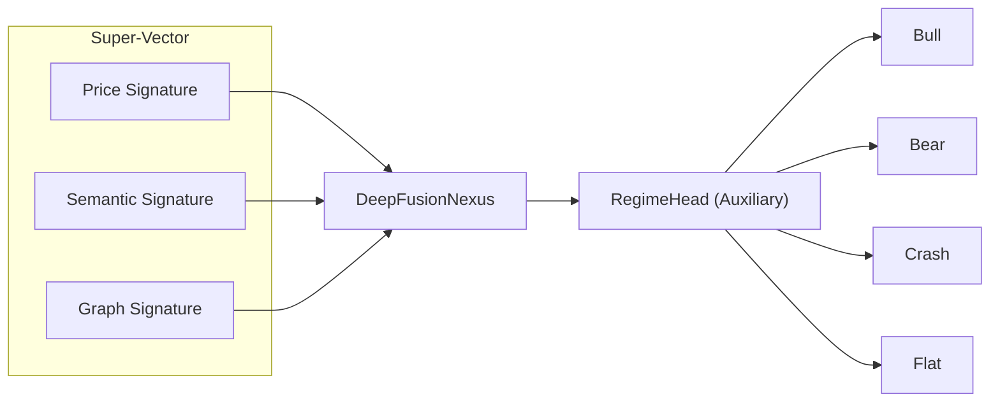

# Cross-Modal Attention and DeepFusionNexus

??? note "Relevant source files"

    - [gh:backend/api/schemas.py]
    - [gh:backend/fusion/cross_attention.py]
    - [gh:backend/fusion/nexus.py]
    - [gh:backend/fusion/parity_check.py]
    - [gh:notebooks/05_fusion_parity_check.ipynb]

The **DeepFusionNexus** (often referred to as the "Thamalus" of the Chimera
architecture) is the second layer of the Lumina V3 system
[gh:backend/fusion/nexus.py#L2] It is responsible for integrating three
disparate modality embeddings, Temporal (Price), Semantic (News), and Structural
(Graph), into a unified 256-dimensional latent state that serves as the
observation vector for the RL Agent [gh:backend/fusion/nexus.py#L6-L13]

## Architectural Overview

The Nexus operates on a "Super-Vector" approach. Instead of projecting all
modalities to a shared dimension first, the raw embeddings are concatenated to
preserve their specific information capacities before being processed by a
Cross-Modal Attention block [gh:backend/fusion/cross_attention.py#L6-L11]

### Data Flow and Dimensionality

The fusion process follows a strict dimensional contract:

1. **Input:** Price (128-d) + Semantic (64-d) + Graph (32-d) = **224-d
   Super-Vector** [gh:backend/fusion/cross_attention.py#L11]
2. **Attention:** Multi-head self-attention re-weights the streams
   [gh:backend/fusion/cross_attention.py#L13]
3. **Gating:** A learned sigmoid mask scales the re-weighted vector
   [gh:backend/fusion/nexus.py#L58-L61]
4. **Projection:** A deepened MLP projects the 224-d vector to the final **256-d
   Latent State** [gh:backend/fusion/nexus.py#L63-L73]

### DeepFusionNexus System Context

The following diagram illustrates how the code entities within the
`backend.fusion` module bridge the gap between raw encoder outputs and the RL
policy input.

#### DeepFusionNexus Data Flow

**Sources:** [gh:backend/fusion/cross_attention.py#L49-L118]
[gh:backend/fusion/nexus.py#L37-L74]

## Cross-Modal Attention (Tsai et al. 2019)

The `CrossModalAttention` block implements a variation of the Multimodal
Transformer [gh:backend/fusion/cross_attention.py#L35-L36] Because the input
dimensions differ (128, 64, 32), the block uses interanl "read" and "write"
projections to allow a standard Transformer encoder to operate on the streams as
a sequence of three tokens [gh:backend/fusion/cross_attention.py#L19-L23]

### Implementation Details

- **Read Projections:** Linear layers (`read_price`, `read_semantic`,
  `read_graph`) project each modality to a shared `d_attn` space (default 512)
  [gh:backend/fusion/cross_attention.py#L83-L86]
- **Modality Embeddings:** A learned parameter `modality_embed` is added to the
  tokens to identify the source stream (Price vs. News vs. Graph)
  [gh:backend/fusion/cross_attention.py#L112]
- **Write Projections:** After passing through `nn.TransformerEncoderLayer`
  [gh:backend/fusion/cross_attention.py#L96] tokens are projected back to their
  native dimensions [gh:backend/fusion/cross_attention.py#L89-L91]
- **Residual Connection:** The re-weighted output is added to the original input
  embeddings (native-space residual)
  [gh:backend/fusion/cross_attention.py#L170-L172]

**Sources:** [gh:backend/fusion/cross_attention.py#L49-L118]

## Gating and Uncertainty Estimation

### Sigmoid Gating Mechanism

After attention, the Nexus applies a learned soft mask. The `gate` is a linear
layer followed by a `Sigmoid` activation [gh:backend/fusion/nexus.py#L58-L61] It
produces values in $(0,1)$ that are used for residual gating:

$$
\text{output}=\text{fused}\times (1.0+\text{gate})
$$

This ensures that the model can up-weight critical regions of the super-vector
without the risk of the signal vanishing. [gh:backend/fusion/nexus.py#L98-L99]

### MC-Dropout Uncertainty

The Nexus provides a method `encode_with_uncertainty` to estimate **epistemic
uncertainty** [gh:backend/fusion/nexus.py#L110]

1. It triggers $N$ stochastic forward passes (default `MC_DROPOUT_SAMPLES`) with
   dropout enabled [gh:backend/fusion/nexus.py#L126-L131]
2. It calculates the `mean` and `std` across these samples
   [gh:backend/fusion/nexus.py#L133]
3. The `std` represents the fusion-level uncertainty, which the `StateAssembler`
   uses to trigger the agent's Uncertainty Gate
   [gh:backend/fusion/nexus.py#L18-L21]

**Sources:** [gh:backend/fusion/nexus.py#L110-L133]

## Training and Parity Check

### Nexus Regime Warmup

The Nexus weights are given a supervised "warmup" via the `DailyNexusDemoModel`
wrapper [gh:backend/simulation/article_simulation.py#L180-L192] which attaches
an auxiliary `regime_head` to train the Nexus to classify market regimes (Crash,
Bear, Flat, Bull) based on the signatures in the super-vector
[gh:backend/simulation/article_simulation.py#L61] Driven by `train_daily_nexus`
[gh:backend/simulation/article_simulation.py#L521] this ensures the RL agent
receives a stable representation from the start of its training.

#### Regime Classification Task

**Sources:** [gh:backend/simulation/article_simulation.py#L1173-L1175]
[gh:notebooks/05_fusion_parity_check.ipynb]

### Parity Check (V2 vs V3)

A parity check is conducted to ensure the Chimera (V3) architecture outperforms
the simple MLP/LSTM baseline (V2) [gh:notebooks/05_fusion_parity_check.ipynb]

- **Criterion:** V3 Sharpe Ratio $\ge$ V2 Sharpe Ratio on held-out data
  [gh:notebooks/05_fusion_parity_check.ipynb]
- **Regime Signatures:** Synthetic data is generated where specific regimes have
  unique biases in one modality (e.g., "Crash" is dominated by the Graph signal)
  [gh:notebooks/05_fusion_parity_check.ipynb]
- **Results:** The Nexus converges over 50 epochs, achieving lower MSE loss and
  higher regime classification accuracy than the baseline
  [gh:notebooks/05_fusion_parity_check.ipynb]

**Sources:** [gh:notebooks/05_fusion_parity_check.ipynb]
[gh:backend/fusion/parity_check.py#L99-L185]
