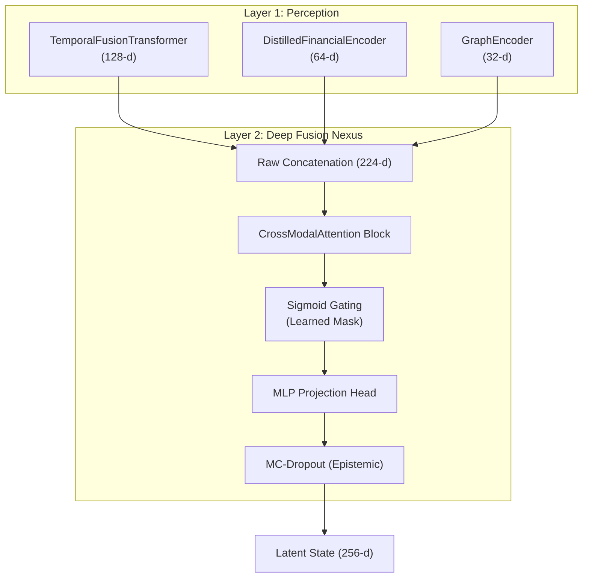
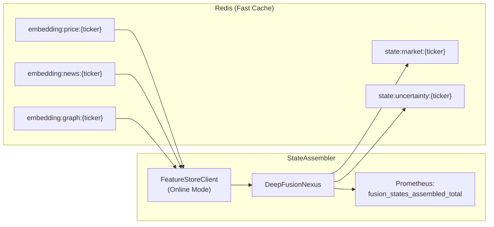

# Fusion Layer: Deep Fusion Nexus

??? note "Relevant source files"

    - [gh:backend/data_engine/storage/timescale.py]
    - [gh:backend/fusion/cross_attention.py]
    - [gh:backend/fusion/nexus.py]
    - [gh:backend/fusion/state_assembler.py]
    - [gh:notebooks/05_fusion_parity_check.ipynb]

The **Fusion Layer** (Layer 2) serves as the "Thalamus" of the Lumina V3
architecture. Its primary role is to ingest the high-dimensional embeddings
produced by the three modality-specific encoders and synthesize them into a
unified, 256-dimensional **Latent State Representation**. This fused state
provides the [Cognition Layer: RL Agent and Training](cognition_layer/index.md)
with a coherent view of the market, resolving conflicts between price action,
news sentiment, and structural supply-chain pressures.

The core of this layer is the `DeppFusionNexus`
[gh:backend/fusion/nexus.py#L37-L48] which orchestrates cross-modal attention,
gating, and latent projection.

### Architectural Overview

The fusion process follows a strict "Super-Vector" concatenation strategy.
Rather than projecting embeddings to a shared dimension immediately, the system
preserves the information capacity of each modality (Price: 128-d, Semantic:
64-d, Structural: 32-d) by raw-concatenating them into a 224-d vector
[gh:backend/fusion/cross_attention.py]

#### Data Flow: From Encoders to Latent State

The following diagram illustrates how code entities withing the `backend/fusion`
module transform modality-specific inputs into the final state consumed by the
agent.

##### Figure 1: Deep Fusion Nexus Transformation Pipeline

Sources: [gh:backend/fusion/cross_attention.py#L6-L15]
[gh:backend/fusion/nexus.py#L4-L13] [gh:backend/fusion/nexus.py#L58-L73]

### Key Components

#### 1. Cross-Modal Attention (DeepFusionNexus)

The `CrossModalAttention` block implements a multi-head self-attention mechanism
where each modality is treated as a separate "token"
[gh:backend/fusion/cross_attention.py#L25-L31] This allows the model to
dynamically re-weight stream; for instance, prioritizing the Semantic (news)
stream during an earnings call while down-weighting Price noise
[gh:backend/fusion/cross_attention.py#L28-L30]

- **Mechanism:** Uses per-modality "read" and "write" projections to manage
  dimension mismatches inside the attention space
  [gh:backend/fusion/cross_attention.py#L19-L22]
- **Gating:** A sigmoid gate `self.gate` allows the model to up- or two
  down-weight specific regions of the super-vector
  [gh:backend/fusion/nexus.py#L58-L61]
- **Uncertainty:** The Nexus uses MC-Dropout to estimate **epistemic
  uncertainty** by running multiple stochastic forward passes
  [gh:backend/fusion/nexus.py#L110-L123]

For details on the mathematical implementation and the training parity check,
see [Cross-Modal Attention and DeepFusionNexus](cross_modal.md).

#### 2. State Assembler

The `StateAssembler` is the operational service that bridges the Feature Store
and the Cognition Layer. It operates in two distinct modes:

- **Live Mode:** Consumes embeddings from Redis at a 1-Hz cadence and publishes
  the 256-d state back to Redis [gh:backend/fusion/state_assembler.py#L108-L110]
- **Arena Mode:** Wires encoders (`TemporalFusionTransformer`,
  `DistilledFinancialEncoder`, `GraphEncoder`) directly to the Nexus for inline
  execution during simulations [gh:backend/fusion/state_assembler.py#L146-L170]

The `StateAssembler` also captures `RawAttributionTensors` (byproducts of the
forward pass like `cross_modal_weights` and `vsn_weights_by_feature`) which are
used for Explainable AI (XAI) [gh:backend/fusion/state_assembler.py#L40-L66]

For details on the service lifecycle and Redis integration, see
[State Assembler](state_assembler.md).

#### System Integration and State Storage

The Fusion Layer interacts heavily with `RedisCache` for real-time state
persistence. The following diagram shows how the `StateAssembler` maps system
components to specific Redis keys and metrics.

##### Figure 2: State Assembler Service Mapping

Sources: [gh:backend/fusion/state_assembler.py#L86-L95]
[gh:backend/fusion/state_assembler.py#L113-L142]
[gh:backend/fusion/state_assembler.py#L72-L74]

#### Summary Table: Fusion Specifications

| Attribute          | Specification                                | Code Reference                                |
| ------------------ | -------------------------------------------- | --------------------------------------------- |
| Input Dimension    | 224 (128 Price + 64 Semantic + 32 Graph) | [gh:backend/config/constants.py]              |
| Output Dimension   | 256 (Latent State)                           | [gh:backend/fusion/nexus.py#L47]              |
| Attention Heads    | 8 Heads (`d_head=64`)                        | [gh:backend/fusion/cross_attention.py#L75]    |
| Cadence            | 1 Hz (Configurable)                          | [gh:backend/fusion/state_assembler.py#L126]   |
| Uncertainty Method | MC-Dropout ($N=20$ samples)                  | [gh:backend/fusion/state_assembler.py#L127]   |
| Persistence        | Redis `state:market:{ticker}`                | [gh:backend/fusion/state_assembler.py#L93-L94] |

Sources: [gh:backend/fusion/nexus.py#L40-L48]
[gh:backend/fusion/cross_attention.py#L74-L81]
[gh:backend/fusion/state_assembler.py#L113-L124]
