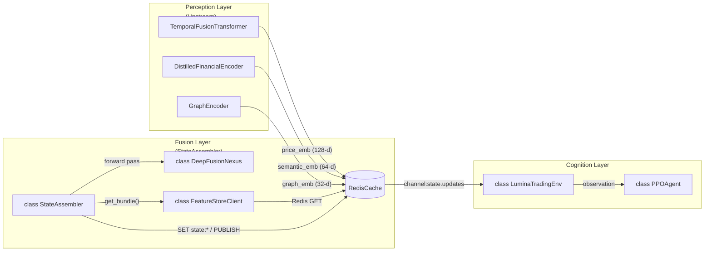
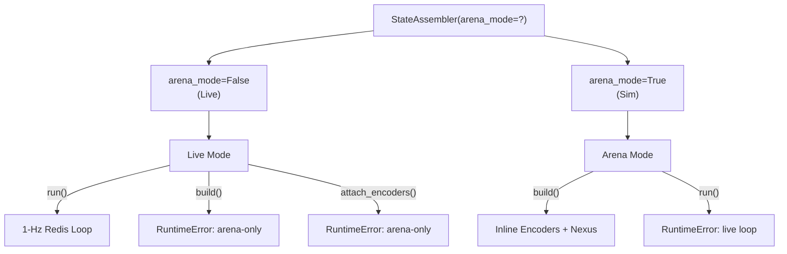

# State Assembler

??? note "Relevant source files"

    - [gh:backend/data_engine/storage/timescale.py]
    - [gh:backend/fusion/state_assembler.py]
    - [gh:tests/fusion/test_state_assembler_modes.py]

The `StateAssembler` is the primary driver of the Lumina V3 Fusion Layer. It
serves as the bridge between the three modality-specific encoder (Perception
Layer) and the Reinforcement Learning agent (Cognition Layer). Its main
responsibility is to aggregate embeddings from the Feature Store, pass them
through the `DeepFusionNexus` to generate a unified 256-d latent state, and
manage uncertainty estimation via MC-Dropout
[gh:backend/fusion/state_assembler.py#L1-L14]

## System Overview

The service operates in two distinct modes to ensure that simulation overhead
(like XAI attribution capturing) never impacts live trading performance:

1. **Live Mode (`arena_mode=False`):** A 1-Hz daemon that consumes embeddings
   from Redis, computes the fused state, and publishes it back to Redis
   [gh:backend/fusion/state_assembler.py#L108-L110]
2. **Arena Mode (`arena_mode=True`):** An inline execution path used by the
   Spartan Arena to run the full end-to-end pipeline (Encoders + Nexus) in a
   single process for high-throughput simulation and XAI data collection
   [gh:backend/fusion/state_assembler.py#L105-L111]

### Data Flow: Live Reflex Arc

In live operation, the `StateAssembler` follows a periodic
"Tick-Assemble-Publish" loop:

| Step | Action  | Description                                                                                                                                                           |
| ---- | ------- | --------------------------------------------------------------------------------------------------------------------------------------------------------------------- |
| 1    | Poll    | Every `interval_s` (default 1.0s), the service checks for new embeddings<br/>[gh:backend/fusion/state_assembler.py#L299-L301]                                         |
| 2    | Fetch   | Retrieves price (128-d), news (64-d), and graph (32-d) embeddings from the `FeatureStoreClient`<br/>[gh:backend/fusion/state_assembler.py#L309-L312]                    |
| 3    | Fuse    | Calls `DeepFusionNexus` froward pass to produce the 256-d latent space<br/>[gh:backend/fusion/state_assembler.py#L335-L338]                                             |
| 4    | Sample  | Periodically performs multiple forward passes with MC-Dropout to estimate state uncertainty<br/>[gh:backend/fusion/state_assembler.py#L348-L356]                      |
| 5    | Persist | Writes the state, attention weights, and uncertainty to Redis and notifies subscribers via `channel:state.updates`<br/>[gh:backend/fusion/state_assembler.py#L358-L369] |

**Sources:** [gh:backend/fusion/state_assembler.py#L289-L369]
[gh:backend/fusion/nexus.py#L1-L20]

## Code Entity Map

The following diagram maps the logical data flow to specific classes and methods
within the codebase.

### Fusion Layer Logic to Code Mapping



In live operation the three Perception encoders run as independent services that
publish their embeddings to `RedisCache`. The `StateAssembler` reads them back
through `FeatureStoreClient.get_bundle()`, fuses them with `DeepFusionNexus`,
writes the resulting `state:*` keys to Redis, and announces the update on
`channel:state.updates`. The `LuminaTradingEnv` consumes that state as the
observation for the `PPOAgent`.

**Sources:** [gh:backend/fusion/state_assembler.py#L86-L148]
[gh:backend/data_engine/storage/redis_cache.py#L51-L75]
[gh:backend/simulation/environments/base_env.py#L82-L132]

## Implementation Details

### State Assembly Loop

The `run()` method implements the live 1-Hz loop. It utilizes the
`FeatureStoreClient` in `online` mode to minimize latency. If any modality
embedding is missing for a specific ticker, the bundle is marked as incomplete
and skipped to prevent the agent from acting on stale or partial data
[gh:backend/fusion/state_assembler.py#L289-L330]

### Uncertainty Estimation

Uncertainty is calculated using Monte Carlo Dropout. Every $N$ ticks (defined by
`compute_uncertainty_every_n`), the assembler performs `uncertainty_samples`
forward passes through the Nexus with dropout enabled. The variance of these
samples is stores as the uncertainty estimate, which the `UncertaintyGate` in
the Cognition layer uses to potentially veto trades
[gh:backend/fusion/state_assembler.py#L348-L356]

### Arena Mode and XAI Attribution

In simulation, the `StateAssembler` uses the `build()` method. This allows the
`Spartan Arena` to pass raw tensors (price windows, news tokens) directly. The
assembler then coordinates the internal encoders and returns a
`RawAttributionTensors` object [gh:backend/fusion/state_assembler.py#L42-L69]

```python
@dataclass(frozen=True)
class RawAttributionTensors:
    cross_modal_weights: torch.Tensor       # (3,) softmaxed weights
    vsn_weights_by_feature: dict[str, torch.Tensor] # TFT VSN importance
    gat_edge_index: torch.Tensor            # Graph topology
    gat_alpha: torch.Tensor                 # GAT attention coefficients
    ticker_list: tuple[str, ...]            # Symbol mapping
```

**Sources:** [gh:backend/fusion/state_assembler.py#L42-L69]
[gh:backend/fusion/state_assembler.py#L178-L189]

## Data Schemas and Redis Keys

The `StateAssembler` manages several key-value patterns in Redis to ensure the
agent has a consistent view of the market state.

| Data Type    | Redis Key Pattern            | Description                                           |
| ------------ | ---------------------------- | ----------------------------------------------------- |
| Market State | `state:market:{ticker}`      | The 256-d float vector (fused latent representation). |
| Attention    | `state:attention:{ticker}`   | Softmax weights for [Price, News, Graph].             |
| Uncertainty  | `state:uncertainty:{ticker}` | Scalar float representing MC-Dropout variance.        |
| Updates      | `channel:state.updates`      | Pub/Sub channel for notifying the `LuminaTradingEnv`. |

**Sources:** [gh:backend/fusion/state_assembler.py#L86-L102]

## Mode Invariants and Safety

To prevent performance degradation, the class enforces strict invariants at
runtime. An instance initialized for live trading will raise a `RuntimeError` if
simulation methods are called, and vice-versa
[gh:tests/fusion/test_state_assembler_modes.py#L1-L12]

### Mode Enforcement Logic



**Sources:** [gh:backend/fusion/state_assembler.py#L105-L118]
[gh:tests/fusion/test_state_assembler_modes.py#L41-L75]

## Metrics and Observability

The service exports several Prometheus metrics to monitor the health of the
fusion pipeline:

- `fusion_states_assembled_total`: Counter tracking successful state writes per
  ticker [gh:backend/fusion/state_assembler.py#L72-L74]
- `fusion_state_latency_seconds`: Histogram measuring the end-to-end latency
  from reading embeddings to writing the fused state
  [gh:backend/fusion/state_assembler.py#L75-L79]
- `fusion_incomplete_bundles_total`: Counter tracking how many ticks were
  skipped due to missing embeddings (labeled by the missing modality)
  [gh:backend/fusion/state_assembler.py#L80-L84]

**Sources:** [gh:backend/fusion/state_assembler.py#L72-L84]
