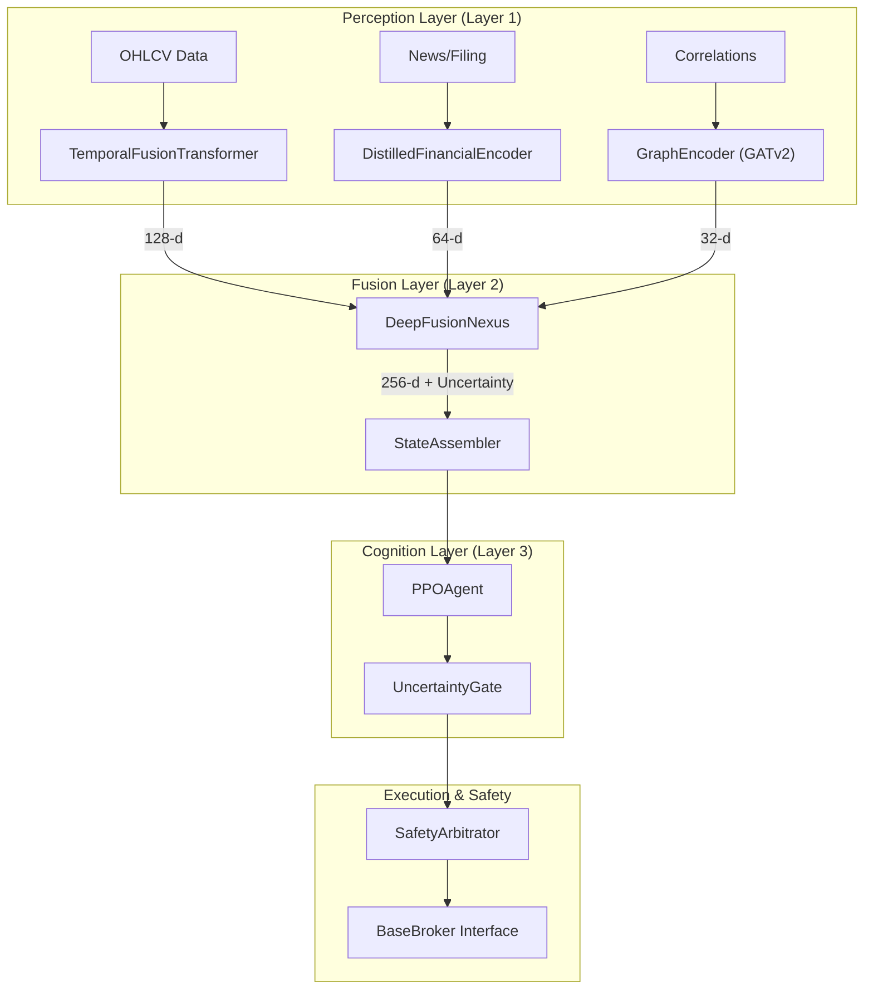
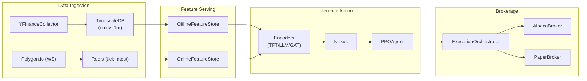

# Lumina V3 Overview

Lumina V3, codenamed **'Chimera'**, is a cognitive autonomous trading system
designed to move beyond linear algorithmic pipelines. Unlike traditional systems
that separate data ingestion, feature engineering, and modelling into isolated
states, Lumina V3 employs **deep sensor fusion**. It treats market data, news
sentiment, and corporate structural relationships as a single, end-to-end
differentiable computation graph [gh:README.md#L14-L32]

The system is built around the "Thalamus" analogy: multiple sensory streams are
merged into a holographic latent state before a central Reinforcement Learning
(RL) agent makes a decision [gh:README.md#L34-L38]

## The Chimera Architecture

The architecture is divided into three functional layers: **Perception,
Fusion,** and **Cognition**. This layered approach ensures that the agent acts
on a unified representation of the market regime rather than raw, noisy signals.

### System Components and Code Entities

The following diagram maps the high-level conceptual layers to the specific code
entities and services that implement them.

#### Diagram: Chimera Architecture Mapping

**Sources:** [gh:README.md#L42-L66] [gh:pyproject.toml#L17-L21]
[gh:backend/config/constants.py#L79-L80]

## Key Design Principles

1. **Dimensional Contract:** To maintain the integrity of the fusion graph,
   vector dimensions are fixed. The system uses a 128-d price embedding, 64-d
   semantic embedding, and 32-d structural embedding, resulting in a 256-d
   latent state for the agent [gh:README.md#L68-L80]
2. **Uncertainty Quantification:** The Fusion Layer utilized MC-Dropout to
   estimate the variance (uncertainty) of its internal state. If uncertainty
   exceeds the `UNCERTAINTY_THRESHOLD`, the **Uncertainty Gate** prevents the
   agent from executing trades [gh:.env.example#L51-L52] [gh:README.md#L51-L56]
3. **Adversarial Training (Spartan Curriculum):** The agent is not just trained
   on historical data but is subjected to a three-phase curriculum including
   Behavioral Cloning, Domain Randomization (adversarial warps like "Flash
   Crashes"), and Sharpe Optimization [gh:README.md#L136-L138]
4. **Hard-Rule Safety:** A **Safety Arbitrator** acts as a final veto layer,
   enforcing non-negotiable risk rules (e.g., `MAX_DRAWDOWN_LIMIT`) before any
   order reaches the broker [gh:.env.example#L52] [gh:README.md#L59-L62]

## System Data Flow

Data flows raw collectors into a dual-storage backend before being processed by
the inference services.

#### Diagram: Data Engine to Execution Flow

**Sources:** [gh:pyproject.toml#L40-L108] [gh:.env.example#L12-L32]
[gh:Makefile#L127-L134]

## Subsystem Overviews

### [Getting Started: Setup and Configuration](overview/getting_started.md)

Covers environment setup using `uv` for dependency management and
`docker-compose` for orchestration. Key targets include `make dev` for local API
development and `make up` for the full containerized stack.

- **Key Files:** [gh:Makefile#L1-L56] [gh:pyproject.toml#L23-L36]
  [gh:.env.example#L1-L75]

### [System Architecture and Data Flow](overview/system.md)

Detailed breakdown of the "Chimera" architecture, the **Dimensional Contract**
(fixed vector sizes), and the end-to-end latency budget (e.g., <100ms for
semantic inference).

- **Key Files:** [gh:README.md#L40-L115]
  [gh:backend/config/constants.py#L79-L80]

### [Data Engine](data_engine/index.md)

Documents the ingestion pipeline. It supports `yfinance` for daily historical
backfills and `Polygon.io` for high-frequency 1-minute bars. Data is stored in
**TimescaleDB** for persistence and **Redis** for sub-millisecond feature
serving.

- **Key Files:** [gh:pyproject.toml#L58-L71] [gh:Makefile#L127-L134]
  [gh:.env.example#L34-L39]

### [Perception Layer (Encoders)](perception_layer/index.md)

Details the three modality-specific models:

- **Temporal:** Temporal Fusion Transformer (TFT) for price action
  [gh:README.md#L86-L115]
- **Semantic:** A 15M-parameter student LLM distilled from FinBERT
  [gh:README.md#L117-L140]
- **Structural:** GATv2 Graph Attention Network for supply-chain and correlation
  analysis [gh:README.md#L141-L157]

### [Fusion Layer: Deep Fusion Nexus](fusion_layer/index.md)

Explains how the `DeepFusionNexus` uses cross-modal attention to combine
embeddings into a 256-d latent state and how the `StateAssembler` orchestrates
this at a 1-Hz cadence.

- **Key Files:** [gh:README.md#L46-L51] [gh:backend/config/constants.py#L76]

### [Cognition Layer: RL Agent and Training](cognition_layer/index.md)

Focuses on the `PPOAgent` and its 4-D action space
`[direction, urgency, sizing, stop_distance]`. It also details the **Spartan
Curriculum** training pipeline.

- **Key Files:** [gh:pyproject.toml#L17-L21] [gh:README.md#L77]
  [gh:README.md#L136-L138]

### [Execution Engine and Safety System](execution/index.md)

Covers the translation of agent actions into broker orders via the
`ExecutionOrchestrator` and the multi-state **Kill Switch** (NORMAL, CLOSE_ONLY,
LIQUIDATE_ALL).

- **Key Files:** [gh:README.md#L59-L65] [gh:.env.example#L25-L32]

### [Simulation and Spartan Arena](simulation/index.md)

Documents the `LuminaTradingEnv` (Gymnasium-compatible) and the **Spartan
Arena,** which runs parallel trajectories under adversarial scenarios to
validate agent robustness.

- **Key Files:** [gh:pyproject.toml#L98] [gh:Makefile#L135-L139]
  [gh:.env.example#L65-L74]

### [Backend API](backend/index.md)

The FastAPI-based gateway. Includes documentation for portfolio tracking, arena
control, and the Prometheus-based monitoring stack.

- **Key Files:** [gh:docker/Dockerfile.api#L1-L75] [gh:pyproject.toml#L40-L56]
  [gh:Makefile#L53-L56]

### [Frontend Dashboard](frontend/index.md)

A React/TypeScript dashboard providing real-time visualization of the agent's
attention heatmaps, equity curves, and divergence points in the Spartan Arena.

- **Key Files:** [gh:Makefile#L102-L103] [gh:pyproject.toml#L150-L153]

### [Infraestructure and Deployment](infra/index.md)

Details on Docker images (including specialized CUDA 12.8 builds for Blackwell
GPUs) and Alembic database migrations.

- **Key Files:** [gh:Makefile#L83-L116] [gh:docker/Dockerfile.api#L1-L75]
  [gh:pyproject.toml#L138-L139]

---

**Sources:** [gh:README.md#L1-L160] [gh:Makefile#L1-L139]
[gh:pyproject.toml#L1-L156] [gh:.env.example#L1-L75]
