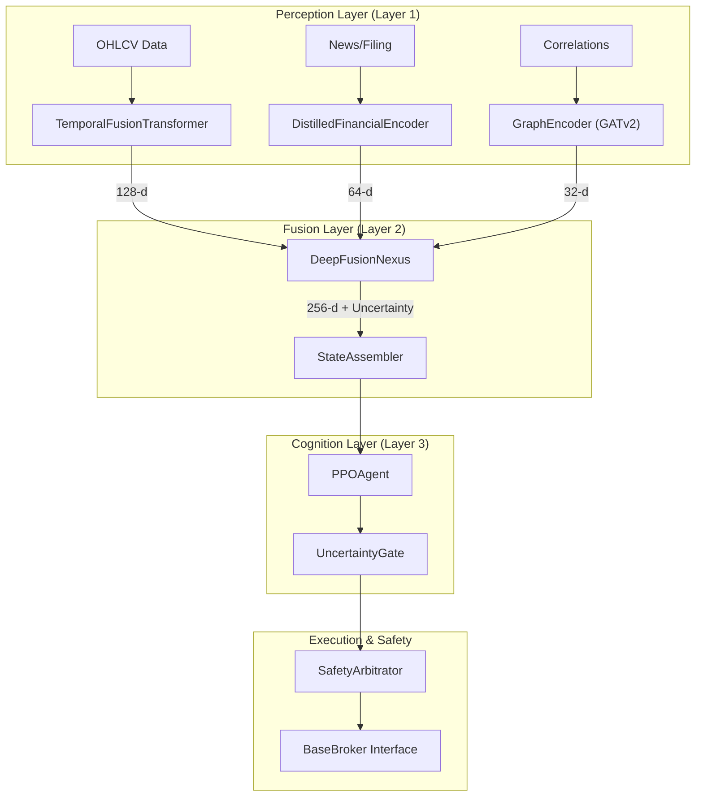
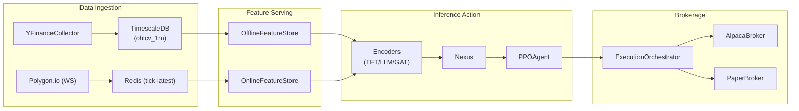

# Lumina V3 Overview

Lumina V3, codenamed **'Chimer'**, is a cognitive autonomous trading system
designed to move beyond linear algorithmic pipelines. Unlike traditional systems
that separate data ingestion, feature engineering, and modelling into isolated
states, Lumina V3 employs **deep sensor fusion**. It treats market data, news
sentiment, and corporate structural relationships as a single, end-to-end
differentiable computation graph
[:material-github: README.md#14-32](https://github.com/franjavi-upct-es/lumina_project/blob/main/README.md?plain=1#L14-L32)

The system is built around the "Thalamus" analogy: multiple sensory streams are
merged into a holographic latent state before a central Reinforcement Learning
(RL) agent makes a decision
[:material-github: README.md#34-38](https://github.com/franjavi-upct-es/lumina_project/blob/main/README.md?plain=1#L34-L38)

## The Chimera Architecture

The architecture is divided into three functional layers: **Perception,
Fusion,** and **Cognition**. This layered approach ensures that the agent acts
on a unified representation of the market regime rather than raw, noisy signals.

### System Components and Code Entities

The following diagram maps the high-level conceptual layers to the specific code
entities and services that implement them.

#### Diagram: Chimera Architecture Mapping

**Sources:**
[:material-github: README.md#42-66](https://github.com/franjavi-upct-es/lumina_project/blob/main/README.md?plain=1#L42-L66)
[:material-github: pyproject.toml#17-21](https://github.com/franjavi-upct-es/lumina_project/blob/main/pyproject.toml#L17-L-21)
[:material-github: backend/config/constants.py#79-80](https://github.com/franjavi-upct-es/lumina_project/blob/main/backend/config/constants.py#L79-L80)

## Key Design Principles

1. **Dimensional Contract:** To maintain the integrity of the fusion graph,
   vector dimensions are fixed. The system uses a 128-d price embedding, 64-d
   semantic embedding, and 32-d structural embedding, resulting in a 256-d
   latent state for the agent
   [:material-github: README.md#68-80](https://github.com/franjavi-upct-es/lumina_project/blob/main/README.md?plain=1#L68-L80)
2. **Uncertainty Quantification:** The Fusion Layer utilized MC-Dropout to
   estimate the variance (uncertainty) of its internal state. If uncertainty
   exceeds the `UNCERTAINTY_THRESHOLD`, the **Uncertainty Gate** prevents the
   agent from executing trades
   [:material-github: .env.example#51-52](https://github.com/franjavi-upct-es/lumina_project/blob/main/.env.example#L51-L52)
   [:material-github: README.md#51-56](https://github.com/franjavi-upct-es/lumina_project/blob/main/README.md?plain=1#L51-L56)
3. **Adversarial Training (Spartan Curriculum):** The agent is not just trained
   on historical data but is subjected to a three-phase curriculum including
   Behavioral Cloning, Domain Randomization (adversarial warps like "Flash
   Crashes"), and Sharpe Optimization
   [:material-github: README.md#136-138](https://github.com/franjavi-upct-es/lumina_project/blob/main/README.md?plain=1#L136-L138)
4. **Hard-Rule Safety:** A **Safety Arbitrator** acts as a final veto layer,
   enforcing non-negotiable risk rules (e.g., `MAX_DRAWDOWN_LIMIT`) before any
   order reaches the broker
   [:material-github: .env.example#52](https://github.com/franjavi-upct-es/lumina_project/blob/main/.env.example#L52)
   [:material-github: README.md#59-62](https://github.com/franjavi-upct-es/lumina_project/blob/main/README.md?plain=1#L59-L62)

## System Data Flow

Data flows raw collectors into a dual-storage backend before being processed by
the inference services.

#### Diagram: Data Engine to Execution Flow

**Sources:**
[:material-github: pyproject.toml#40-108](https://github.com/franjavi-upct-es/lumina_project/blob/main/pyproject.toml#L40-L108)
[:material-github: .env.example#12-32](https://github.com/franjavi-upct-es/lumina_project/blob/main/.env.example#L12-L32)
[:material-github: Makefile#127-134](https://github.com/franjavi-upct-es/lumina_project/blob/main/Makefile#L127-L134)

## Subsystem Overviews

### Getting Started: Setup and Configuration

Covers environment setup using `uv` for dependency management and
`docker-compose` for orchestration. Key targets include `make dev` for local API
development and `make up` for the full containerized stack.

- **Key Files:**
  [:material-github: Makefile#1-56](https://github.com/franjavi-upct-es/lumina_project/blob/main/Makefile#L1-L56)
  [:material-github: pyproject.toml#23-36](https://github.com/franjavi-upct-es/lumina_project/blob/main/pyproject.toml#L23-L36)
  [:material-github: .env.example#1-75](https://github.com/franjavi-upct-es/lumina_project/blob/main/.env.example#L1-L75)

### System Architecture and Data Flow

Detailed breakdown of the "Chimera" architecture, the **Dimensional Contract**
(fixed vector sizes), and the end-to-end latency budget (e.g., <100ms for
semantic inference).

- **Key Files:**
  [:material-github: README.md#40-115](https://github.com/franjavi-upct-es/lumina_project/blob/main/README.md?plain=1#L40-L115)
  [:material-github: backend/config/constants.py#79-80](https://github.com/franjavi-upct-es/lumina_project/blob/main/backend/config/constants.py#L79-L80)

### Data Engine

Documents the ingestion pipeline. It supports `yfinance` for daily historical
backfills and `Polygon.io` for high-frequency 1-minute bars. Data is stored in
**TimescaleDB** for persistence and **Redis** for sub-millisecond feature
serving.

- **Key Files:**
  [:material-github: pyproject.toml#58-71](https://github.com/franjavi-upct-es/lumina_project/blob/main/pyproject.toml#L58-L71)
  [:material-github: Makefile#127-134](https://github.com/franjavi-upct-es/lumina_project/blob/main/Makefile#L127-L134)
  [:material-github: .env.example#34-39](https://github.com/franjavi-upct-es/lumina_project/blob/main/.env.example#L34-L39)

### Perception Layer (Encoders)

Details the three modality-specific models:

- **Temporal:** Temporal Fusion Transformer (TFT) for price action
  [:material-github: README.md#86-115](https://github.com/franjavi-upct-es/lumina_project/blob/main/README.md?plain=1#L86-L115)
- **Semantic:** A 15M-parameter student LLM distilled from FinBERT
  [:material-github: README.md#117-140](https://github.com/franjavi-upct-es/lumina_project/blob/main/README.md?plain=1#L117-L140)
- **Structural:** GATv2 Graph Attention Network for supply-chain and correlation
  analysis
  [:material-github: README.md#141-157](https://github.com/franjavi-upct-es/lumina_project/blob/main/README.md?plain=1#L141-L157)

### Fusion Layer: Deep Fusion Nexus

Explains how the `DeepFusionNexus` uses cross-modal attention to combine
embeddings into a 256-d latent state and how the `StateAssembler` orchestrates
this at a 1-Hz cadence.

- **Key Files:**
  [:material-github: README.md#46-51](https://github.com/franjavi-upct-es/lumina_project/blob/main/README.md?plain=1#L46-L51)
  [:material-github: backend/config/constants.py#76](https://github.com/franjavi-upct-es/lumina_project/blob/main/backend/config/constants.py#L76)

### Cognition Layer: RL Agent and Training

Focuses on the `PPOAgent` and its 4-D action space
`[direction, urgency, sizing, stop_distance]`. It also details the **Spartan
Curriculum** training pipeline.

- **Key Files:**
  [:material-github: pyproject.toml#17-21](https://github.com/franjavi-upct-es/lumina_project/blob/main/pyproject.toml#L17-L21)
  [:material-github: README.md#77](https://github.com/franjavi-upct-es/lumina_project/blob/main/README.md?plain=1#L77)
  [:material-github: README.md#136-138](https://github.com/franjavi-upct-es/lumina_project/blob/main/README.md?plain=1#L136-L138)

### Execution Engine and Safety System

Covers the translation of agent actions into broker orders via the
`ExecutionOrchestrator` and the multi-state **Kill Switch** (NORMAL, CLOSE_ONLY,
LIQUIDATE_ALL).

- **Key Files:**
  [:material-github: README.md#59-65](https://github.com/franjavi-upct-es/lumina_project/blob/main/README.md?plain=1#L59-L65)
  [:material-github: .env.example#25-32](https://github.com/franjavi-upct-es/lumina_project/blob/main/.env.example#L25-L32)

### Simulation and Spartan Arena

Documents the `LuminaTradingEnv` (Gymnasium-compatible) and the **Spartan
Arena,** which runs parallel trajectories under adversarial scenarios to
validate agent robustness.

- **Key Files:**
  [:material-github: pyproject.toml#98](https://github.com/franjavi-upct-es/lumina_project/blob/main/pyproject.toml#L98)
  [:material-github: Makefile#135-139](https://github.com/franjavi-upct-es/lumina_project/blob/main/Makefile#L135-L139)
  [:material-github: .env.example#65-74](https://github.com/franjavi-upct-es/lumina_project/blob/main/.env.example#L65-L74)

### Backend API

The FastAPI-based gateway. Includes documentation for portfolio tracking, arena
control, and the Prometheus-based monitoring stack.

- **Key Files:**
  [:material-github: docker/Dockerfile.api#1-75](https://github.com/franjavi-upct-es/lumina_project/blob/main/docker/Dockerfile.api#L1-L75)
  [:material-github: pyproject.toml#40-56](https://github.com/franjavi-upct-es/lumina_project/blob/main/pyproject.toml#L40-56)
  [:material-github: Makefile#53-56](https://github.com/franjavi-upct-es/lumina_project/blob/main/Makefile#L53-L56)

### Frontend Dashboard

A React/TypeScript dashboard providing real-time visualization of the agent's
attention heatmaps, equity curves, and divergence points in the Spartan Arena.

- **Key Files:**
  [:material-github: Makefile#102-103](https://github.com/franjavi-upct-es/lumina_project/blob/main/Makefile#L102-L103)
  [:material-github: pyproject.toml#150-153](https://github.com/franjavi-upct-es/lumina_project/blob/main/pyproject.toml#L150-153)

### Infraestructure and Deployment

Details on Docker images (including specialized CUDA 12.8 builds for Blackwell
GPUs) and Alembic database migrations.

- **Key Files:**
  [:material-github: Makefile#83-116](https://github.com/franjavi-upct-es/lumina_project/blob/main/Makefile#L83-L116)
  [:material-github: docker/Dockerfile.api#1-75](https://github.com/franjavi-upct-es/lumina_project/blob/main/docker/Dockerfile.api#L1-L75)
  [:material-github: pyproject.toml#138-139](https://github.com/franjavi-upct-es/lumina_project/blob/main/pyproject.toml#L138-L139)

---

**Sources:**
[:material-github: README.md#1-160](https://github.com/franjavi-upct-es/lumina_project/blob/main/README.md?plain=1#L1-L160)
[:material-github: Makefile#1-139](https://github.com/franjavi-upct-es/lumina_project/blob/main/Makefile#L1-L139)
[:material-github: pyproject.toml#1-156](https://github.com/franjavi-upct-es/lumina_project/blob/main/pyproject.toml#L1-L156)
[:material-github: .env.example#1-75](https://github.com/franjavi-upct-es/lumina_project/blob/main/.env.example#L1-L75)
