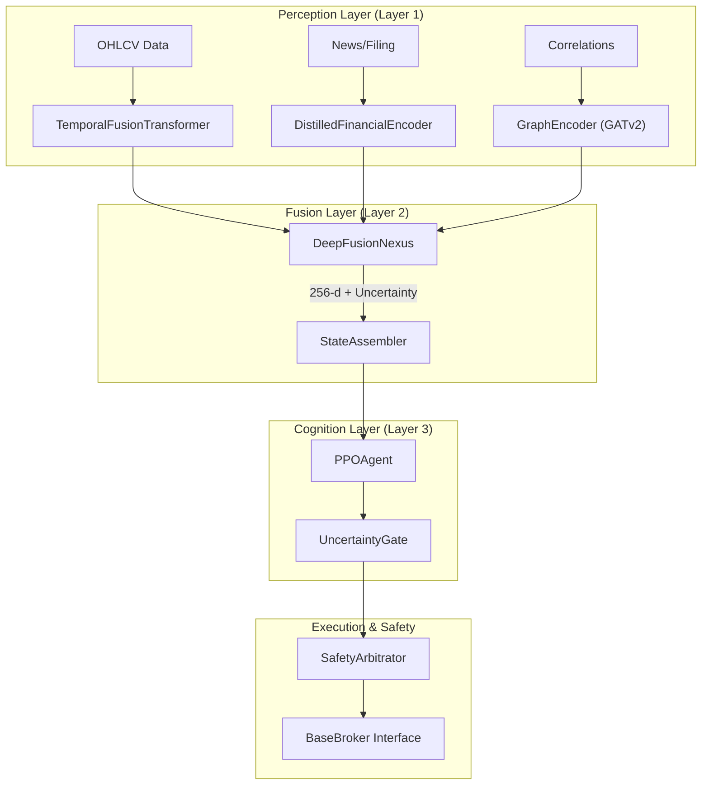

# Lumina V3 Overview

Lumina V3, codenamed **'Chimer'**, is a cognitive autonomous trading system
designed to move beyond linear algorithmic pipelines. Unlike traditional systems
that separate data ingestion, feature engineering, and modelling into isolated
states, Lumina V3 employs **deep sensor fusion**. It treats market data, news
sentiment, and corporate structural relationships as a single, end-to-end
differentiable computation graph
[:material-github: README.md#14-32](https://github.com/franjavi-upct-es/lumina_project/blob/main/README.md?plain=1#L14-L32)

The system is built around the "Thalamus" analogy: multiple sensory streams are
merged into a holographic latent state before a central Reinforcement Learning
(RL) agent makes a decision
[:material-github: README.md#34-38](https://github.com/franjavi-upct-es/lumina_project/blob/main/README.md?plain=1#L34-L38)

## The Chimera Architecture

The architecture is divided into three functional layers: **Perception,
Fusion,** and **Cognition**. This layered approach ensures that the agent acts
on a unified representation of the market regime rather than raw, noisy signals.

### System Components and Code Entities

The following diagram maps the high-level conceptual layers to the specific code
entities and services that implement them.

#### Diagram: Chimera Architecture Mapping

**Sources:**
[:material-github: README.md#42-66](https://github.com/franjavi-upct-es/lumina_project/blob/main/README.md?plain=1#L42-L66)
[:material-github: pyproject.toml#17-21](https://github.com/franjavi-upct-es/lumina_project/blob/main/pyproject.toml#L17-L-21)
[:material-github: backend/config/constants.py#79-80](https://github.com/franjavi-upct-es/lumina_project/blob/main/backend/config/constants.py#L79-L80)

## Key Design Principles

1. **Dimensional Contract:** To maintain the integrity of the fusion graph,
   vector dimensions are fixed. The system uses a 128-d price embedding, 64-d
   semantic embedding, and 32-d structural embedding, resulting in a 256-d
   latent state for the agent
   [:material-github: README.md#68-80](https://github.com/franjavi-upct-es/lumina_project/blob/main/README.md?plain=1#L68-L80)
2. **Uncertainty Quantification:** The Fusion Layer utilized MC-Dropout to
   estimate the variance (uncertainty) of its internal state. If uncertainty
   exceeds the `UNCERTAINTY_THRESHOLD`, the **Uncertainty Gate** prevents the
   agent from executing trades
   [:material-github: .env.example#51-52](https://github.com/franjavi-upct-es/lumina_project/blob/main/.env.example#L51-L52)
   [:material-github: README.md#51-56](https://github.com/franjavi-upct-es/lumina_project/blob/main/README.md?plain=1#L51-L56)
3. **Adversarial Training (Spartan Curriculum):** The agent is not just trained
   on historical data but is subjected to a three-phase curriculum including
   Behavioral Cloning, Domain Randomization (adversarial warps like "Flash
   Crashes"), and Sharpe Optimization
   [:material-github: README.md#136-138](https://github.com/franjavi-upct-es/lumina_project/blob/main/README.md?plain=1#L136-L138)
