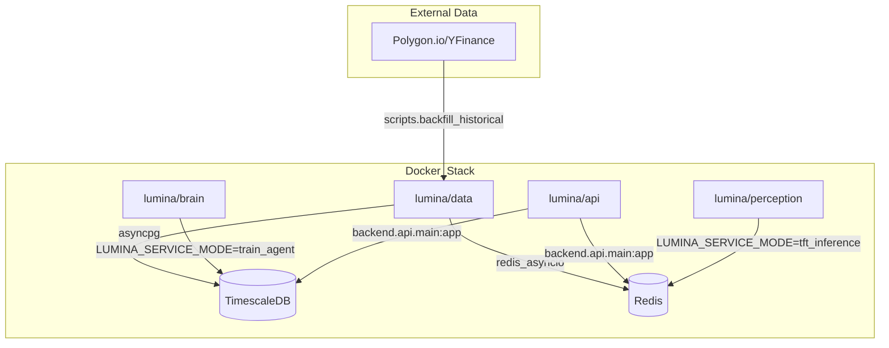
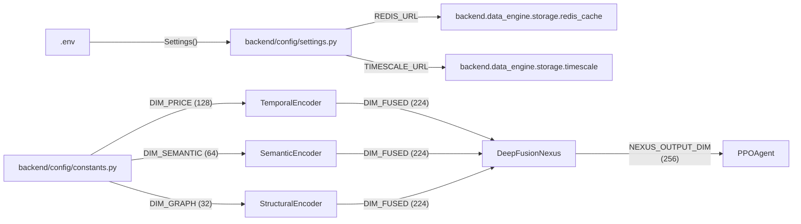

# Getting Started: Setup and Configuration

??? note "Relevant source files"

    - [gh:.env.example]
    - [gh:.gitignore]
    - [gh:.python-version]
    - [gh:Makefile]
    - [gh:backend/cognition/training/behavioral_cloning.py]
    - [gh:backend/config/constants.py]
    - [gh:backend/config/settings.py]
    - [gh:docker/Dockerfile.api]
    - [gh:pyproject.toml]
    - [gh:uv.lock]

This page provides a comprehensive guide for initializing the Lumina V3
"Chimera" development environment. It covers dependency management with `uv`,
configuration via Pydantic settings, and the containerized orchestration of the
multi-service architecture.

## 1. Environment Prerequisites

Lumina V3 requires a Linux or macOS environment with the following
specifications:

- **Python 3.11:** Explicitly pinned in [gh:.python-version#L1] and
  [gh:pyproject.toml#L27]
- **uv:** The project uses `uv` for ultra-fast dependency resolution and virtual
  environment management [gh:Makefile#L4-L5]
- **Docker & Docker Compose:** Required for running the full stack, including
  TimescaleDB and Redis.
- **NVIDIA GPU (Optional):** Recommended for the Perception and Cognition
  layers. The stack supports CUDA 12.4 (standard) and CUDA 12.8 (Blackwell)
  [gh:Makefile#L33-L34]

## 2. Local Installation

The project utilizes a layered dependency strategy defined in
[gh:pyproject.toml#L6-L15] This allows individual services (API, Data, Brain) to
install only the necessary sub-packages.

### Step-by-Step Setup

1. **Clone and Sync:** Use the `Makefile` to synchronize the environment with
   all optional extras (dev, api, data, perception, brain, gpu).

    ```bash
    make install
    ```

    _Source: [gh:Makefile#L50-L51]_

2. **Configuration:** Copy the template environment file:

    ```bash
    cp .env.example .env
    ```

    _Source: [gh:.env.example#L1-L5]_

3. **Database Migrations:** Apply Alembic migrations to initialize the
   TimescaleDB schema (hypertables, news events, and portfolio tables).

    ```bash
    make migrate
    ```

    _Source: [gh:Makefile#L50-L51]_

## 3. Configuration & Environment Variables

Lumina V3 uses a centralized configuration system powered by
`pydantic-settings`. The `Settings` class in
[gh:backend/config/settings.py#L39-L108] acts a singleton that validates
environment variables at runtime.

### Key Configuration Groups

| Group   | Variable                | Default                    | Description                                       |
| ------- | ----------------------- | -------------------------- | ------------------------------------------------- |
| Data    | `DATA_SOURCE`           | `yfinance`                 | `yfinance` (free/daily) or `polygon` (paid/1-min) |
| Broker  | `BROKER_MODE`           | `paper`                    | `paper` (local sim) or `alpaca` (Alpaca API)      |
| Storage | `REDIS_URL`             | `redis://localhost:6379/0` | Async Redis connection string                     |
| Storage | `TIMESCALE_URL`         | `postgresql://...`         | TimescaleDB connection string                     |
| Safety  | `UNCERTAINTY_THRESHOLD` | `0.85`                     | MC-Dropout threshold for the Uncertainty Gate     |
| Arena   | `ARENA_ARTIFACT_DIR`    | `./artifacts/arena`        | Storage for simulation trajectories               |

Sources: [gh:backend/config/settings.py#L14-L108] [gh:.env.example#L7-L75]

## 4. Docker Stack & Profiles

The system is decomposed into specialized Docker images to optimize resource
usage and build times.

### Service Architecture Diagram

This diagram maps the logical system components to their respective Docker
entities and code entry points.



Sources: [gh:docker/Dockerfile.api#L44-L45] [gh:Makefile#L83-L104]
[gh:.env.example#L54-L59]

### Running the Stack

The `Makefile` provides targets for different hardware configurations:

- **Standard:** `make up` (Standard Docker Compose) [gh:Makefile#L104-L107].
- **Low VRAM (8GB):** `make up-8gb` (Offloads semantic models to CPU)
  [gh:Makefile#L109-L110].
- **NVIDIA Blackwell:** `make up-blackwell` (Uses CUDA 12.8 base images)
  [gh:Makefile#L112-L113].

## 5. Makefile Workflow Reference

The `Makefile` serves as the primary interface for common development tasks.

### Data Management

- **Backfill yfinance:** `make backfill-yfinance` Runs
  `scripts.backfill_historical` to pull daily bars for the `TARGET_TICKERS`
  defined in [gh:backend/config/constants.py#L94-L154].
- **Backfill Polygon:** `make backfill-polygon` Pulls 1-minute resolution data
  (requires `POLYGON_API_KEY`).

### Development & Testing

- **Hot-Reload API:** `make dev` Starts the FastAPI server on port 8000 with
  environment overrides for local storage [gh:Makefile#L53-L56].
- **Fast Tests:** `make test-unit` Runs `pytest` excluding integration tests
  that require live databases [gh:Makefile#L61-L62].
- **Full Suite:** `make test` Runs unit and integration tests (marked with
  `integration` in [gh:pyproject.toml#L171]).

### Simulation

- **Run Arena:** `make run-arena` Executes a Spartan Arena simulation run for a
  specific ticker (default AAPL) and generates artifacts in the
  `ARENA_ARTIFACT_DIR` [gh:Makefile#L135-L139].

## 6. Project Structure and Data Flow

The following diagram illustrates how the configuration and setup parameters
flow into the core system entities.



Sources: [gh:backend/config/constants.py#L40-L74]
[gh:backend/config/settings.py#L39-L65] [gh:pyproject.toml#L17-L21]

---

Sources:

- [gh:Makefile#L1-L139]
- [gh:backend/config/settings.py#L1-L108]
- [gh:backend/config/constants.py#L1-L228]
- [gh:pyproject.toml#L1-L213]
- [gh:docker/Dockerfile.api#L1-L75]
- [gh:.env.example#L1-L75]
