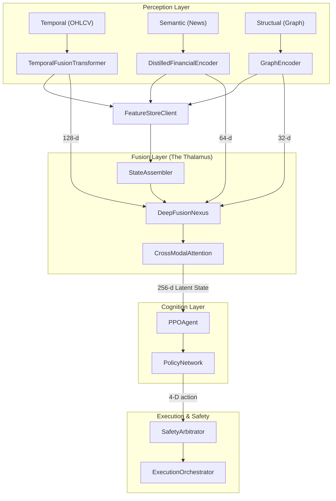
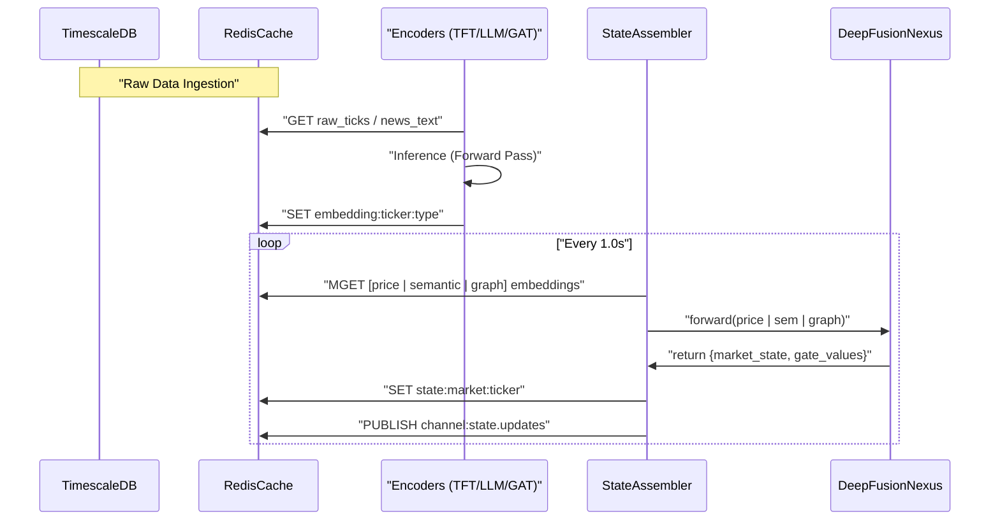

# System Architecture and Data Flow

??? note "Relevant source files"

    - [gh:README.md]
    - [gh:backend/cognition/training/behavioral_cloning.py]
    - [gh:backend/config/constants.py]
    - [gh:backend/data_engine/storage/timescale.py]
    - [gh:backend/fusion/nexus.py]
    - [gh:backend/fusion/state_assembler.py]

The Lumina V3 "Chimera" architecture is a deep-fusion trading system designed to
move beyond linear pipelines. Instead of isolated stages, it implements a
holographic representation where market data modalities (temporal, semantic, and
structural) are fused into a single latent state before being processed by a
cognitive RL agent. This page details the end-to-end flow from raw ingestion to
broker execution.

## 1. The Chimera Three-Layer Architecture

The system is structured into three distinct layers, mimicking the biological
thalamus for sensory integration.

1. **Perception Layer (Encoders):** Modality-specific neural networks transform
   raw, heterogeneous data into fixed-dimensional embeddings.
2. **Fusion Layer (Deep Fusion Nexus):** A cross-modal attention mechanism that
   merges embeddings into a unified 256-d "Latent State".
3. **Cognition Layer (RL Agent):** A PPO-based agent that reasons on the latent
   state to produce a 4-D continuous action vector.

### System Component Map

The following diagram maps the logical layers to their primary code entities and
data structures.

#### Chimera Architecture to Code Entity Map

**Sources:** [gh:README.md#L40-L66] [gh:backend/config/constants.py#L10-L22]
[gh:backend/fusion/state_assembler.py#L98-L111]

## 2. Dimensional Contract and Latency Budget

To ensure end-to-end differentiability and prevent dimension-mismatch bugs,
Lumina V3 enforces a strict **Dimensional Contract**.

| Component            | Symbol             | Value | Code Definition                          |
| -------------------- | ------------------ | ----- | ---------------------------------------- |
| Price Embedding      | `DIM_PRICE`        | 128   | [gh:backend/config/constants.py#L43-L44] |
| Semantic Embedding   | `DIM_SEMANTIC`     | 64    | [gh:backend/config/constants.py#L46-L47] |
| Structural Embedding | `DIM_GRAPH`        | 32    | [gh:backend/config/constants.py#L49-L50] |
| Fused Super-Vector   | `DIM_FUSED`        | 224   | [gh:backend/config/constants.py#L52-L53] |
| Agent Latent State   | `NEXUS_OUTPUT_DIM` | 256   | [gh:backend/config/constants.py#L68-L69] |
| Action Space         | `ACTION_DIM`       | 4     | [gh:backend/config/constants.py#L58-L65] |

### Latency Budget

The system is designed for sub-second reflex arcs. The
`DistilledFinancialEncoder` is specifically optimized to meet a **< 100 ms**
inference budget on a single CPU core [gh:README.md#L138-L139] The
`StateAssembler` monitors this via Prometheus histograms with buckets ranging
from 5ms to 500ms [gh:backend/fusion/state_assembler.py#L72-L76]

## 3. End-to-End Data Flow

The data flow operates in two distinct modes: **Live Execution** (decoupled via
Redis) and **Arena Mode** (inline for attribution).

### 3.1. Live Execution Flow

In live mode, the `StateAssembler` acts as a high-frequency driver (default 1-Hz
cadence) [gh:backend/fusion/state_assembler.py#L119]

1. **Ingestion:** `MarketDataCollectors` push raw data to `TimescaleStore`
   (cold) and `RedisCache` (hot)
   [gh:backend/data_engine/storage/timescale.py#L80-L128]
2. **Encoding:** Modality-specific services read raw data, produce embeddings,
   and write them back to Redis via the `FeatureStoreClient`.
3. **Assembly:** The `StateAssembler` pulls the three latest embeddings from
   Redis, concatenates them into a 224-d super-vector, and passes them to the
   `DeepFusionNexus` [gh:backend/fusion/state_assembler.py#L230-L245]
4. **Fusion:** The Nexus applies `CrossModalAttention` and a sigmoid gating
   mechanism to produce the 256-d latent state
   [gh:backend/fusion/nexus.py#L84-L104]
5. **Uncertainty:** Epistemic uncertainty is calculated via MC-Dropout
   (stochastic forward passes) [gh:backend/fusion/nexus.py#L110-L133]

#### Data Flow: From Raw Ingestion to Latent State

**Sources:** [gh:backend/fusion/state_assembler.py#L83-L132]
[gh:backend/fusion/nexus.py#L110-L133]
[gh:backend/data_engine/storage/timescale.py#L112-L128]

### 3.2 Cognition and Execution Flow

The `PPOAgent` consumes the market state to produce trade actions.

1. **Policy Evaluation:** The `PolicyNetwork` processes the 256-d state to
   output a Squashed Gaussian distribution over the 4-D action space
   [gh:backend/cognition/training/behavioral_cloning.py#L20-L25]
2. **Safety Check:** The action is intercepted by the `SafetyArbitrator`, which
   applies hard-coded rules (e.g., max drawdown, position limits)
   [gh:README.md#L59-L62]
3. **Execution:** If approved, the `ExecutionOrchestrator` maps the continuous
   vector `[direction, urgency, sizing, stop_distance]` to specific broker
   orders (Alpaca/Paper) [gh:backend/config/constants.py#L58-L65]

## 4. Feature Store and State Assembly

The `FeatureStoreClient` provides the abstraction layer for both `Online`
(Redis) and `Offline` (TimescaleDB) access.

### The StateAssembler Modes

The `StateAssembler` class [gh:backend/fusion/state_assembler.py#L98] is the
critical junction between Perception and Cognition. It supports two operational
modes:

- **Standard Mode (`arena_mode=False`):** Used in production. It consumes
  embeddings asynchronously from Redis to minimize coupling between encoders and
  the agent [gh:backend/fusion/state_assembler.py#L101-L103]
- **Arena Mode (`arena_mode=True`):** Used during training and "Spartan Arena"
  simulations. It runs the entire pipeline (Encoders + Nexus) inline via the
  `build()` method to capture `RawAttributionTensors` for XAI
  [gh:backend/fusion/state_assembler.py#L171-L182]

**Raw Attribution Tensors** captured during Arena mode includes:

- `cross_modal_weights`: Softmaxed weights showing importance of Price vs News
  vs Graph [gh:backend/fusion/state_assembler.py#L50-L51]
- `vsn_weights_by_feature`: TFT Variable Selection Network weights showing which
  OHLCV indicators were active [gh:backend/fusion/state_assembler.py#L52-L53]
- `gat_alpha`: Attention coefficients from the Graph Encoder
  [gh:backend/fusion/state_assembler.py#L56-L57]

**Sources:** [gh:backend/fusion/state_assembler.py#L39-L68]
[gh:backend/fusion/state_assembler.py#L140-L170]
[gh:backend/config/constants.py#L79-L89]
