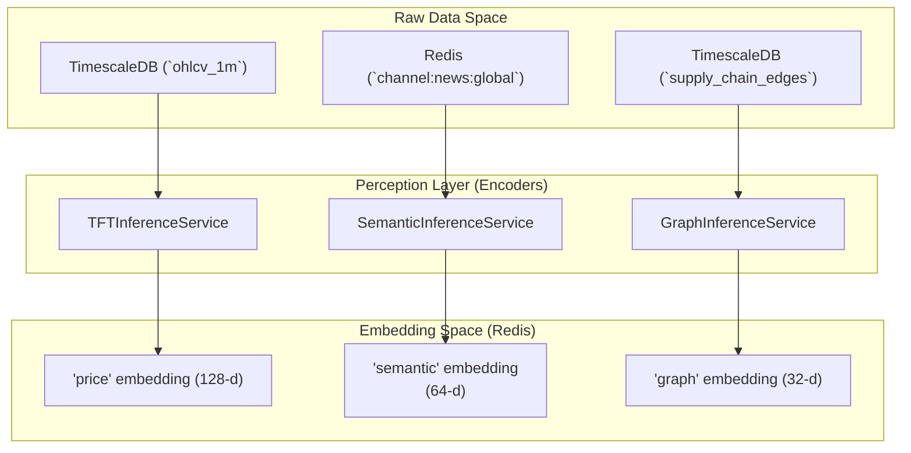
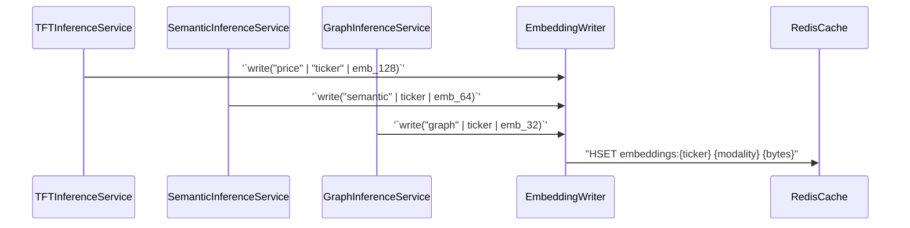

# Perception Layer (Encoders)

??? note "Relevant source files"

    - [gh:backend/perception/semantic/inference.py]
    - [gh:backend/perception/structural/inference.py]
    - [gh:backend/perception/temporal/inference.py]

The **Perception Layer** constitutes Layer 1 of the Chimera architecture. Its
primary objective is to transform raw, multi-modal market data into
high-dimensional latent embeddings. These embeddings represent three distinct
facets of market reality: price dynamics (Temporal), market sentiment
(Semantic), and relational dependencies (Structural).

Each encoder operates as an independent microservice, consuming data from the
[Data Engine](../data_engine/index.md) and publishing embeddings to the
`RedisCache` via the `EmbeddingWriter`
[gh:backend/perception/common/embedding_writer.py] These embeddings are later
consumed by the [Fusion Layer: Deep Fusion Nexus](../fusion_layer/index.md) to
form a unified market state.

### High-Level Architecture

The Perception Layer bridges the gap between raw data streams (OHLCV, News,
Supply-Chain) and the "Code Entity Space" of the Chimera system.

#### Data Flow to Latent Space

Sources: [gh:backend/perception/temporal/inference.py#L18-L31]
[gh:backend/perception/semantic/inference.py#L18-L31]
[gh:backend/perception/structural/inference.py#L19-L24]

### 3.1. Temporal Encoder: Temporal Fusion Transformer (TFT)

The Temporal Encoder processes sequential price data to identity patterns,
trends, and volatility regimes. It utilizes a **Temporal Fusion Transformer
(TFT)** architecture, which excels at multi-horizon forecasting and identifying
long-term dependencies in time-series data.

- **Model:** `TemporalFusionTransformer`
  [gh:backend/perception/temporal/tft_model.py]
- **Input:** A window of OHLCV (Open, High, Low, Close, Volume) bars defined by
  `OHLCV_WINDOW_MINUTES` [gh:backend/perception/temporal/inference.py#L26]
- **Output:** A 128-dimensional "price" embedding.
- **Service:** The `TFTInferenceService` subscribes to live ticks via Redis
  [gh:backend/perception/temporal/inference.py#L39] and updates embeddings in
  real-time.

For details, see
[Temporal Encoder: Temporal Fusion Transformer (TFT)](temporal.md)

### 3.2. Semantic Encoder: Distilled Financial LLM

The Semantic Encoder translates unstructured textual data —such as news
headlines and article bodies— into numerical sentiment vectors. To maintain low
latency, the system uses a 15M-parameter student model distilled from a larger
FinBERT teacher.

- **Model:** `DistilledFinancialEncoder`
  [gh:backend/perception/semantic/distilled_llm.py]
- **Input:** Tokenized text from `channel:news.global`
  [gh:backend/perception/semantic/inference.py#L39]
- **Output:** A 64-dimensional "semantic" embedding.
- **Service:** `SemanticInferenceService` handles incoming news events,
  tokenizes them using the `AutoTokenizer`, and generates embeddings for all
  mentioned tickers [gh:backend/perception/semantic/inference.py#L65-L81]

For details, see [Semantic Encoder: Distilled Financial LLM](semantic.md).

### 3.3. Structural Encoder: Graph Attention Network (GATv2)

The Structural Encoder captures the interconnected nature of the market,
modeling dependencies such as supply-chain relationships and sector
correlations. It uses a **Graph Attention Network (GATv2)** to propagate
information across a global market graph.

- **Model:** `GraphEncoder` [gh:backend/perception/structural/gat_model.py]
- **Input:** A graph object `Data` containing node features (price momentum) and
  `edge_index` (supply-chain links)
  [gh:backend/perception/structural/inference.py#L26-L31]
- **Service:** `GraphInferenceService` runs on a daily cadence, rebuilding the
  global graph via `build_graph_data` and updating the structural context for
  the entire universe [gh:backend/perception/structural/inference.py#L99-L121]

For details, see
[Structural Encoder: Graph Attention Network (GATv2)](structural.md)

### Modality Integration

The following diagram illustrates how the different inference services interact
with the `EmbeddingWriter` to persist data into the `RedisCache`.

#### Inference Service to Redis Mapping

Sources: [gh:backend/perception/temporal/inference.py#L71]
[gh:backend/perception/semantic/inference.py#L81]
[gh:backend/perception/structural/inference.py#L38]
[gh:backend/perception/common/embedding_writer.py]

### Summary Table

| Encoder       | Modality       | Output Dim | Cadence     | Primary Source    |
| ------------- | -------------- | ---------- | ----------- | ----------------- |
| TFT           | Price/Time     | 128-d      | Per Tick    | Redis Tick Stream |
| Distilled LLM | News/Sentiment | 64-d       | Per Article | Redis Pub/Sub     |
| GATv2         | Relationships  | 32-d       | Daily       | TimescaleDB Graph |

Sources: [gh:backend/perception/temporal/inference.py#L24-L37]
[gh:backend/perception/semantic/inference.py#L34-L37]
[gh:backend/perception/structural/inference.py#L42-L93]
