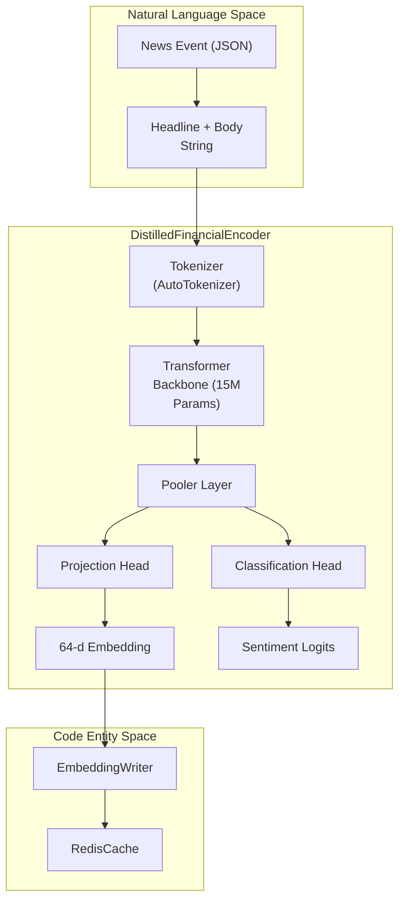
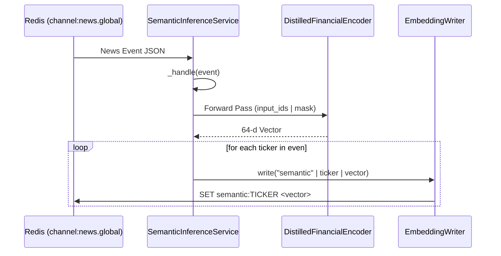

# Semantic Encoder: Distilled Financial LLM

??? note "Relevant source files"

    - [gh:backend/perception/semantic/inference.py]
    - [gh:docker/Dockerfile.api]
    - [gh:pyproject.toml]

The Semantic Encoder is the natural language processing component of the Lumina
V3 'Chimera' architecture. It transforms unstructured financial text (news
headlines, article bodies, and social sentiment) into a compact 64-dimensional
semantic embedding space. To meet the system's sub-second latency requirements
while maintaining the reasoning capabilities of large-scale financial models,
the system employs a knowledge distillation a knowledge distillation pipeline
where a large **FinBERT** teacher trains a high-performance **15M-parameter
student**model.

## Distillation Pipeline and Model Architecture

The core of the semantic subsystem is the `DistilledFinancialEncoder`. While the
teacher model (FinBERT) contains approximately 110M parameters, the student is
optimized for inference speed and memory efficiency, fitting in less than 50 MB
at `fp16` precision [gh:pyproject.toml#L111-L113].

### The DistilledFinancialEncoder

The model architecture consists of a lightweight backbone followed by a
projection head that compresses the hidden state into the final 64-d embedding.

| Component          | Specification                  |
| ------------------ | ------------------------------ |
| Teacher Model      | `ProsusAI/finbert`             |
| Student Parameters | ~15 Million                    |
| Input Sequence     | 256 tokens (`max_length`)      |
| Output Latent      | 64-dimensional semantic vector |

### Model Logic Flow

The `DistilledFinancialEncoder` produces two outputs: the semantic embedding
used for trading decisions and a classification logit (typically sentiment or
relevance) used during the distillation phase to align student behavior with the
teacher.

#### Semantic Encoder Internal Data Flow

**Sources:** [gh:backend/perception/semantic/distilled_llm.py#L10-L15]
[gh:backend/perception/semantic/inference.py#L56-L69]
[gh:backend/perception/common/embedding_writer.py#L1-L10]

## Semantic Inference Service

The `SemanticInferenceService` handles the real-time processing of news streams.
It operates as an asynchronous consumer, subscribing to global news channels and
updating the Feature Store (Redis) with fresh embeddings.

### Key Implementation Details

- **Subscription:** The service listens to the `channel:news.global` Redis
  pub/sub channel [gh:backend/perception/semantic/inference.py#L38-L39].
- **Handling Events:** Upon receiving a message, it concatenates the headline
  and body, tokenizes the text, and runs a forward pass through the distilled
  model [gh:backend/perception/semantic/inference.py#L65-L81]
- **Ticker Mapping:** A single news can affect multiple assets. The service
  iterates through the `tickers` list in the vent metadata and writes the same
  semantic vector to each ticker's key in Redis via the `EmbeddingWriter`
  [gh:backend/perception/semantic/inference.py#L80-L81].

### Execution Flow

**Sources:** [gh:backend/perception/semantic/inference.py#L34-L71]
[gh:backend/perception/common/embedding_writer.py#L15-L25]

## XAI: Integrated Gradients Attribution

For the Lumina V3 system to be "explainable" (XAI), it must identify which
specific words in a news article triggered a trading decision. This is handled
by the **Captum** library integration [gh:pyproject.toml#L104-L108].

When the `Spartan Arena` identifies a "divergence point" (where the agent's
action differs significantly from expected behavior), it can trigger the
Integrated-Gradients path. This calculates the attribution of the output
embedding back to the input tokens, allowing the `RunSummarizer` to generate
narratives like: _"Agent sold due to high attribution on tokens ['banckruptcy',
'litigation', 'default']"_ [gh:pyproject.toml#L155].

## Deployment and Dependencies

The semantic encoder is part of the `perception` service layer. It is designed
to run on either CPU or GPU, though GPU is prefered for the teacher-student
training phase.

- **Library Requirements:** Depends on `torch`, `transformers`, and `captum`
  [gh:pyproject.toml#L79-L80] [gh:pyproject.toml#L107].
- **Quantization:** While the student is small, the `gpu` extra (including
  `bitsandbytes`) is available to run the 110M-parameter teacher on
  memory-constrained hardware during distillation [gh:pyproject.toml#L110-L117].
- **Checkpointing:** The service looks for trained weights at
  `models/semantic/best.pt`. If missing, it falls back to random weights with a
  warning, requiring a run of the trainer script first
  [gh:backend/perception/semantic/inference.py#L74-L104].

**Sources:** [gh:pyproject.toml#L73-L88]
[gh:backend/perception/semantic/inference.py#L74-L104]
