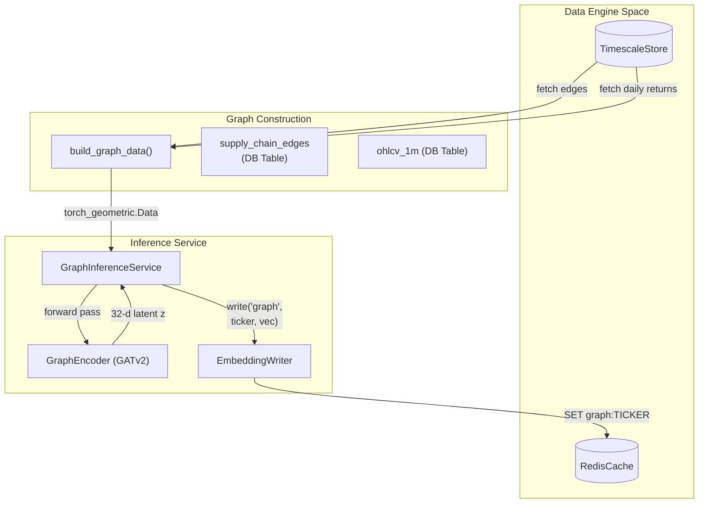
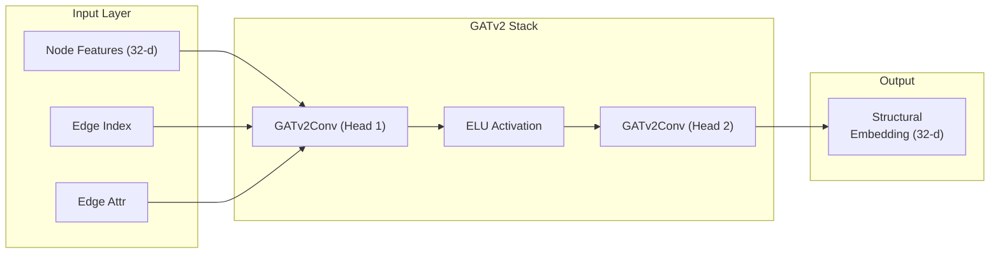

# Structural Encoder: Graph Attention Network (GATv2)

??? note "Relevant source files"

    - [gh:backend/perception/structural/inference.py]
    - [gh:notebooks/04_graph_construction.ipynb]

The Structural Encoder is the third modality-specific encoder in the Perception
Layer. It captures **inter-asset dependencies** and **systemic risk
propagation** by modelling the market as a heterogeneous graph. Unlike the
Temporal (TFT) and Semantic (LLM) encoders which process assets in isolation,
the GATv2 encoder produces a **32-dimensional structural pressure embedding**
that reflects an asset's position within the broader supply-chain and
correlation network.

## Graph Architecture and Data Flow

The structural pipeline operates on a daily cadence, constructing a graph where
nodes represent tickers and edges represent either static supply-chain
relationships or dynamic price correlations.

### System-to-Code Entity Mapping

The following diagram bridges the high-level structural concepts to the specific
code implementation responsible for graph construction and inference.

#### Structural Encoding Pipeline

**Sources:** [gh:backend/perception/structural/inference.py#L18-L38]
[gh:backend/perception/structural/inference.py#L93-L95]
[gh:backend/perception/structural/graph_builder.py#L192]

## Graph Construction (`graph_builder`)

The graph is built using `torch_geometric.data.Data` objects
[gh:notebooks/04_graph_construction.ipynb] It incorporates two distinct edge
types to capture different forms of structural "pressure":

1. **Static Edges (Supply Chain):** Derived from the `supply_chain_edges` table.
   These represent fundamenta dependencies (e.g., NVDA supplying AAPL)
   [gh:notebooks/04_graph_construction.ipynb]
2. **Dynamic Edges (Correlation):** Generated based on Pearson correlation of
   log returns over a lookback period. Edges are created when $|r|>0.6$
   [gh:notebooks/04_graph_construction.ipynb]

### Node Feature Composition

Each node (ticker) is initialized with a 32-dimensional feature vector `x`
before being processed by the GATv2 layers:

- **Sector One-Hot:** (NUM_SECTORS dims) Identifies the asset class
  [gh:notebooks/04_graph_construction.ipynb]
- **Log Market Cap:** (1 dim) Scaled representation of asset size
  [gh:notebooks/04_graph_construction.ipynb]
- **Realized Volatility:** (1 dim) 252-day annualized volatility
  [gh:notebooks/04_graph_construction.ipynb]
- **Beta vs SPY:** (1 dim) Systematic risk exposure
  [gh:notebooks/04_graph_construction.ipynb]
- **Padding:** Reserved zeros to maintain the 32-dim structural interface
  [gh:notebooks/04_graph_construction.ipynb]

**Sources:** [gh:notebooks/04_graph_construction.ipynb]

## GATv2 Model Architecture (`GraphEncoder`)

The `GraphEncoder` utilizes the GATv2 (Graph Attention Network v2) operator,
which improves upon standard GAT by implementing "dynamic attention", allowing
every node to attend to every other node with a more flexible ranking mechanism.

### GATv2 Information Flow

**Sources:** [gh:backend/perception/structural/gat_model.py#L15]
[gh:backend/perception/structural/inference.py#L31]

The model produces a latent representation $z \in \mathbb{R}^{32}$ for every
node in the graph. This embedding encapsulates not just the asset's own state,
but the state of its neighbors weighted by their attention scores (structural
pressure).

### Inference and Persistence

The `GraphInferenceService` runs as a background daemon, typically on a daily
interval (`_DAILY_INTERVAL_S = 86400`)
[gh:backend/perception/structural/inference.py#L43]

#### Key Functions

- `run_once(data, tickers_order)`: Performs the forward pass on the GPU and
  converts the resulting tensor to a NumPy array
  [gh:backend/perception/structural/inference.py#L26-L39]
- `EmbeddingWriter.write()`: Commits the 32-d vectors to Redis using the key
  format `graph:{ticker}`
  [gh:backend/perception/structural/inference.py#L36-L37]
- `_pick_device()`: Handles fallback logic, attempting to use CUDA but reverting
  to CPU if the probe fails
  [gh:backend/perception/structural/inference.py#L45-L53]

#### Data Lifecycle

1. **Trigger:** The service wakes up every 24 hours
   [gh:backend/perception/structural/inference.py#L99]
2. **Fetch:** `build_graph_data` queries TimescaleDB for the latest prices and
   edges [gh:backend/perception/structural/inference.py#L101]
3. **Compute:** The `GraphEncoder` processes the full market graph in a single
   batch [gh:backend/perception/structural/inference.py#L32]
4. **Store:** Embeddings are written to Redis, where the `StateAssembler` will
   later retrieves them for fusion
   [gh:backend/perception/structural/inference.py#L37]

**Sources:** [gh:backend/perception/structural/inference.py#L18-L38]
[gh:backend/perception/structural/inference.py#L82-L102]
