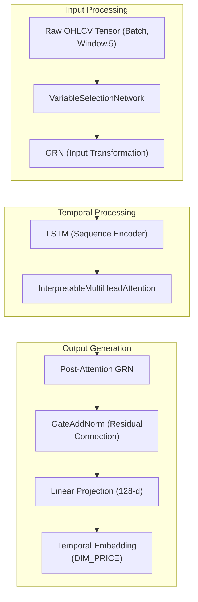
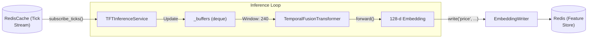

# Temporal Encoder: Temporal Fusion Transformer (TFT)

??? note "Relevant source files"

    - [gh:backend/cognition/training/behavioral_cloning.py]
    - [gh:backend/config/constants.py]
    - [gh:backend/perception/temporal/inference.py]
    - [gh:notebooks/02_tft_prototype.ipynb]

The **Temporal Encoder** is the first component of the Perception Layer in the
Chimera architecture. It is responsible for transforming raw multi-variate price
data (OHLCV) into a high-dimensional **Temporal Embedding** ($d=128$). It
utilizes a custom implementation of the **Temporal Fusion Transformer (TFT)**
(Lim et al., 2021), optimized for financial time-series by incorporating gated
residual networks and variable selection to handle noisy market data.

## 1. Architecture Overview

The `TemporalFusionTransformer` class
[gh:backend/perception/temporal/tft_model.py#L60-L72] implements a multi-stage
pipeline designed to extract both long-term dependencies and local patterns from
market bars.

### Key Components

- **Gated Residual Network (GRN):** The fundamental building block
  [gh:backend/perception/temporal/tft_model.py#L28-L32] It provides adaptive
  non-linear processing with a GLU (Gated Linear Unit) to skip unnecessary
  steps, preventing vanishing gradients in deep financial networks.
- **Variable Selection Network (VSN):** Performs instance-specific feature
  selection [gh:backend/perception/temporal/tft_model.py#L42-L57] It assign
  weights to different OHLCV inputs, allowing the model to ignore features
  (e.g., Volume) if they are currently non-informative.
- **LSTM Encoder:** Processes the sequence of variable-selected features to
  capture local temporal context
  [gh:backend/perception/temporal/tft_model.py#L85-L91]
- **Interpretable Multi-Head Attention:** A specialized attention mechanism that
  allows the model to focus on specific past events (e.g., a flash crash 30
  minutes ago) [gh:backend/perception/temporal/tft_model.py#L93-L98]
- **Temporal Embedding Output:** The final state is projected to a
  128-dimensional vector defined by `DIM_PRICE`
  [gh:backend/config/constants.py#L56-L57]

#### Data Flow Diagram: TFT Internal Logic

This diagram maps the logical flow of data through the PyTorch entities defined
in `tft_model.py`.

**Sources:** [gh:backend/perception/temporal/tft_model.py#L25-L137]
[gh:backend/config/constants.py#L56-L57]

## 2. Implementation Details

### Variable Selection Network (VSN)

The VSN is critical for financial data where the signal-to-noise ratio varies.
It computes a vector of weights $\alpha$ for the input features and produces a
weighted sum of transformed features.

- **Function:** `VariableSelectionNetwork.forward`
  [gh:backend/perception/temporal/tft_model.py#L50-L57]
- **Mechanism:** It uses a `GRN` to produce weights for each input variable and
  another set of `GRNs` to transform each individual variable before weighting
  them.

### Gated Residual Network (GRN)

The GRN allows the model to adaptively control the flow of information.

- **Function:** `GatedResidualNetwork.forward`
  [gh:backend/perception/temporal/tft_model.py#L35-L39]
- **Logic:** `x -> Linear -> ELU -> Linear -> GLU -> AddNorm`.

#### Dimensional Constants

The TFT's output is strictly governed by project-wide constants to ensure
compatibility with the `DeepFusionNexus`.

| Constant                | Value | Description                                  |
| ----------------------- | ----- | -------------------------------------------- |
| `DIM_PRICE`             | 128   | Size of the temporal embedding vector.       |
| `OHLCV_WINDOW_MINUTES`  | 240   | Look-back window (4 hours of 1-min bars).    |
| `OHLCV_HORIZON_MINUTES` | 60    | Target horizon for self-supervised training. |

**Sources:** [gh:backend/config/constants.py#L56-L95]
[gh:backend/perception/temporal/tft_model.py#L28-L140]

## 3. Training and Preprocessing

### Self-Supervised Pre-training

The TFT is pre-trained using a self-supervised task: predicting the forward
return over `OHLCV_HORIZON_MINUTES` [gh:backend/config/constants.py#L95]
This ensures the encoder learns to extract features relevant to price movement
before being integrated into the RL agent's policy.

### Preprocessing Pipeline

1. **Normalization:** The `TFTInferenceService` applies Min-Max scaling to the
   input buffer [gh:backend/perception/temporal/inference.py#L68]
2. **Windowing:** A sliding window of 240 bars is maintained in a `deque`
   [gh:backend/perception/temporal/inference.py#L33]
3. **Outlier Handling:** The prototype utilizes `RobustScaler` to mitigate the
   impact of price spikes [gh:notebooks/02_tft_prototype.ipynb]

**Sources:** [gh:backend/perception/temporal/inference.py#L31-L62]
[gh:notebooks/02_tft_prototype.ipynb]

## 4. Inference Service

The `TFTInferenceService` handles real-time embedding generation. It subscribes
to a Redis tick stream and writes embeddings back to the Feature Store.

### System Integration Diagram

This diagram shows how the `TFTInferenceService` interacts with the broader
system components.

### Key Functions

- `run()`: Main loop that consumes ticks from Redis
  [gh:backend/perception/temporal/inference.py#L36-L45]
- `_handle()`: Manages the rolling buffer, performs normalization, and executes
  the model forward pass [gh:backend/perception/temporal/inference.py#L50-L71]
- `_pick_device()`: Logic to select `cuda` or `cpu` with a hardware probe
  [gh:backend/perception/temporal/inference.py#L77-L85]

**Sources:** [gh:backend/perception/temporal/inference.py#L18-L80]
[gh:backend/perception/common/embedding_writer.py#L1-L20]

## 5. Verification: Prototype Over-fitting

The architectural integrity of the TFT was verified in
`notebooks/02_tft_prototype.ipynb`.

- **Goal:** Over-fit the model on 200 samples of SPY 1h bars
  [gh:notebooks/02_tft_prototype.ipynb]
- **Criterion:** Achieve a Training MSE < 1e-3 within 60 epochs
  [gh:notebooks/02_tft_prototype.ipynb]
- **Observation:** Successful over-fitting confirms that gradients flow
  correctly through the complex GRN/VSN/Attention stack
  [gh:notebooks/02_tft_prototype.ipynb]

**Sources:** [gh:notebooks/02_tft_prototype.ipynb]
